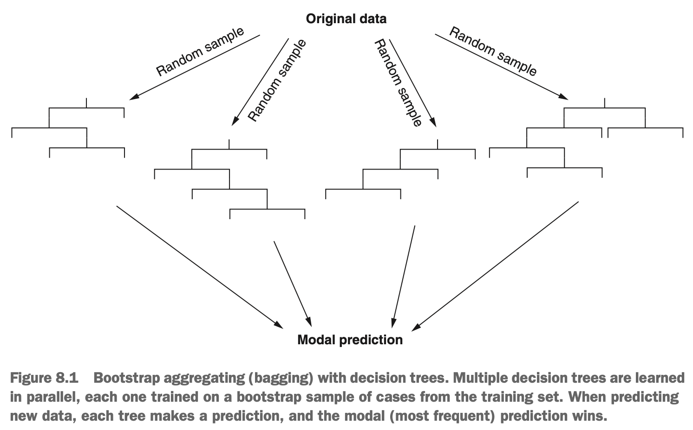
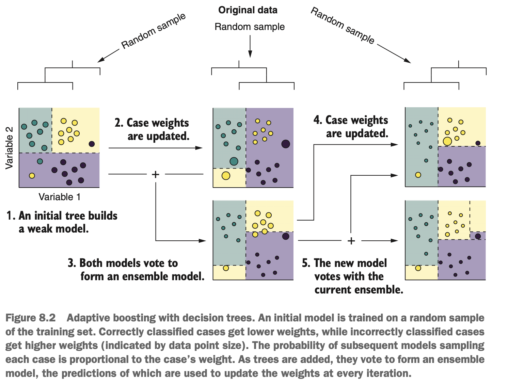

```{r, include = FALSE}
library(tidyverse)
library(mlr)
library(parallel)
library(parallelMap)
```


# Ensemble Techniques: Bagging, Boosting, & Stacking

In the previous lesson, we highlighted an important limitation of decision trees: they have a tendency to overfit the training set. This results in models that generalise poorly to new data. As a result, individual decision trees are rarely used, but they can become extremely powerful predictors when many trees are combined together.

Hopefully, by the end of this lesson, we will understand the difference between ordinary decision trees & *ensemble methods*, such as *random forest* & *gradient boosting*, which combine multiple trees to make predictions. 

There are three different ensemble methods:

* Bootstrap aggregation
* Boosting
* Stacking

We'll also learn about *benchmarking*, & how to use it to find the best-performing algorithm for a particular problem. Benchmarking is the process of letting a bunch of different learning algorithms fight it out to select the one that performs best for a particular problem.


### Training Models on Sampled Data; Bootstrap Aggregating

Machine learning algorithms can be sensitive to noise resulting from outliers & measurement error. If noisy data exists in our training set, then our models are more likely to have high variance when making predictions on future data. How can we then, train a learner tha makes use of all the data available to use, but can look past this noisy data & reduce prediction variance? The answer is to use *bootstrap aggregation* (or *bagging* for short).

The premise of baggin is quite simple:

1. Decide how many sub-models you're going to train.
2. For each sub-model, randomly sample cases from the training set, with replacement, until you have a sample the same size as the original training set.
3. Train a sub-model on each sample of cases.
4. Pass new data through each sub-mode, & let them vote on the prediction
5. The *modal* prediction (most frequent prediction) from all the sub-models is used as the predicted output.

The most critical part of bagging is the random sampling of the cases. Imagine we're playing Scrabble & have a bag of 100 letter tiles. We reach into the bag, blindly rummaging around, pull out a tile, & write down the letter we got. This is taking a random sample. Then, we put the tile back. This is called replacement, & sampling with replacement simply means we put the values back after we've drawn them. As such, the same value could be drawn again. We continue to do this until we've drawn 100 random samples, the same number as are in the bag to begin with. This process is called *bootstrapping* & is an important technique in statistics & machine learning. Our bootstrap sample of 100 tiles should do a reasonable job of reflecting the frequencies of each letter in the original bag.

Why does training sub-models on bootstrap samples of the training set help us? Imagaine that cases are distributed over their feature space. Each time we take a bootstrap sample, because we are sampling with replacement, we are more likely to select a case near the center of that distribution than a case that lies near the extremes of the distribution. Some of the bootstrap samples may contain extreme values & make poor predictions on their own, but here's the second crucial part of bagging: we *aggregate* the predictions of all these models. This simply means we let them all make their predictions & then take the majority vote. The effect of this is a sort of averaging out of all the models, which reduces the impact of noisy data & reduces overfitting. Bagging for decision trees is illustrated in the diagram below.

{width=70%}

Bagging (& as we'll learn, boosting & stacking) is a technique that can be applied to any supervised machine learning algorithm. Having said this, it works best on algorithms that tend to create low-bias, high-variance models, such as decision trees. In fact, there is a famous & popular implementation of bagging for decision trees called *random forest*. It's called random forest because it uses many random samples from the training set to train a decision tree. What do many trees make? A forest!

So the random forest algorithm uses bagging to create a large number of trees. These trees are saved as part of the model; when we pass the model new data, each tree makes its own prediction, & the modal prediction is returned. The random forest algorithm has one extra trick up its sleeve, however. At each node of a particular tree, the algorithm randomly selects a proportion of the predictor variables it will consider for that split. At the next node, the algorithm makes another random selection of predictor variables it will consider for that split, & so on. While this may seem counter-intuitive, the result of randomly sampling cases & randomly sampling features is to create individual trees that are highly *uncorrelated*.


### Learning from the Previous Models' Mistakes: Boosting

With bagging, the individual models are trained in parallel. In contrast, boosting is an ensemble technique that, again, trains many individual models, but builds them sequentially. Each additional model seeks to correct the mistakes of the previous ensemble of models. 

Just like bagging, boosting can be applied to any supervised machine learning algorithm. However, boosting is most beneficial when using *weak learners* as the sub-models. By *weak learner*, we mean a model that only does a little better at making predictions than a random guess. For this reason, boosting has been traditionally applied to shallow decision trees. By *shallow*, we mean a decision tree that doesn't have many levels of depth, or may only have a single split.

The function of boosting is to combine many weak learners together to form one strong ensemble learner. The reason we use weak learners is that there is no improvement in model performance when boosting with strong learners versus weak learners. So why waste computational resources training hundreds of strong, probably more complex learners, when we can get the same performance by training weak, less complex ones?

There are two methods of boosting, which differ in the way they correct the mistakes of the previous set of models:

* Adaptive boosting
* Gradient boosting


##### Weighting Incorrectly Predicted Cases: Adaptive Boosting

AdaBoost, or adaptive boosting, works as follows. Initially, all cases in the training set have the same importance, or *weight*. An initial model is trained on a bootstrap sample of the training set where the probability of a case being sampled is proportional to its weight (all equal at this point). The cases that this initial model incorrectly classifies are given more weight/importance, while cases that it correctly classifies are given less weight/importance.

The next model takes another bootstrap sample from the training set, but the weights are no longer equal. Remember that the probability of a csae being sampled is proprotional to its weight. So, a case with twice as much weight as another case is twice as likely to be sampled (& more likely to be sampled repeatedly). This ensures that cases incorrectly classified by the previous model are more likely to be featured in the bootstrap for the subsequent model. The subsequent model is therefore more likely to learn rules that will correctly classify these cases.

Once we have at least two models, the data are classified based on an aggregated vote, just like in bagging. Cases that are incorrectly classified by the majority vote are then given more weight, & cases that are correctly classified by the majority vote are given less weight. Perhaps slightly confusingly, the models themselves also have weight. This model weight is based on how many mistakes a particular model makes (more mistakes, less weight). If you only have two models in an ensemble, one which predicts group A & the other of which predicts group B, the model with the higher weight wins the vote.

This process continues: a new model is added to the ensemble, all the models vote, weights are updated, & the next model samples the data based on the new weights. Once we reach the maximum number of predefined trees, the process stops, & we get our final ensemble model. Think about the impact this has: new models are correcting the mistakes of the previous set of models. This is why boosting is an excellent way of reducing bias. However, just like bagging, it also reduces variance, because we're also taking bootstrap samples. When unseen cases are passed to the final model for prediction, each tree votes individually (like in bagging), but each vote is weighted by the model weight.

{width=70%}


##### Learning from the Previous Models' Residuals: Gradient Boosting

Gradient boosting is very similar to adaptive boosting, only differing the way it corrects the mistakes of the previous models. Rather than weighting the cases differently depending on the accuracy of their classification, subsequent models try to predict the *residuals* of the previous ensemble of models.

A *residual* or residual error, is the difference between the true value (the 'observed' value) & the value predicted by a model. This is easier to understand when thinking about predicting a continuous variable (regression). Imagine that we're trying to predict how much dept a person has. If an individual has a real debt of 2,500 dollars, but our model predicts they have a debt of 2,100 dollars, the residual is 400 dollars. It's called a residual because it's the error left over after the model has made its prediction.

It's harder to think of a residual for a classification model, but we can quantify the residual error of a classification model as

* the proportion of all cases incorrectly classified.
* the *log loss*

The proportion of cases that were misclassified is pretty self-explanatory. The log loss is similar but more greatly penalises a model that makes incorrect classifications *confidently*. If your friend tells you with 'absolution certainty' that Helsinki is the capital of Sweden (it's not), you'd think less of them than if they said they 'think it might be' the capital. This is how log loss treats misclassification error. For either method, models that give the correct classifications will have a lower error than those that make lots of misclassifications. Which method is better? It depends, so we'll let hyperparameter tuning choose for us.

So in gradient boosting, subsequent models are chosen that minimise the residual error of the previous ensemble of models. By minimising the residual error, subsequent models will, in effect, favour the correct classification of cases that were previously misclassified (thereby modeling the residuals).

Gradient boosting doesn't necessarily train sub-models on samples of the training set. If we choose to sample the training set, the process is called *stochastic gradient boosting* (*stochastic* meaning 'random'). Sampling in stochastic gradient descent is usually *without replacement*, which means it isn't a bootstrap sample. We don't need to replace each case during sampling because it's not important to sample cases based on their weights (like in AdaBoost) & there is little impact on performance. Just like for AdaBoost & random forext, it's a good idea to sample from the training set, because doing so reduces variance. The proportion of cases we sample from the training set can be tuned as a hyperparameter.

There are a number of gradient boosting algorithms around, but probably the best known is the XGBoost (extreme gradient boosting) algorithm. It's popularity is due to how well it performs on a wide range of tasks, as it tends to outperform most other supervised learning algorithms. Many Kaggle (online community that runs machine learning competitions) data science competitions have been won using XGBoost, & it has become the supervised learning algorithm many data scientists try before all else.

While XGBoost is an implementation of gradient boosting, it has a few tricks up its sleeve:

* It can build different branches of each tree *in parallel*, speeding up model building.
* It can handle missing data.
* It employs *regularisation*, which prevents individual predictors from having too large of an impact on predictions (aiding in preventing overfitting).


##### Learning from Predictions Made by other Models: Stacking

The principle of the stacking ensemble technique is that it is used to combine predictions from multiple algorithms. Although it is a valuable technique, it is not as commonly used as bagging or boosting.

In bagging & boosting, the learners are often (but don't always have to be) *homogenous*. Put another way, all of the sub-models were learned by the same algorithm (decision trees). Stacking explicitly uses different algorithms to learn sub-models. For example, we may choose to use the kNN algorithm, logistic regression algorithm, & the SVM algorithm to build three independent base models.

The idea behind stacking is that we create base models that are good at learning different patterns in the feature space. One model may then be good at predicting in one area of the feature space, but makes mistakes in another area. One of the other models may do a good job of predicting values in an area of the feature space where the others do poorly. So here's the key to stacking: the predictions made by the base models are used as predictor variables (along with all the original predictors) by another model: the *stacked model*. This stacked model is then able to learn from the predictions made by the base models to make more accurate predictions of its own. Stacking can be tedious & complicated to implement, but it usually results in improved model performance if you use base learners that are different enough from each other.
