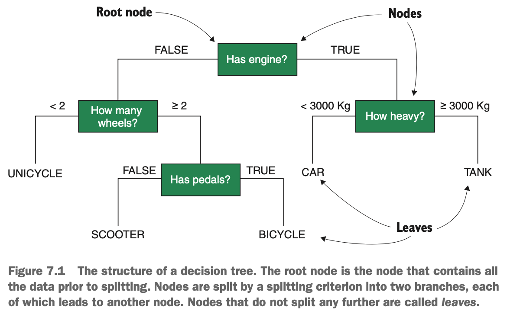
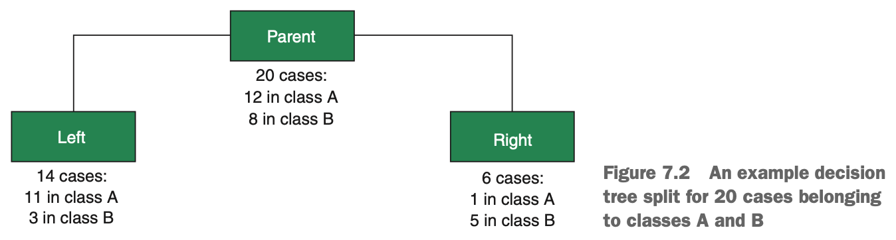
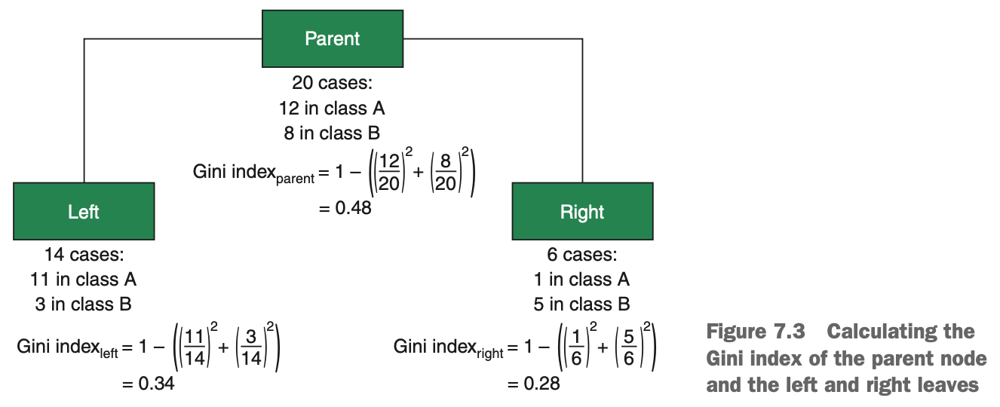
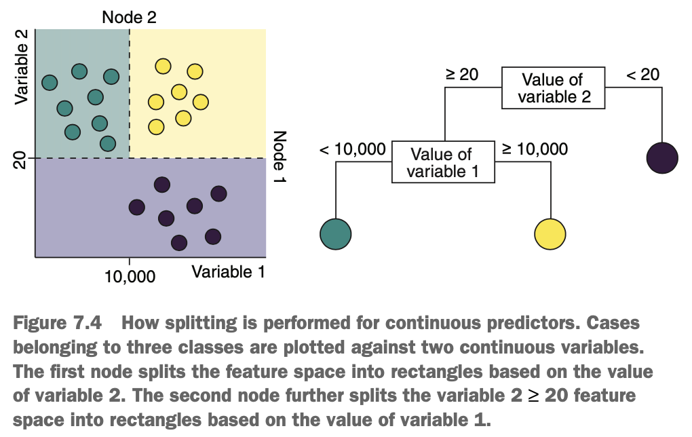
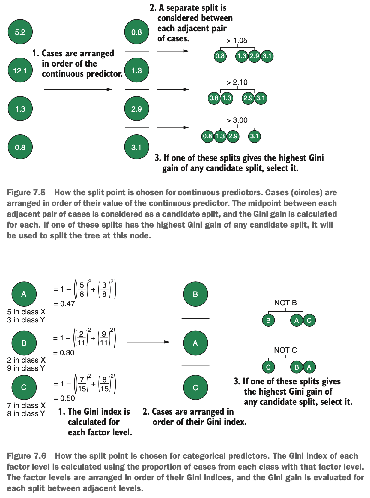
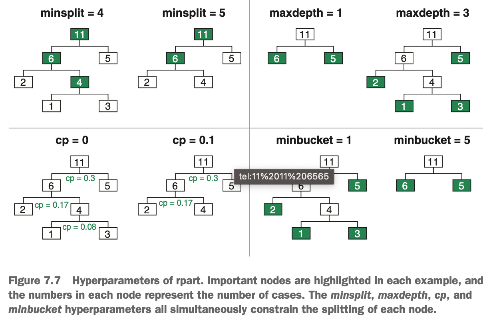

# What is the Recursive Partitioning Algorithm?

Imagine that we want to create a model to represent the way people commute to work, given features of the vehicle. We gather information on the vehicles, such as how many wheels they have, whether they have an engine, & their weight. You could formulate your classification process as a series of sequential questions. Every vehicle is evaluated at each question & moves either left or right in the model, depending on how its features satisfy the question.

{width=60%}

Notice that our model has a branching, tree-like structure, where each question splits the data into two branches. Each branch can lead to additional questions, which have branches of their own. The question parts of the tree are called *nodes*, & the very first question/node is called the *root node*. Nodes at the end of a series of questions are called *leaf nodes* or *leaves*. Leaf nodes have a single branch leading to them but no branches leading away from them. When a case finds its way down the tree into a leaf node, it progresses no further & is classified as the majority class within the leaf. While it may be strange that the root is at the top & the leaves are at the bottom, this is the way tree-based models are usually represented.

This all seems simple, but in we could have easily constructed the above model by hand. So tree-based models aren't necessarily learned by machine learning. We can have a tree-based approach to deciding what flight to buy (is the price above our budget, is the airline reliable, is the food terrible, & so on). So how can we learn the structure of a decision tree automatically for complex data sets with many features? Enter the rpart algorithm.

At each stage of the tree-building process, the rpart algorithm considers all of the predictor variables & selects the predictor that does the best job of discriminating the classes. It starts at the root & then, at each branch, looks again for the next feature that will best discriminate the classes of the cases that took that branch. But how does rpart decide on the best feature at each split? This can be done a few different ways, & rpart offers two different approaches: the difference in *entropy* (called *information gain*) & the difference in *Gini index* (called the *Gini gain*). The two methods usually give very similar results, but the Gini index is slightly faster to compute, so we'll focus on it.

### Using Gini Gain to Split the Tree

Entropy & Gini index are two ways of trying to measure the same thing: *impurity*. Impurity is a measure of how heterogeneous the classes are within a node. By estimating the impurity (with whichever method you choose) that would result from using each predictor variable for the next split, the algorithm can choose the feature that will result in the smallest impurity. Put another way, the algorithm chooses the feature that will result in subsequent nodes that are as homogeneous as possible.

The below diagram shows an example split. We have 20 cases in a parent node belonging to two classes, A & B. We split the node into two leaves based on some criterion. In the left leaf, we have 11 cases from class A & 3 from class B. In the right leaf, we have 5 from class B & 1 from class A.

{width=70%}

We want to know the *Gini gain* of this split. The Gini gain is the difference between the Gini index of the parent node & the Gini index of the split. Looking at the above diagram, the Gini index for any node is calculated as:

$$Gini~index = 1 - (p(A)^2 + p(B)^2)$$

where *p(A)* & *p(B)* are the proportions of cases belonging to classes A & B, respectively. The Gini indices for the parent node & the left & right leaves are shown below.

{width=70%}

Now that we have Gini indices for the left & right leaves, we can calculate the Gini index for the split as a whole. The Gini index of the split is the sum of the left & right Gini indices multiplied by the proportion of cases they accepted from the parent node:

$$Gini~index_{split} = p(left) * Gini~index_{left} + p(right) * Gini~index_{right}$$

$$Gini~index_{split} = \frac{14}{20} * 0.34 + \frac{6}{20} * 0.28 = 0.32$$

And the Gini gain (the difference between Gini indices of the parent node & the split) is simply

$$Gini~gain = 0.48 - 0.32 = 0.16$$

where 0.48 is the Gini index of the parent, as calculated in the above diagram.

The Gini gain at a particular node is calculated for each predictor variable, & the predictor that generates the largest Gini gain is used to split the node. This is repeated fro every node as the tree grows.

### What About Continuous & Multilevel Categorical Predictors?

When a predictor variable is *dichotomous* (has only two levels), it's quite obvious how to use it for a split: cases with one value go left, & cases with the other value go right. Decision trees can also split the cases using continuous variables, but what value is chosen as the split point? Take a look at the diagram below. We have cases from three classes plotted against two continuous variables. The feature space is split into rectangles by each node. At the first node, the cases are split into those with a value of variable 2, greater than or less than 20. The cases that make it to the second node are further split into those with a value of variable 1, greater than or less than 10,000.

{width=55%}

But what is the exact split point chosen for a continuous predictor? Well, the cases in the training set are arranged in order of the continuous variable, & the Gini gain is evaluated for the midpoint between each adjacent pair of cases. If the greatest Gini gain among all predictor variables is one of these midpoints, then this is chosen as a split for that node.

A similar procedure is used for categorical predictors with more than two levels. First, the Gini index is computed for each level of the predictor (using the proportion of each class that has that value of the predictor). The factor levels are arranged in order of their Gini indices, & the Gini gain is evaluated for a split between each adjacent pair of levels. Take a look at the below diagrams. We have a factor with three levels (A, B, & C): we evaluate the Gini index of each & find that their values are B < A < C. Now we evaluate the Gini gain for the splits B versus A & C, & C versus B & A.

{width=60%}

In this way, we can create a binary split from categorical variables with many predictors without having to try every single possible combination of level splits ($2 ^ {m - 1}$), where *m* is the number of levels of the variable). If the split B versus A & C is found to have the greatest Gini gain, then cases reaching this node will go down one branch if they have a value of B for this variable, & will go down the other branch if they have a value of A or C.

### Hyperparameters of the Rpart Algorithm

Decision tree algorithms are described as *greedy*. By greedy, we mean they search for the split that will perform best *at the current node*, rather than the one that will produce the best result globally. For example, a particular split might discriminate the classes best at the current node but result in poor separation further down that branch. Conversely, a split that results in poor separation at the current node may yield better separation further down the tree. Decision tree algorithms would never pick this second split because they only look at *locally optimal* splits, instead of *globally optimal* ones. There are three issues with this approach:

* The algorithm isn't guaranteed to learn a globally optimal model.
* If left unchecked, the tree will continue to grow deeper until all the leaves are pure (of only one class).
* For large data sets, growing extremely deep trees becomes computationally expensive.

While it's true that rpart isn't guaranteed to learn a globally optimal model, the depth of the tree is of greater concern to us. Besides the computational cost, growing a full-depth tree until all the leaves are pure is very likely to overfit the training set & create a model with high variance. This is because as the feature space is split up into smaller & smaller pieces, we're much more likely to start modeling the noise in the data.

How do we guard against such extravagant tree building? There are two ways of doing it:

* Grow a full tree & then *prune* it
* Employ *stopping criteria*

In the first approach, we allow the greedy algorithm to grow its full, overfit tree & then we get out our garden shears & remove leaves that don't meet certain criteria. This process is imaginatively named *pruning*, because we end up removing branches & leaves from our tree. This is sometimes called *bottom-up* pruning because we start from the leaves & prune up toward the root.

In the second approach, we include conditions during tree building that will force splitting to stop if certain criteria aren't met. This is sometimes called *top-down* pruning because we are pruning the tree as it grows down from the root.

Both approaches may yield comparable results in practice, but there is a slight computational edge to top-down pruning because we don't need to grow full trees & then prune them back. For this reason, we will be using the stopping criteria approach.

The stopping criteria we can apply at each stage of the tree-building process are as follows:

* Minimum number of cases in a node before splitting
* Maximum depth of the tree
* Minimum improvement in performance for a split
* Minimum number of cases in a leaf

These criteria are illustrated in the diagram below.

{width=60%}

For each candidate split during tree building, each of these criteria is evaluated & must be passed for the node to be split further. 

The minimum number of cases needed to split a node is called *minsplit* by rpart. If a node has fewer than the specified number, the node will not be split further. The maximum depth of the tree is called *maxdepth* by rpart. If a node is already at this depth, it will not be split further. The minimum improvement in performance is, confusingly, not the Gini gain of a split. Instead, a statistic called the *complexity parameter* (*cp* in rpart) is calculated for each level of depth of the tree. If the *cp* value of a depth is less than the chosen threshold value, the nodes at this level will not be split further. In other words, if adding another layer to the tree doesn't improve the performance of the model by *cp*, don't split the nodes. The *cp* value is calculated as:

$$cp = \frac{p(incorrect_{l + 1}) - p(incorrect_{l})}{n(splits_{l} - n(splits_{l + 1}))}$$

where p(incorrect) is the proportion of incorrectly classified cases at a particular depth of the tree, & n(splits) is the number of splits at that depth. The indices l & l + 1 indicate the current depth (l) & one depth above (l + 1). This reduces to the difference in incorrectly classified cases in one depth compared to the depth above it, divided by the number of new splits added to the tree.

Finally, the minimum number of cases in a leaf is called *minbucket* by rpart. If splitting a node would result in leaves containing fewer cases than *minbucket*, the node will not be split.

