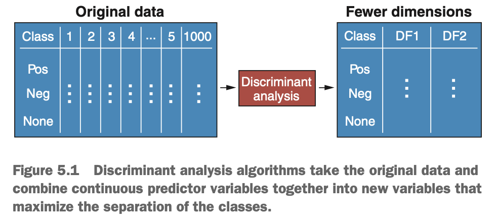
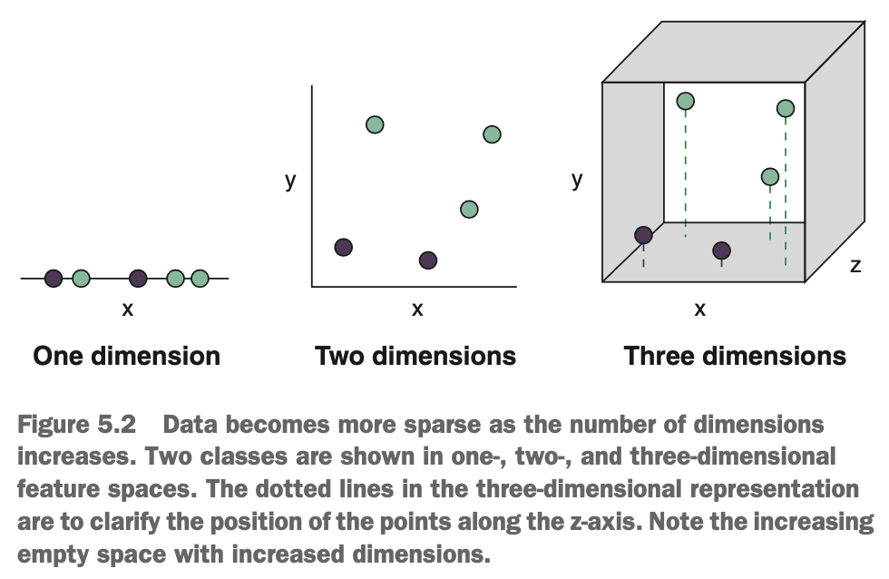
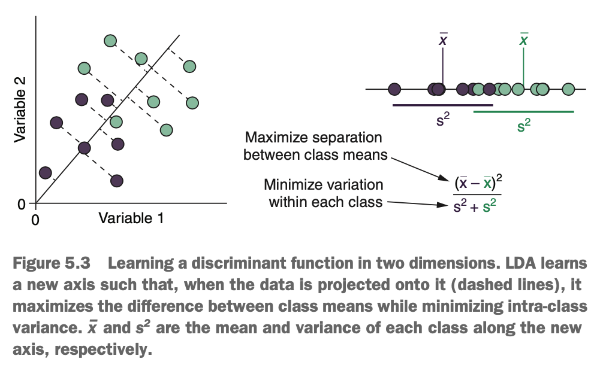
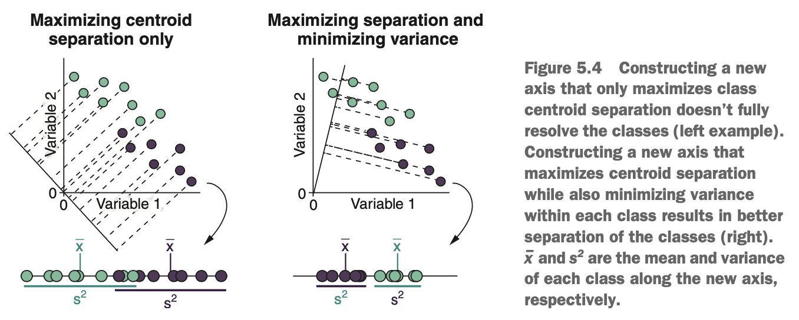
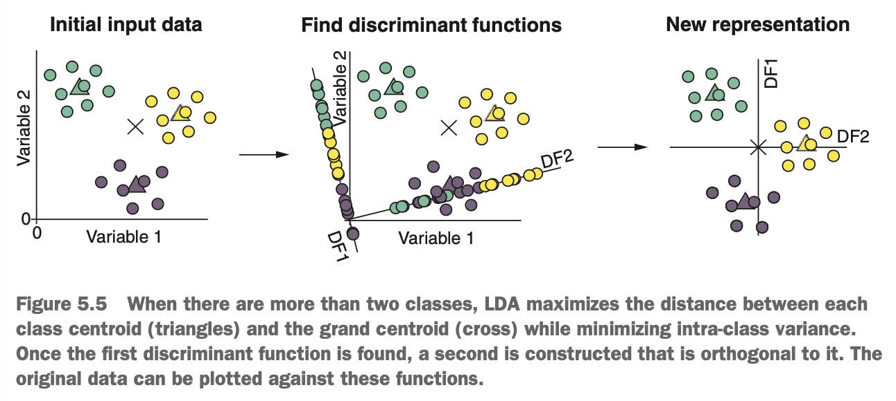
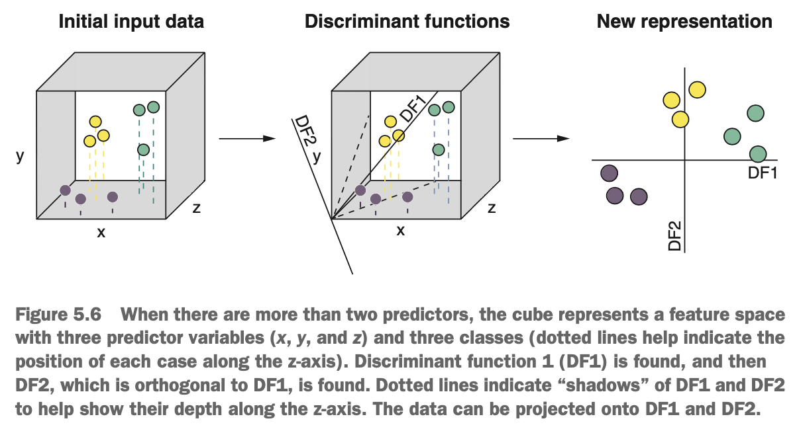
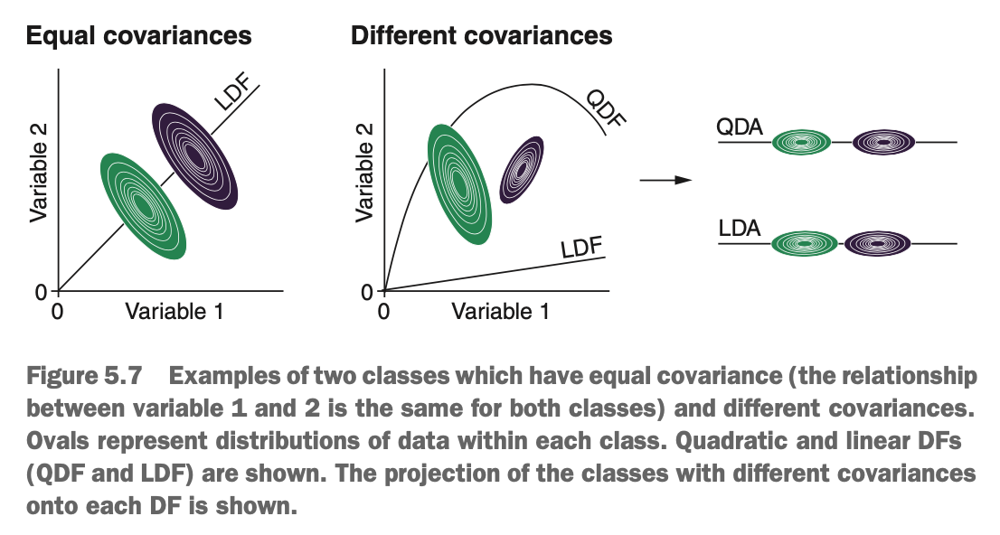
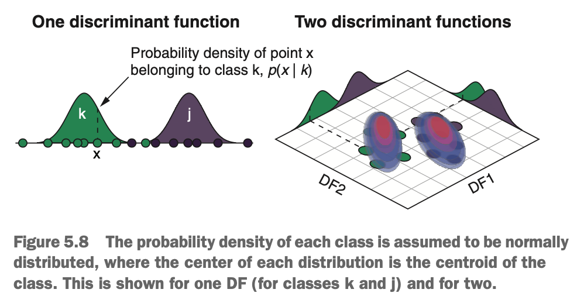

# What is discriminant analysis?

Imagine you want to find out if you can predict how patients will respond to a drug based on their gene expression. You measure the expression level of 1,000 genes & record whether they respond positively, negatively, or not at all to the drug (a 3-class classification problem).

A data set with this many predictor variables (1000 genes) presents a few problems.

* The data is very difficult to explore & plot manually.
* There may be many predictor variables that contain no or very little predictive information.
* We have the *curse of dimensionality* to contend with (a problem algorithms encounter when trying to learn patterns in high-dimensional data)

In our gene expression example, it would be nearly impossible to plot all 1,000 genes in such a way that we could interpret the similarities/differences between the classes. Instead, we could use discriminant analysis to take all that information & condense it into a manageable number of *discriminant functions*, each of which is a combination of the original variables. Put another way, discriminant analysis takes the predictor variables as input & finds a new, lower-dimensional representation of those variables that maximises the separation between the classes. Therefore, while discriminant analysis is a classification technique, it employs dimension reduction to achieve its goal.

{width=50%}

The number of discriminant functions will be the smaller of these two values:

* The number of classes minus 1
* The number of predictor variables

In the gene expression example, the information contained in those 1,000 predictor variables would be condensed into just 2 variables (3 classes minus 1). We could easily plot these two new variables against each other to see how separable our 3 classes are.

As you may have learned before, including predictor variables that contain little or no predictive value adds noise can negatively impact how the learned model performs. When discriminant analysis algorithms learn their discriminant functions, greater weight/importance is given to predictors that better discriminate the classes. Predictors that contain little or no predictive value are given less weight & contribute less to the final model. To a degree, this lower weighting of uninformative predictors mitigates their impact on model performance.

The curse of dimensionality is a terrifying-sounding phenomenon that causes problems when working with high-dimensional data (data with many predictor variables). As the *feature space* (the set of all possible combinations of predictor variables) increases, the data in that space becomes more sparse. Put more plainly, for the same number of cases in a data set, if you increase the feature space, the cases get further apart from each other, & there is more empty space between them.

{width=50%}

The consequence of the increase in dimensionality is that an area of the feature space may have very few cases occupying it, so an algorithm is more likely to learn
from "exceptional" cases in the data. When algorithms learn from exceptional cases, this results in models that are overfit & have a lot of variance in their predictions. This is the curse of dimensionality.

This isn't to say that having more variables is bad, however. For most problems, adding predictors with valuable information improves the predictive accuracy of a model, until it doesn't (until we get diminishing returns, a.k.a. Hughes phenomenon). So how do we guard against overfitting due to the curse of dimensionality? We perform feature selection to include only variables that have predictive value &/or by performing dimension reduction.

Discriminant analysis isn't one algorithm but instead comes in many flavours. The two most fundamental & commonly used algorithms are:

* Linear discriminant analysis (LDA)
* Quadratic discriminant analysis (QDA)

### How does discriminant analysis learn?

We'll start by explaining how LDA works & then generalise this to QDA. 

LDA aims to learn a new representation of the data that separates the *centroid* of each class, while keeping the within-class variance as low as possible. A centroid is simply the point in the feature space that is the mean of all the predictors (a vector of means, one for each dimension). Then LDA finds a line through the origin that, when the data is projected onto it, simultaneously does the following:

* Maximises the difference between class centroids along the line
* Minimises the within-class variance along the line

To choose this line, the algorithm maximises the below expression over all possible axes.

$$\frac{(\bar{x}_1 - \bar{x}_2)^2}{s_1^2 + s_2^2}$$

The numerator is the difference between the class means ($\bar{x}_1$ & $\bar{x}_2$ for the means of class 1 & class 2, respectively), squared to ensure that the value is positive (because we don't know which will be bigger). The denominator is the sum of variances of each class along the line ($s_1^2$ & $s_2^2$ for the variances of class 1 & class 2, respectively). The intuition behind this is what we want the means of the classes to be as separated as possible, with the scatter/variance within each class to be as small as possible.

{width=50%}

Why not simply find the line that maximises the separation of the centroids? Because the line that best separates the centroids doesn't guarantee the best separation of the cases in different classes. For example, on the left diagram of the figure below, the classes are not fully resolved because the relatively high variance means they overlap with each other.

{width=65%}

In the example on the right, however, the new axis tries to maximise centroid separation while minimising the variance of each class along that axis. This results in centroid that are slightly closer together, but much smaller variances, such that the cases from the two classes are fully separated.

This new axis is called a *discriminant function*, & it is a linear combination of the original variables. For example, a discriminant function could be described by an equation:

$$DF = -0.5*var_1 + 1.2*var_2 + 0.85 * var_3$$

In this way, the discriminant function (DF) in this equation is a linear combination of variables $var_1$, $var_2$, & $var_3$. The combination is linear because we are simply adding together the contributions from each variable. The values that each variable is multiplied by are called the *canonical discriminant function coefficients* & weigh each variable by how much it contributes to class separation. In other words, variables that contribute most to class separation will have larger absolute canonical DF coefficients (positive or negative). Variables that contain little or no class-separation information will have canonical DF coefficients closer to 0.

### What if we have more than 2 classes?

Discriminant analysis can handle classification problems with more than 2 classes. But how does it learn the best axis in this situation? Instead of trying to maximise the separation between class centroids, it maximises the separation between each class centroid & the *grand centroid* of the data (the centroid of all the data, ignoring class membership). In the below diagram, we have two continuous measurements made on cases from 3 classes. The class centroids are shown with triangles & the grand centroid is indicated by a cross.

{width=65%}

LDA first finds the axis that best separates the class centroids from the grand centroid that minimises the variance of each class along it. Then, LDA constructs a second axis that is *orthogonal* to the first. this simply means the second DF must be perpendicular to the first. The data is then projected onto these new axes such that each case gets a *discriminant score* for each function (its value along the new axis). These discriminant scores can be plotted against each other to form a new representation of the original data.

But what's the big deal? We've gone from having 2 predictor variables to having... two predictor variables (DF1 & DF2)! In fact, all we've done is center & scale the data, & rotate it around 0. When we only have 2 variables, discriminant analysis cannot perform any dimension reduction because the number of DFs is the smaller of the number of classes minus 1 & the number of variables (& we only have 2 variables).

But what happens when we have more than two predictor variables?

{width=60%}

LDA finds the DF that maximises the separation between each class centroid & the grand centroid, while minimising the variance along it. This axis extends through a 3-dimensional space.

Next, LDA finds the second DF, which is orthogonal to the first, which also tries to maximise separation while minimising variance. Because we only have 3 classes in the above example (& the number of DFs is the smaller of the number of classes minus 1 or the number of predictors), we stop at 2 DFs. By taking the discriminant scores of each case in the data (the values of each case along the two DFs), we can plot our data in only two dimensions.

LDa has taking a 3-dimensional data set & combined the information in those 3 variables into 2 new variables that maximise the separation between the classes. But what if we had 1,000 predictor variables, like in the gene expression example? LDA would still condense all this information into only 2 variables. Immensely powerful.

### Learning curves instead of straight lines: QDA

LDA performs well if the data within each class is normally distributed across all the predictor variables, & the classes have similar *covariances*. Covariance simply means how much one variable increases/decreases when another variable increases/decreases. So LDA assums that for each class in the dataset, the predictor variables *covary* with each other the same amount.

This often isn't the case, & classes have different covariances. In this situation, QDA tends to perform better than LDA because it doesn't make this assumption (though it still assumes the data is normally distributed). Instead of learning straight lines that separate the classes, QDA learns curved lines. It is also well suited, therefore, to situations in which classes are best separated by a nonlinear decision boundary.

{width=55%}

In the diagram above, on the left example, two classes are normally distributed across both variables & have equal covariances. We can see that the covariances are equal because, for both classes, as variable 1 increases, variable 2 increases by the same amount. In this sitaution, LDA & QDA will find similar DFs, although LDA is slightly less prone to overfitting than QDA because it is less flexible.

In the example on the right in the figure, the two class are normally distributed, but their covarainces are different. In this situation, QDA will find a curved DF that, when the data is projected onto it, will tend to do a better job of separating the classes than a linear DF.

### How does LDA & QDA make predictions?

Whichever method is chosen, the DFs have been constructed & we've reduced our high-dimensional data into a small number of discriminants. How do LDA & QDA use this information to classify new observations? They use an extremely important statistical theorem called *Baye's rule*.

Baye's rule provides us with a way of answering the question: given the values of the predictor variables for any case in our data, what is the probability of the case belonging to class k? This is written as *p(k|x)*, where *k* represents membership class k, & *x* represents the values of the predictor variables. We would read this as 'the probability of belonging to class k, given the data, x'. This is given by Baye's rule:

$$p(k|x) = \frac{p(x|k) * p(k)}{p(x)}$$

We already know *p(k|x)* is the probability of a case belonging to class k given the data. This is called the *posterior probability*. *p(x|k)* is the same thing, but flipped around: what is the probability of observing this data, given the case belongs to class k? Put another way: if this case was in class k, what is the likelihood of it having these values of the predictor variables? This is called the *likelihood*.

*p(k)* is called the *prior probability* & is simply the probability of any case belonging to class k. This is the proportion of all cases in the data that belong to class k. For example, if 30% of cases were in class k, *p(k)* would equal 0.3.

Finally, *p(x)* is the probability of observing a case with exactly these predictor values in the data set. This is called the *evidence*. Estimating the evidence is often very difficult (because each case in the data set may have a unique combination of predictor values), & it only servers to make all the posterior probabilities sum to 1. Therefore, we can omit the evidence from the equation & say that

$$p(k|x) \propto p(x|k) * p(k)$$

where the $\propto$ symbol means the value on either side of it are *proportional* to each other instead of *equal* to each other. In a more digestible way,

$$posterior \propto likelikhood * prior$$

The prior probability for a case (*p(k)*) is easy to work out: it's the proportion of cases in the data set that belong to class *k*. But how do we calculate the likelihood (*p(x|k)*)? The likelihood is calculated by projecting the data onto its DFs & estimating its *probability-density*. The probability density is the relative probability of observing a case within a particular combination of discriminant scores.

Discriminant analysis assumes that the data is normally distributed, so it estimates the probability density by fitting a normal distribution to each class across each DF. The center of each normal distribution is the centroid, & its stardard deviation is one unit on the discriminant axis. This is illustrated in the figure below for a single DF & for for 2 DFs ( the same thing happesn in more than 2 dimensions, but is difficult to visualise). You can see that cases near the class centroid along the discriminant axes have a high probability density for that class, & classes far away have a lower probability density.

{width=50%}

Once the probability density is estimated for a case for a given class, it can be passed into the equation:

$$posterior = likelihood * prior$$

The posterior probability is estimated for each class & the class that has the highest probability is what the case is classified as.

**Note: The prior probability (proportion of cases in that class) is important because if the classes are severely imbalanced, despite a case being far from the centroid of a class, the case could be more likely to belong to that class because there are so many more cases in it.**