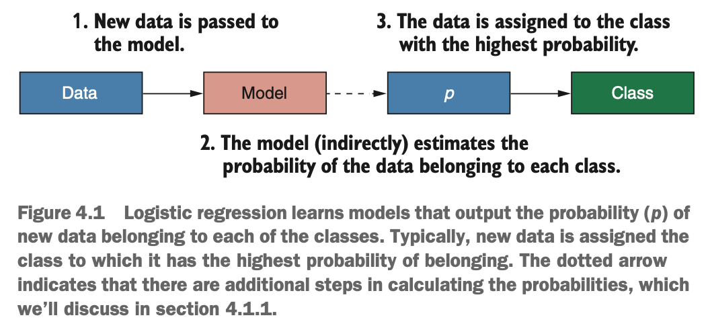
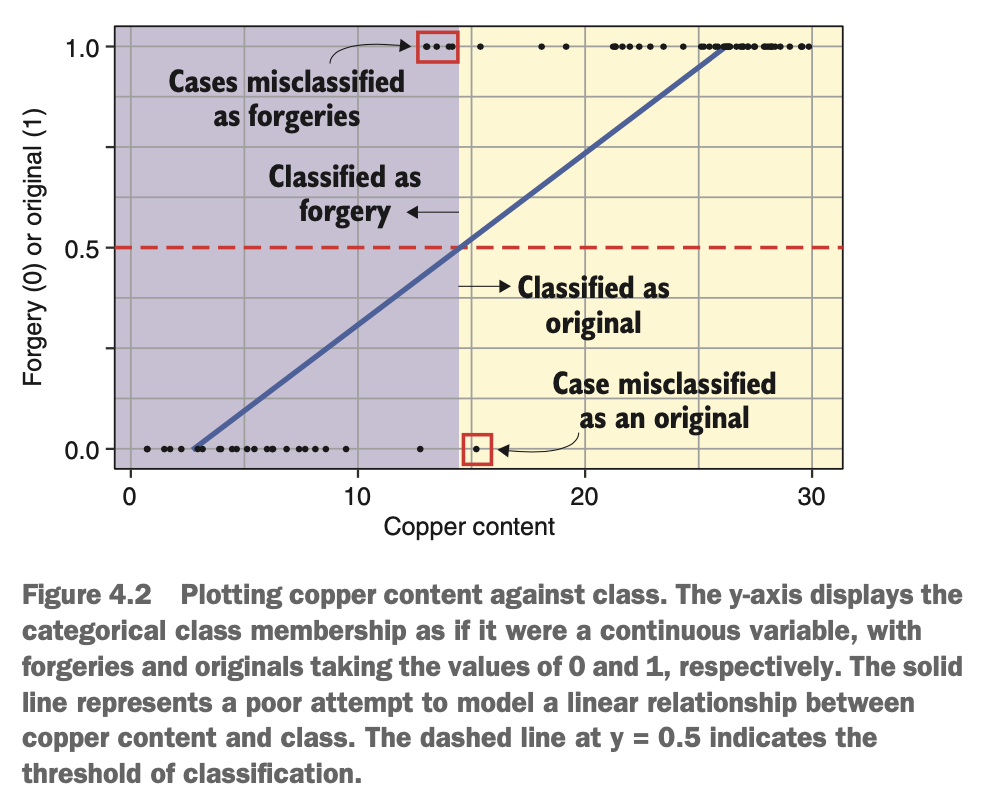
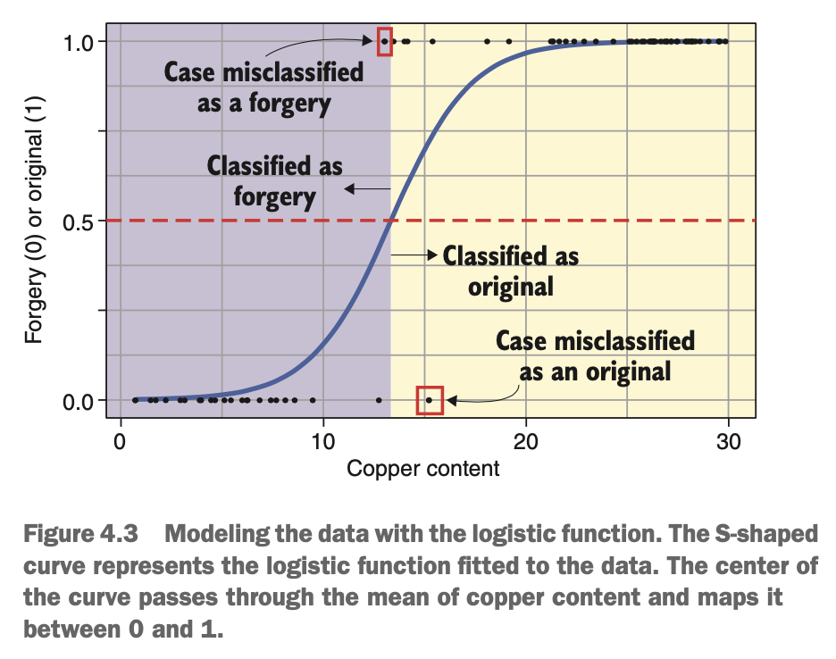
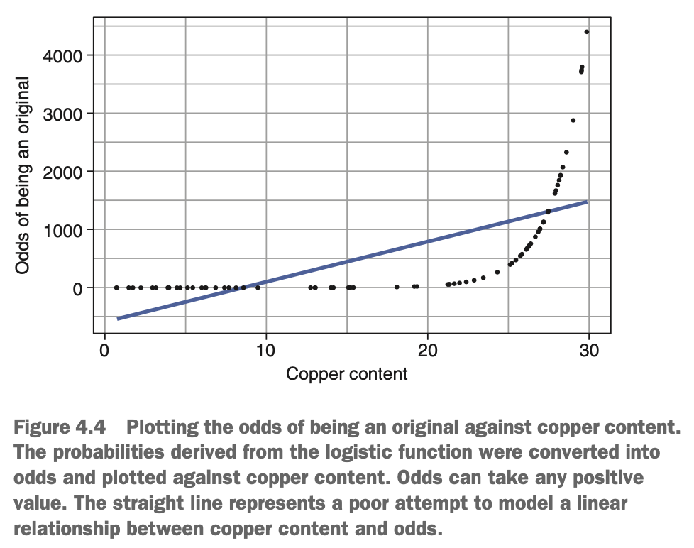
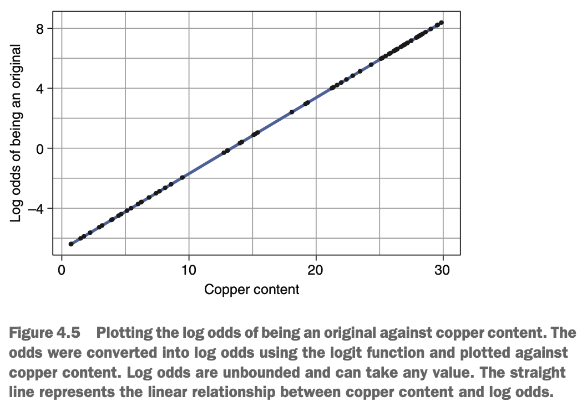
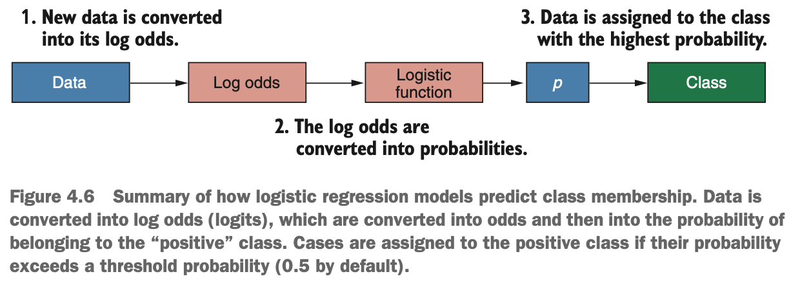
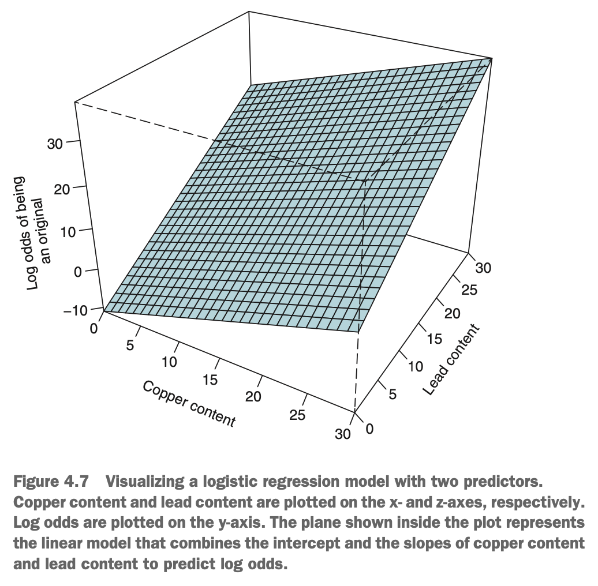
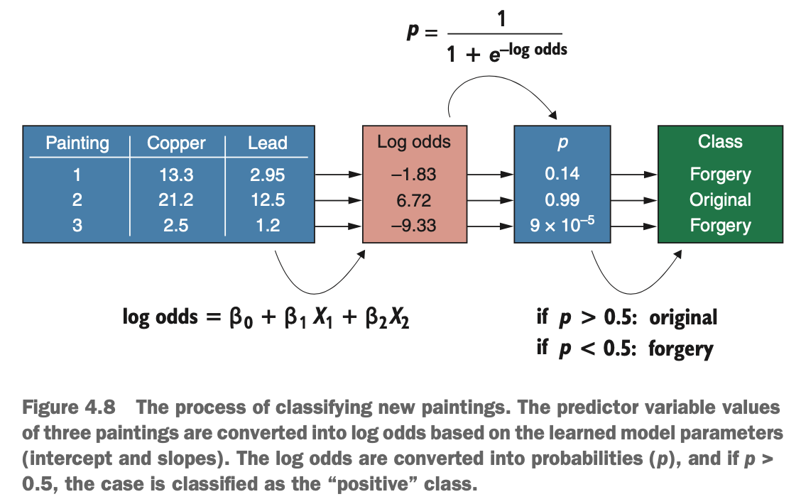
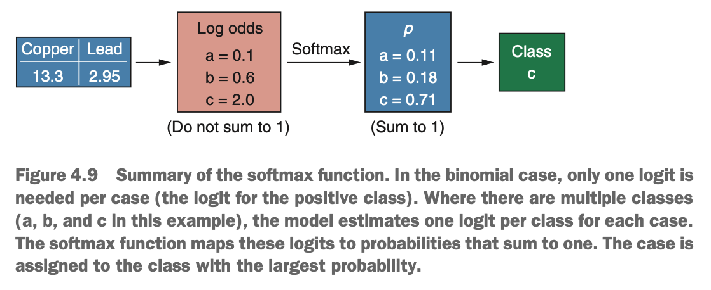

# What is logistic regression?

Imagine that you're the curator of fifteen-century art at a museum. When works of art, allegedly by famous painters, come to the museum, it's your job to determine whether they are genuine or fake (a two-class classification problem). You have access to the chemical analysis performed on each painting, & you are aware that many forgeries of this period used paints with lower copper content than the original paintings. You can use logistic regression to learn a model that tells you the probability of a painting being an original based on the copper content of its paint. The model will then assign this painting to the class with the highest probability.

{width=55%}

Logistic regression is a very popular classification algorithm, especially in the medical community, partly because of how interpretable the model is. For every predictor variable in our model, we can get an estimate of just how the value of that variable impacts the probability that a case belongs to one class over another.

### How does logistic regression learn?

{width=50%}

We've plotted the copper content of a sample of paintings we know to be real or forgeries against their class as if it were a a continuous variable between 0 & 1. We can see that on average, the forgeries contain less copper in their paint than the originals. We could model the relationship with a straight line as shown in the above figure. This approach works well when the predictor variable has a linear relationship with a continuous variable that you want to predict, but it doesn't do a good job of modeling the relationship between a continuous variable & a categorical one.

As shown in the figure, we could find the copper content at which the straight line passes halfway between 0 & 1, & classify paintings with copper content below this value as forgeries & paintings above as originals. This might result in many misclassifications, so a better approach is needed.

We can better model the relationship between copper content & class membership using the logistic function. The logistic function is a S-shaped curve that maps a continuous variable (copper content) onto value between 0 & 1. this does a much better job of representing the relationship between copper content & whether a painting is an original or forgery. 

{width=50%}

The figure shows a logistic function fit to the same data. We find the copper content at which the logistic function passes halfway between 0 & 1, & classify paintings with copper content below this value as forgeries & paintings above the value as originals. This typically results in fewer misclassifications than when we do this using a straight line. Importantly, as the logistic function maps our x variable between the values of 0 & 1, we can interpret its output as the probability of a case with a particular copper content being an original painting. As you can see, the logistic function approaches 1 as copper content increases. This represents that, on average, original paintings have a higher copper content, so if you pick a painting at random & find that it has a copper content of 20, it has a ~ 0.99 or 99% probability of being original.

The opposite is also true: as copper content decrease the logistic function approaches 0. This represents the fact that on average, forgeries have lower copper content, so if you pick a painting at random & find it has a copper content of 7, it has a ~ 0.99 or 99% probability of being a forgery.

Great! We can estimate the probability of a painting being an original by using the logistic function. But what if we have more than one predictor variable? Because probabilities are bound between 0 & 1, it's difficult to combine the information from two predictors. For example, say the logistic function estimates that a painting has a 0.6 probability of being an original for one predictor variable, & a 0.7 probability for the other predictor. We can't simply add these estimates together, because they would be larger than 1, & this wouldn't make sense.

Instead, we can take these probabilities & convert them into their *log odds* (the "raw" output from logistic regression models). The odds of a painting being an original is

$$odds = \frac{probability~of~being~an~original}{probability~of~being~a~forgery}$$

You may come across this written as

$$odds = \frac{p}{1 - p}$$

Odds are a convenient way of representing the likelihood of something occurring. They tell us how much more likely an event is to occur, rather than how likely it is not to occur.

In *The Empire Strikes Back*, C3PO says that the odds of "successfully navigating an asteroid field are approximately 3,720 to 1!" What C3PO was trying to tell Han & Leia was that the probability of successfully navigating an asteroid field is approximately 3,720 times smaller than the probability of unsuccessfully navigating it. Despite being a highly intelligent protocol droid, C3Po got his odds the wrong way around. He should have said the odds of successfully navigating an asteroid field are approximately1 to 3,720.

{width=50%}

The above figure shows copper content plotted against the odds of a painting being an original. Notice that the odds are not bounded between 0 & 1, & that they take on positive values.

As we can see though, the relationship between the copper content of the paint & the odds of a painting being an original is not linear. Instead, if we take the natural logarithm (ln) of the odds, we get the *log odds*.

$$log~odds = ln(odds) = ln({\frac{p}{1 - p}})$$

Taking the natural logarithm of the odds generates their log odds & the plotted log odds against copper content is in the figure below.

{width=55%}

We now have a linear relationship between our predictor variable & the log odds of a painting being an original. Also notice that log odds are completely unbounded, meaning they can extend to positive & negative infinity. When interpreting log odds,

* A positive value means something is more likely to occur than to not occur.
* A negative value means something is less likely to occur than to occur.
* Log odds of 0 means something is as likely to occur as not to occur.

Why did we make it such a big deal about there being a linear relationship between our predictor variable & its log odds? For one, modeling a straight line is easy. All that an algorithm needs to learn to model a straight line relationship is the y-intercept & the slope of the line. Additionally, having a linear relationship means that we have can have multiple predictor variables, adding their contributions to the log odds together to get the overall log odds of a painting being an original based on the information from all of its predictors.

Now, how do we get from the straight-line relationship between copper content & the log odds of being of being an original, to making predictions about new paintings? 

$$log~odds = y-intercept + slope * copper$$

The model calculates the log odds of our new data being an original painting using where we add the y-intercept & the product of the slope & the value of copper in our new painting. Once we've calculated the log odds fo the new painting, we convert it into the probability of being an original using the logistic function,

$$p = \frac{1}{1 + e^{-z}}$$

where *p* is the probability, *e* is Euler's number (~2.718), & *z* is the log odds of a particular case. Then quite simply, if the probability of a painting being an original is > 0.5, it is classified as an original. If the probability is < 0.5, it is classified as a forgery. This conversion of log odds to odds to probabilities is illustrated in the figure below.

{width=60%}

You will often see the model

$$log~odds = y-intercept + slope * copper$$

rewritten as this.

$$ln({\frac{p}{1 -p}}) = \beta_{0} + \beta_{copper} x_{copper}$$

This is the same equation as y = mx + b, but with different symbols. The logistic regression model predicts the log odds (left of the equals sign) by adding the y-intercept ($\beta_{0}$) & the slope of the line ($\beta_{copper}$) multiplied by the value of copper ($x_{copper}$). By representing the model in this way, it is simpler to combine multiple predictors together linearly, i.e. by adding their effects together.

Let's say we also include the amount of the metal, lead, as a predictor for whether a painting is an original or not. The mode will instead look like this.

$$ln({\frac{p}{1 - p}}) = \beta_{0} + \beta_{copper}x_{copper} + \beta_{lead}x_{lead}$$

With two predictor variables, we can represent the model as a plane, with the log odds shown on the vertical axis. the same principle applies for more than two predictors, but it's difficult to visualise on a 2D surface.

{width=55%}

Now for any painting we pass into our model, the model does the following:

* Multiplies it copper content by the slope for copper
* Multiplies the lead content by the slope for lead
* Adds these two values & the y-intercept together to get the log odds of painting being an original
* Converts the log odds into a probability
* Classifies the painting as an original if the probability is > 0.5, or classifies the painting as a forgery if the probability is < 0.5

We can extend the model to include as many predictor variables as we want

$$ln({\frac{p}{1 - p}}) = \beta_{0} + \beta_{1}x_{1} + \beta_{2}x_{2}~...~\beta_{n}x_{n}$$

where *k* is the number of predictor variables in the data set the ... represents the variables in between. The whole procedure for classifying new paintings is summarise in the figure below.

{width=60%}

First, we convert the copper & lead values of our new data into their log odds by using the linear model learned by the algorithm. Next, we convert the log odds into their probabilities using the logistic function. Finally, if the probability is > 0.5, we classify the painting as an original & if its probability is < 0.5, we classify it as a forgery.

### What if we have more than two classes?

The above scenario is an example of binomial logistic regression. In other words, the decision about which class to assign to new data can take on only one of two named categories. But we can use a variant of logistic regression to predict one of multiple classes. This is called multinomial logistic regression, because there are now multiple possible categories to choose from.

In multinomial logistic regression, instead of estimating a single logit for each case, the model estimates a logit for each case for each of the output classes. These logits are then passed into an equation called the *softmax* function which turns the logits into probabilities for each class, that all sum to 1. Then which ever class has the largest probability is selected as the output class.

{width=60%}
