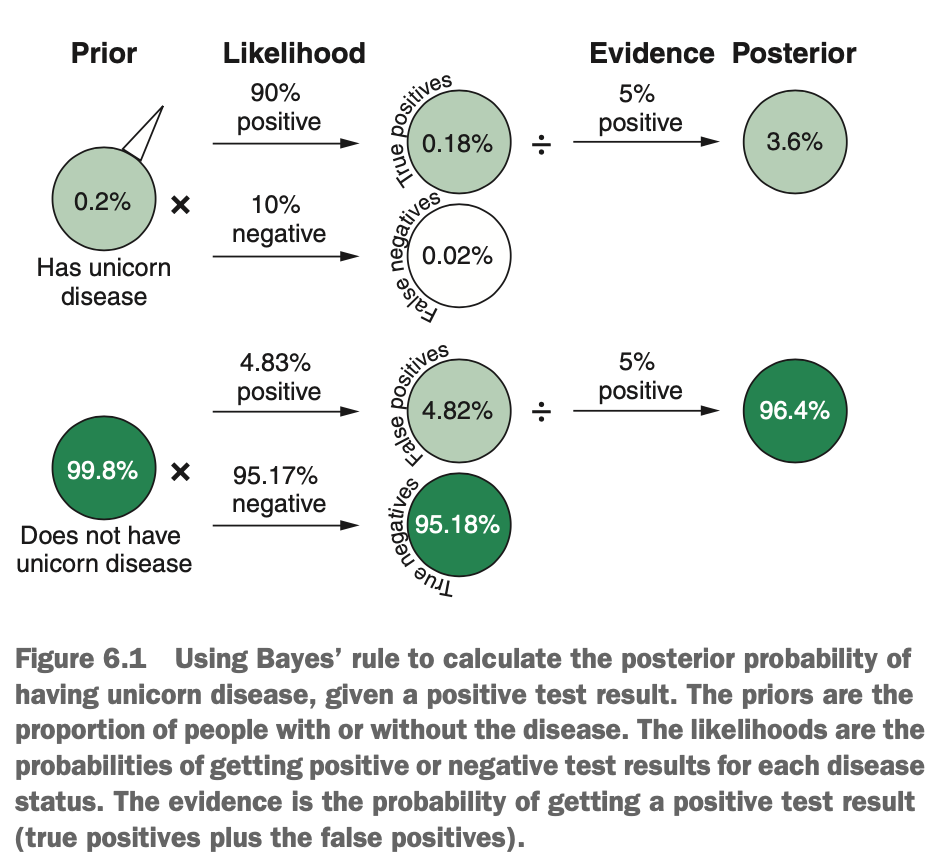

# What is the Naive Bayes Algorithm?

Imagine that 0.2% of the population of unicorn disease (symptoms include obsession with glitter & compulsive rainbow drawing). The test for unicorn disease has a true positive rate of 90% (if you have the disease, the test will detect it 90% of the time). When tested, 5% of the whole population get a positive result from the test. Based on this information, if we get a positive result from the test, what is the probability you have unicorn disease?

It may be instinct to say 90%, but this doesn't account for how prevalent the disease is & the proportion of test that are positive (which also includes false positives). So how do we estimate the probability of having the disease, given a positive test result?. We use Bayes' rule.

$$p(k|x) = \frac{p(x|k) * p(k)}{p(x)}$$

Where

* `p(k|x)` is the probability of having the disease (k) given a positive test result (x). This is called the *posterior probability*.
* `p(x|k)` is the probability of getting a positive test result if you *do* have the disease. This is called *likelihood*.
* `p(k)` is the probability of having the disease regardless of any test. This is the proportion of people in the population with the disease & is called the *prior probability*.
* `p(x)` is the probability of getting a positive test result & includes the true positives & false positives. This is called the *evidence*.

We can rewrite this in plain English:

$$posterior = \frac{likelihood * prior}{evidence}$$

So our likelihood (the probability of getting a positive test result if we do have unicorn disease) is 90%. Our prior probability (the proportion of people with unicorn disease) is 0.2%. Finally, our evidence (the probability of getting a positive test result) is 5%. We simply substitute these values into Bayes' rules:

$$posterior = \frac{0.9*0.002}{0.05} = 0.036$$

Phew! After taking into account the prevalence of the disease & the proportion of tests that are positive (including false positives), a positive test means that we only have a 3.6% chance of actually having the disease -- much better than 90%. This is the power of Bayes' rule -- it allows you to incorporate prior information to get a more accurate estimation of *conditional probabilities* (the probability of something, given the data).

{width=50%}

### Using Naive Bayes for Classification

Imagine that you have a database of tweets from the social media platform Twitter & you want to build a model that automatically classifies each tweet into a topic. The topics are

* Politics
* Sports
* Movies
* Other

You create four categorical predictor variables:

* Whether the word *opinion* is present
* Whether the word *score* is present
* Whether the word *game* is present
* Whether the word *cinema* is present

For each of the four topics, we can express the probability of a case belonging to that topic as

$$p(topic|words) = \frac{p(words|topic) * p(topic)}{p(words)}$$

How that we have more than one predictor variable, p(words|topic) is the likelihood of a tweet having that exact combination of words present, given the tweet is in that topic. We estimate this by finding the likelihood of having this combination of values of each predictor variable *individually*, given that the tweet belongs to that topic, & multiply them together. This looks like:

$$p(topic|words) = \frac{p(opinion|topic) * p(score|topic) * p(game|topic) * p(cinema|topic) * p(topic)}{p(opinion) * p(score) * p(game) * p(cinema)}$$

For example, if a tweet contains the words *opinion*, *score*, & *game*, but not *cinema*, then the likelihood would be as follows for any particular topic.

$$p(words|topic) = p(opinion_{yes}|topic) * p(score_{yes}|topic) * p(game_{yes}|topic) * p(cinema_{no}|topic)$$

Now, the likelihood of a tweet containing a certain word if its in a particular topic is simply the proportion of tweets from that topic that contain that word. Multiplying the likelihoods together from each predictor variable gives us the likelihood of observing this *combination* of predictor variable values (this combination of words), given a particular class. 

This is what makes naive Bayes "naive". By estimating the likelihood for each predictor variable individually & then multiplying them, we are making the very strong assumption that the predictor variables are *independent*.

In spite of this naive assumption being wrong quite often, naive Bayes tends to perform well even in the presence of non-independent predictors. Having said this, strongly dependent predictor variables will impact performance.

So the likelihood & prior probabilities are farily simple to compute & are the parameters learned by the algorithm; but what about the evidence, p(words)? In practice, because the values of the predictor variables are usually reasonably unique to each case in the data, calculating the evidence (the probability of observing that combination of values) is very difficult. As the evidence is really just a normalising constant that makes all the posterior probabilities sum to 1, we can discard it & simply multiply the likelihood & prior probability.

$$posterior \propto likelihood * prior$$

Note that instead of an = sign, we use $\propto$ to mean "proportional to", because without the evidence to normalise the equation, the posterior is no longer equal to the likelihood times the prior. this is okay, though, because proportionality is good enough to find the most likely class. Now, for each tweet, we calculate the relative posterior probability for each of the topics:

$$p(politics|words) \propto p(words|politics) * p(politics)$$
$$p(sports|words) \propto p(words|sports) * p(sports)$$
$$p(movies|words) \propto p(words|movies) * p(movies)$$
$$p(other|words) \propto p(words|other) * p(other)$$

Then we assign the tweet to the topic with the highest relative posterior probability.

### Calculating Likelihood for Categorical & Continuous Predictors

When we have a categorical predictor (such as whether a word is present or not), naive Bayes uses that proportion of training cases in that particular class, with that value of the predictor. When we have a continuous variable, naive Bayes (typically) assumes that the data within each group is normally distributed. The probability density of each case based on this fitted normal distribution is then used to estimate the likelihood of observing this value of the predictor in that class. In this way, cases near the mean of the normal distribution for a particular class will have high probability density for that class, & cases far away fromt he mean will have low probability density.

When your data has a mixture of categorical & continuous predictors, because naive Bayes assumes independence between data values, it simply uses the appropriate method for estimating the likelihood, depending on whether each predictor is categorical or continuous.