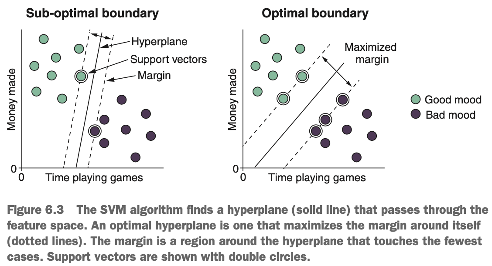
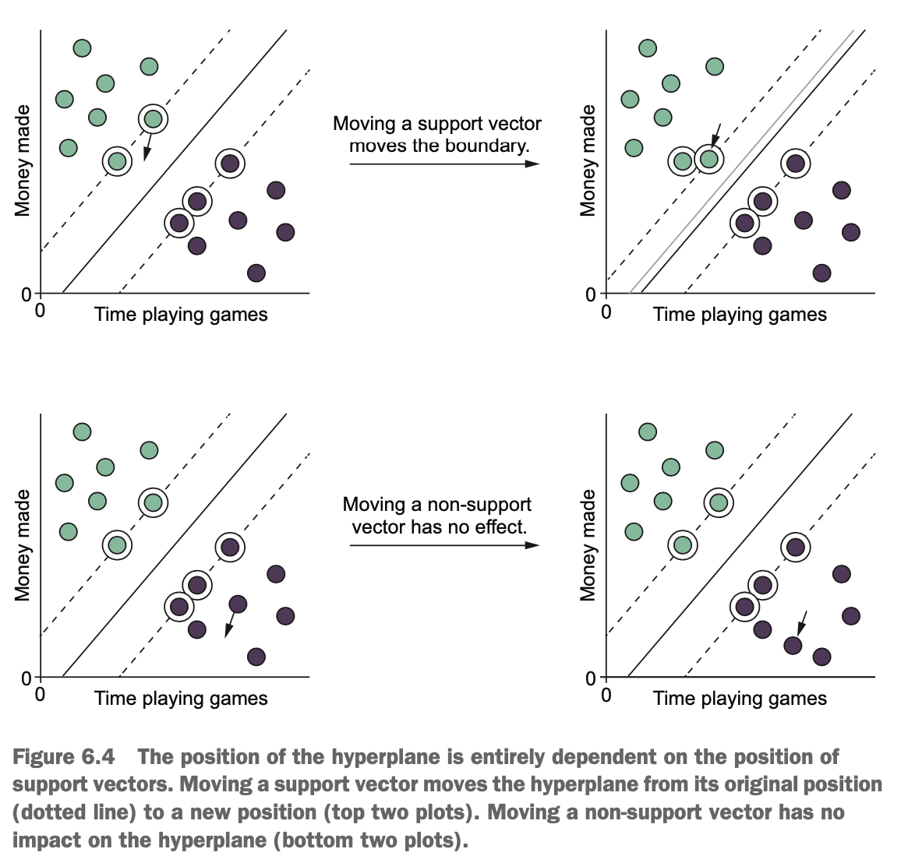
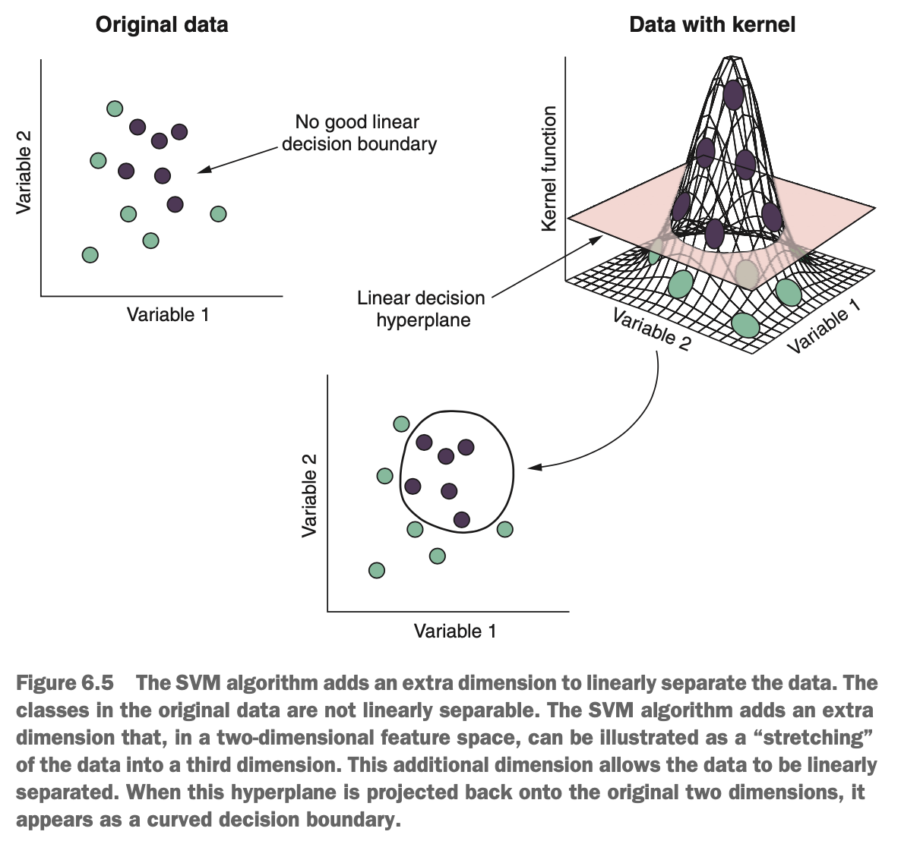
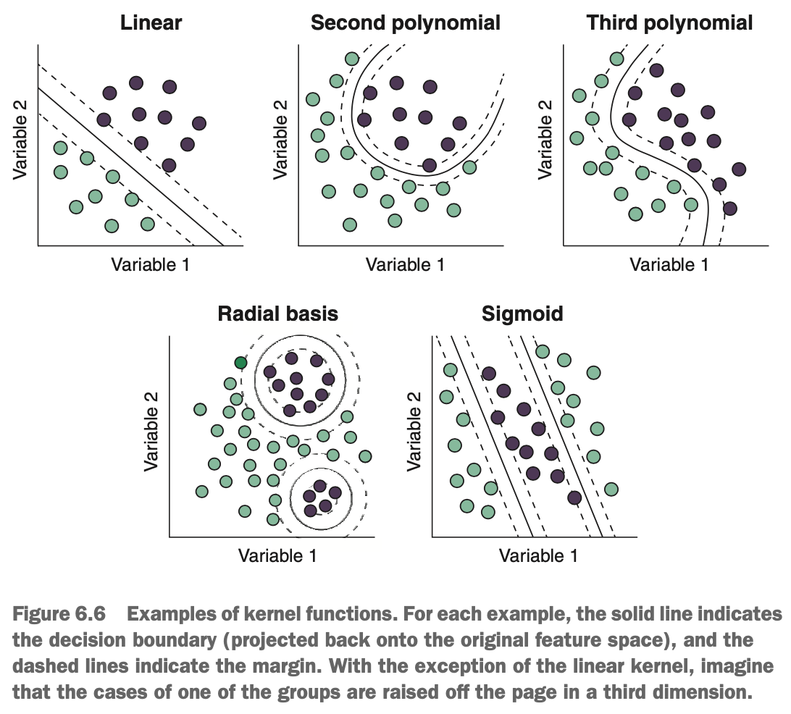
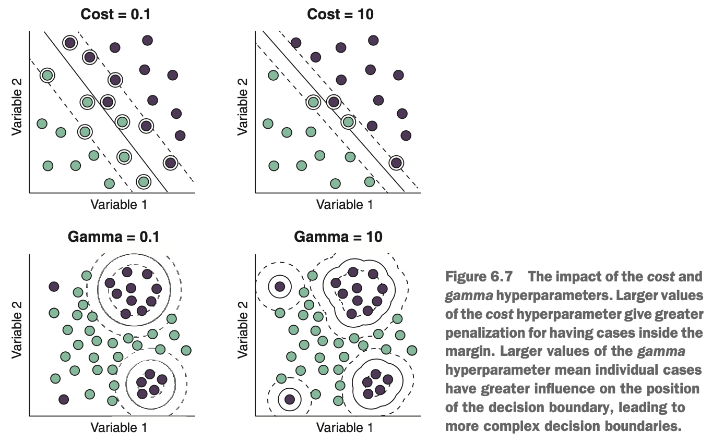
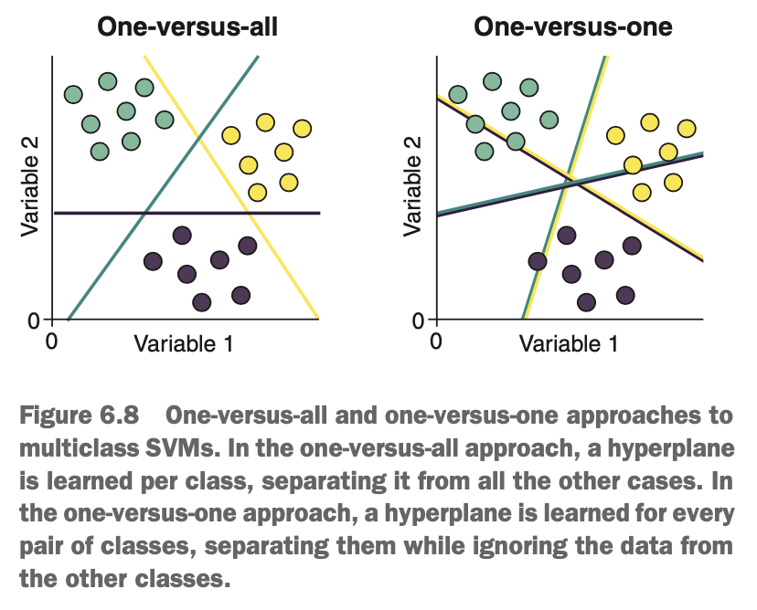
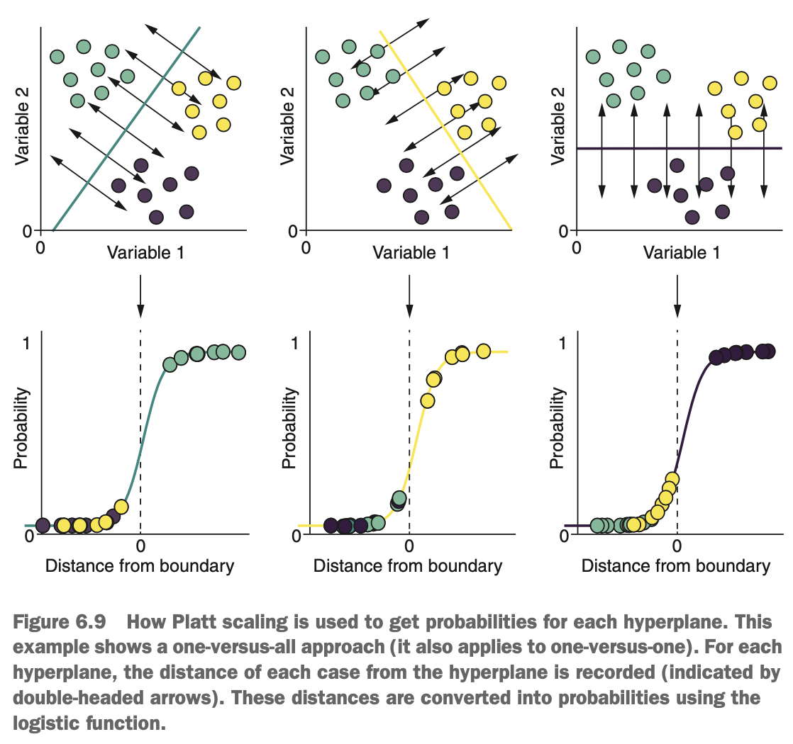

# What is the Support Vector Machine (SVM)?

Imagine that we would like to predict whether our boss will be in a good mood or not (a very important machine learning application btw). Over a couple of weeks, we record the number of hours we spend playing games at our desk & how much money we make the company each day. We also record the boss's mood the next day as good or bad (they're very binary). Our job is to use the SVM algorithm to build a classifier that will help use decide whether to avoid our boss on a particular day. The SVM algorithm will learn a linear hyperplane that separates the days our boss is in a good mood from the days they are in a bad mood. The SVM algorithm is also able to add an extra dimension to find the best hyperplane.

Take a look at the diagrams below. The plots show the data we recorded on the mood of our boss, based on how hard we're working & how much money we're making for the company.

{width=60%}

For problems where the classes are fully, linearly separable, there may be many different hyperplanes that do just as good a job at separating the classes in the training data. To find the optimal hyperplane (which will, hopefully, generalise better to unseen data), the algorithm finds the hyperplane that maximises the *margin* around itself. The margin is the distance around the hyperplane that touches the fewest training cases. The cases in the data that touch the margin are called *support vectors* because they support the position of the hyperplane (hence, the name of the algorithm).

The support vectors are the most important cases in the training set because they define the boundary between the classes. Not only this, but the hyperplane that the algorithm learns is entirely dependent on the position of the support vectors and none of the other cases in the training set. Take a look at the diagram below. If we move the position of one of the support vectors, then we move the position of the hyperplane. If, however, we move a non-support vector case, there is no influence on the hyperplane at all.

{width=60%}

SVMs are extremely popular, mainly for three reasons:

* They are good at finding ways of separating non-linearly separable classes.
* They tend to perform well for a wide variety of tasks.
* We now have the computational power to apply them to larger, more complex data sets.

The last point is important because it highlights a potential downside of SVMs -- they tend to be more computationally expensive to train than many other classification algorithms. For this reason, if you have a very large data set, & computational power is limited, it may be economical for you to try cheaper algorithms first & see how they perform.

### What if the Classes aren't Fully Separable?

In the diagrams shown so far, the classes have been fully separable. This is so we can clearly se how the positioning of the hyperplane is chosen to maximise the margin. But what happens in situations where the classes are *not* completely separable? How can the algorithm find a hyperplane when there is no margin that won't have cases *inside* it?

The original formulation of SVMs uses what is often referred to as a *hard margin*. If an SVM uses a hard margin, then no cases are allowed to fall within the margin. This means that if the classes are not fully separable, the algorithm will fail. This is a massive problem, because it relegates *hard_margin* SVM to handling only "easy" classification problems, where the training set can be clearly partitioned from its component classes. As a result, an extension to the SVM algorithm called *soft-margin SVM* is much more commonly used. In soft-margin SVM, the algorithm still learns a hyperplane that best separates the classes, but it allows cases to fall inside its margin.

The soft-margin SVM algorithm still tries to find the hyperplane that best separates the classes, but is penalised for having cases inside its margin. How severe the penalty is for having a case inside the margin is controlled by a hyperparameter that controls how "hard" or "soft" the margin is. The harder the margin is, the fewer cases will be inside it; the hyperplane will depend on a smaller number of support vectors. The softer the margin is, the more cases will be inside it; the hyperparameter will depend on a large number of support vectors. This has consequences for the bias-variance trade-off: if our margin is too hard, we might overfit the noise near the decision boundary, whereas if our margin is too soft, we might underfit the data & learn a decision boundary that has a bad job of separating the classes.

### SVMs for Non-Linearly Separable Data

So far, the SVM algorithm seems quite simple -- & for linearly separable classes like in our boss-mood example, it is. But one of the strengths of the SVM algorithm is that it can learn decision boundaries between classes that are *not* linearly separable. We've been telling you so far that the algorithm learns linear hyperplanes, so this may seem like a contradiction. Well, here's what makes the SVM algorithm so powerful: it can add an extra dimension to your data to find a linear way to separate nonlinear data.

Take a look at the diagram below. 

{width=60%}

The classes are not linearly separable using the two predictor variables, so the SVM algorithm adds an extra dimension to the data, such that a linear hyperplane can separate the classes in this new, higher-dimensional space. We can visualise this as a sort of deformation or stretching of the feature space. The extra dimension is called a *kernel*.

How does the algorithm find this new kernel? It uses mathematical transformation of the data called a *kernel function*. There are many kernel functions to choose from, each of which applies a different transformation to the data & is suitable for finding linear decision boundaries for different situations. The below diagram shows examples of situations where some common kernel functions can separate non-linearly separable data:

* Linear kernel (equivalent to no kernel)
* Polynomial kernel
* Gaussian radial basis kernel
* Sigmoid kernel

{width=60%}

### Hyperparameters of the SVM Algorithm

This is where SVMs become fun, difficult, painful, depending on your problem, computational budget, & sense of humour. We need to tune a lot of hyperparameters when building an SVM. This, coupled with the fact that training a single model can be moderately expensive, can make training an optimally performing SVM take quite a long time.

The SVM algorithm has quite a few hyperparameters to tune, but the most important ones to consider are the following:

* the *kernel* hyperparameter
* the *degree* hyperparameter, which controls how "bendy" the decision boundary will be for a polynomial kernel
* the *cost* or *C* hyperparameter, which controls how "hard" or "soft" the margin is
* the *gamma* hyperparameter, which controls how much influence individual cases have on the position of the decision boundary

The effects of the kernel function & *degree* hyperparameter are shown in the previous diagram. Note the difference in the shape of the decision boundary between the second & third-degree polynomials.

The *cost* (also called *C*) hyperparameter in soft-margin SVMs assigns a cost or penalty to having cases inside the margin or, put another way, tells the algorithm how bad it is to have cases inside the margin. A low cost tells the algorithm that it's acceptable to have more cases inside the margin & will result in wider margins that are less influenced by local differences near the class boundary. A high cost imposes a harsher penalty on having cases inside the boundary & will result in narrower margins that are more influenced by local differences near the class boundary. The effect of *cost* is illustrated for a linear kernel in the below diagram.

The *gamma* hyperparameter controls the influence that each case has on the position of the hyperplane & is used by all the kernel functions except the linear kernel. Think of each case in the training set jumping up & down shouting, "Me! Me! Classify me correctly!" The larger *gamma* is, the more attention-seeking each case is, & the more granular the decision boundary will be (potentially leading to overfitting). The smaller *gamma* is, the less attention-seeking each case will be, & the less granular the decision boundary will be (potentially leading to underfitting). The effect of *gamma* is illustrated for a Gaussian radial basis kernel in the below diagram.

`{width=70%}

In short, the SVM algorithm has multiple hyperparameters to tune!

### What if We Have More Than Two Classes?

So far, we've only shown examples of two-class classification problems. This is because the SVM algorithm is inherently geared toward separating two classes. But can we use it for multi-class problems (when we're trying to predict more than two classes)? Absolutely? When there are more than two classes, instead of creating a single SVM, we make multiple models & let them fight it out to predict the most likely class for new data. There are two ways of doing this:

* One-versus-all
* One-versus-one

In the one-versus-all (also called *one-versus-rest*) approach, we create as many SVM models as there are classes. Each SVM model describes a hyperplane that best separates one class from *all other classes*. Hence the names, one-versus-all. When we classify new, unseen cases, the models play a game of *winner takes all*. Put simply, the model that puts the new cases on the "correct" side of its hyperplane (the side with the class it separates from all the others) wins. The case is there assigned to the class that the model was trying to separate from the others. This is demonstrated in the diagram below.

{width=45%}

In the one-versus-one approach, we create an SVM model for every pair of classes. Each SVM model describes a hyperplane that best separates one class from *one other class*, ignoring data from the other classes. Hence, the name, one-versus-one. When we classify new, unseen cases, each model casts a vote. For example, if one model separates classes A & B, & the new data falls on the B side of the decision boundary, that model will vote for B. This continues for all the models, & the majority class vote wins.

So which do we choose? Well in practice, there is usually little difference in the performance of the two methods. Despite training more models (for more than three classes), one-versus-one is sometimes less computationally expensive than one-versus-all. This is because, although we're training more models, the training sets are smaller (because of the ignored cases). The implementation of the SVM algorithm called by mlr uses the one-versus-one approach.

There is, however, a problem with these approaches. There will often be regions of the feature space in which none fo the models give a clear winning class. For example, in the diagram above, observe the triangular space between the hyperplanes. If a new case appear inside the triangle, non of the three models would clearly win outright. This is a classification no-man's land. Though not as obvious in the diagram, this can also occur with the one-versus-one approach.

If there is no outright winner when predicting a new case, a technique called *Platt scaling* is used. Platt scaling takes the distances of the cases from each hyperplane & converts them into probabilities using the logistic function. The logistic function maps a continuous variable to probabilities between 0 & 1. Using Platt sclaing to make predictions proceeds like so:

1. For every hyperplane (whether we use one-versus-all or one-versus-one):
   * Measure the distance of each case from the hyperplane.
   * Use the logistic function to convert these distances into probabilities.
2. Classify new data as belonging to the class of the hyperplane that has the highest probability.

{width=60%}

We can see this being demonstrated in the above diagram, where the one-versus-all approach is being used, & have three separate hyperplanes (one to separate each class from the rest). The dashed arrows in the figure indicate distance in either direction, away from the hyperplanes. Platt scaling converts these distances into probabilities using the logistic function (the class each hyperplane separates from the rest has positive distance).

When we classify new, unseen data, the distance of the new data is converted into a probability using each of the three S-shaped curves, & the case is classified as one that gives the highest probability. Handily, all of this is taken care of for us in the implementation of SVM called by mlr. If we supply a three-class classification task, we will get a one-versus-one SVM model with Platt scaling without having to change our code.
