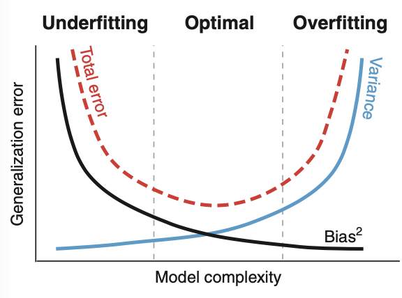
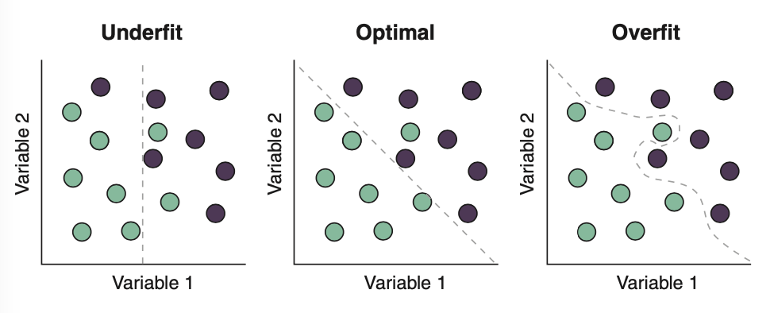
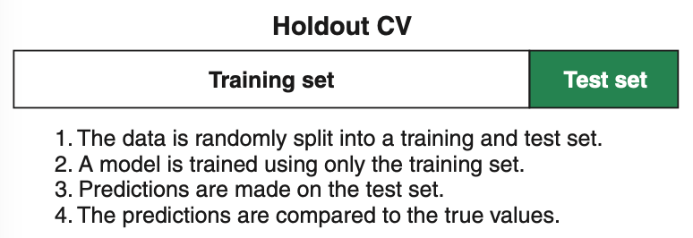
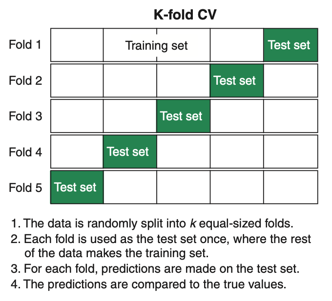
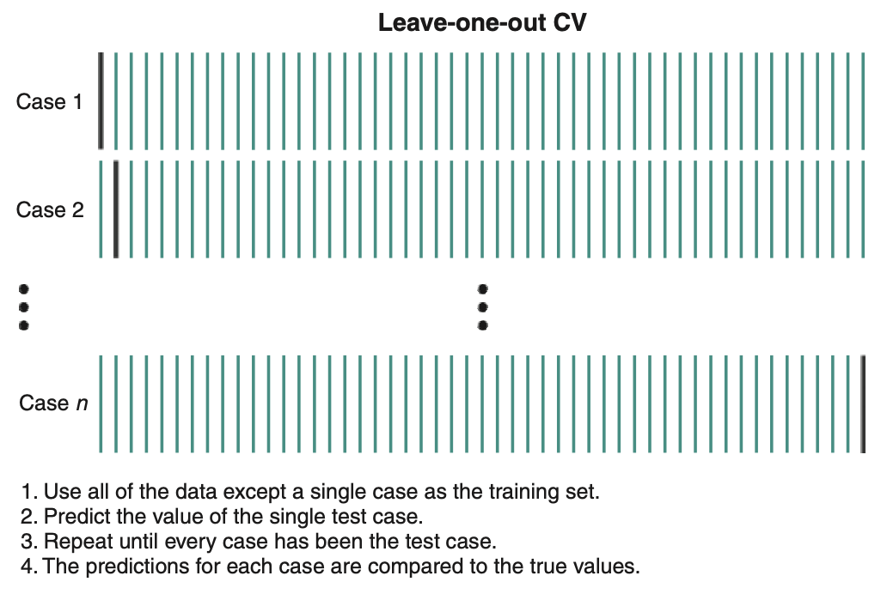
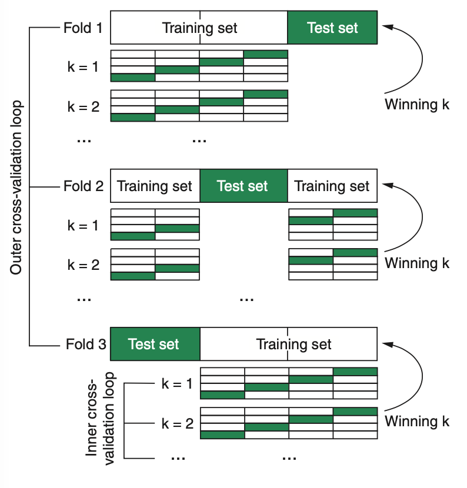

```{r, include = FALSE}
library(tidyverse)
library(plotly)
library(mlr)
library(mclust) # diabetes data set
```


# Building Your First kNN Model

Imagine we work in a hospital & are trying to improve the diagnosis of patients with diabetes. We collect diagnostic data over a few months from suspected diabetes patients & record whether they were diagnosed as healthy, chemically diabetic, or overtly diabetic. We will use the kNN algorithm to train a model that can predict which of these classes a new patient will belong to, so that diagnoses can be improved. This is a three-class classification problem.


### Loading & Exploring the Dataset

```{r}
diabetesTib <- as_tibble(diabetes)
head(diabetesTib)
summary(diabetesTib)
```

* **class** The type of of diabetes: *Normal*, *Overt*, *Chemical*
* **glucose** Area under plasma glucose curve after a 3 hour oral glucose tolerance test (OGTT)
* **insulin** Area under plasma insulin curve after a 3 hour oral glucose tolerance test (OGTT)
* **sspg** Steady state plasma glucose

To show how the variables are related, we will plot them against each other whilst separating the classes by colour.

```{r}
ggplotly(
  ggplot(diabetesTib, aes(glucose, insulin, colour = class, shape = class)) +
    geom_point() + 
    theme_bw() +
    labs(x = "Glucose", y = "Insulin", 
         title = "Insulin vs Glucose; Diabetic Classification")
)

ggplotly(
  ggplot(diabetesTib, aes(sspg, insulin, colour = class, shape = class)) +
    geom_point() + 
    theme_bw() +
    labs(x = "SSPG", y = "Insulin", 
         title = "Insulin vs SSPG; Diabetic Classification")
)

ggplotly(
  ggplot(diabetesTib, aes(sspg, glucose, colour = class, shape = class)) +
    geom_point() + 
    theme_bw() +
    labs(x = "SSPG", y = "Glucose", 
         title = "Glucose vs SSPG; Diabetic Classification")
)
```

Looking at the data, we can see there are differences in continuous variables among the three classes, so let's build a kNN classifier that we can use to predict diabetic status from measurements (*glucose*, *insulin*, *sspg*) of future patients.

**Note: Our dataset only consists of continuous predictor variables, but in the event that we are working with categorical variables, be sure to encode them as numbers. Otherwise, distance metrics other than Euclidean distance may be used.**

**Note: It is also important kNN (and many machine learning algorithms) to scale the predictor variables by dividing them by their standard deviation. This preserves the relationships between the variables, but ensures that variables measured on larger scales (glucose is measured in mg/dL, insulin is measured in pmol/L) aren't given more importance by the algorithm. We don't need to scale the predictors ourselves, because the kNN algorithm wrapped by the mlr package does it for us.**


### Using mlr to Train Your First kNN Model

We understand the problem we're trying to solve (classifying new patients into one of three classes), & now we need to train the kNN algorithm to build a model that will solve that problem. Building a machine learning model with the mlr package has three main stages:

1. **Define the task.** The task consists of the data & what we want to do with it. In this case, the data is `diabetesTib`, & we want to classify the data with the `class` variable as the target variable.
2. **Define the learner.** The learner is simply the name of the algorithm we plan to use, along with any additional arguments the algorithm accepts.
3. **Train the model.** This stage is what it sounds like: you pass the task to the learner & the learner generates a model that you can use to make future predictions.


### Defining the Task: Telling mlr What We're Trying to Achieve

We start by defining our task. The components needed to define a task are:

* The data containing the predictor variables (variables we hope contain information needed to make predictions/solve our problem)
* The target variable we want to predict

We want to build a classification model, so we use the `makeClassifTask()` function to define a classification ask. We supply the name of our tibble as the `data` argument and the name of the factor that contains the class labels as the `target` argument.

```{r}
diabetesTask <- makeClassifTask(data = diabetesTib, target = "class")
diabetesTask
```

If we call the task, we see that it's a classification task on the `diabetesTib` tibble, whose target is the `class` variable. We also get some information about the number of observations & the number of different types of variables. Some additional information includes whether we have missing data, the number of observations in each class, & which class is considered to be the positive class (only relevant for two-class tasks).


### Defining the Learner: Telling mlr Which Algorithm to Use

Next, we will define our learner. The components needed to define a learner are as follows:

* The class of algorithm we are using:
   - `classif.` for classification
   - `regr.` for regression
   - `cluster.` for clustering
   - `surv.` & `multilabel.` for prediction survival & multilabel classification
* The algorithm we are using
* Any additional options we wish to use to control the algorithm

We use the `makeLeaner` function to define a learner. The first argument to the `makeLearner()` function is the algorithm that we're going to use to train our model. In this case, we want to use the kNN algorithm, so we supply `classif.knn` as the argument. Note how the class (`classif.`) is joined to the name (`knn`) of the algorithm. The second argument `par.vals` stands for parameter values, which allows us to specify the number of k-nearest neighbours we want the algorithm to use. For now, we will set k = 2.

```{r}
knn <- makeLearner("classif.knn", par.vals = list("k" = 2))
knn
```


### Training the Model: Putting It All Together

Now that we've defined the task & learner, we can train the model. This is achieved with the `train()` function, which takes the learner as the first argument & the task as its second argument.

```{r}
knnModel <- train(knn, diabetesTask)
knnModel
```

We have our model, so let's pass the data through it to see how it performs. The `predict()` function takes unlabeled data & passes it through the model to get the predicted classes. The first argument is the model, & the data being passed to it is given as the `newdata` argument.

```{r, warning = FALSE}
knnPred <- predict(knnModel, newdata = diabetesTib)
knnPred
```

We can pass these predictions as the first argument of the `performance()` function. This function compares the classes predicted by the model to the true classes, and returns performance metrics of how well the predicted & true values match each other. We specify the performance metrics we want the function to return by supplying them as a list to the `measures` argument. The two measures we will ask for are `mmce`, the mean mis-classification error, & `acc`, the accuracy. MMCE is simply the proportion of cases classified as a class other than their true class. Accuracy is the opposite of this, the proportion of cases that were correctly classified by the model. They sum to 1.00.

```{r}
performance(knnPred, measures = list(mmce, acc))
```

Our model is correctly classifying approximately 95.2% of the cases. Does this mean it will perform well on new, unseen patient? We don't know. Evaluating model performance by asking it to make predictions on data we used to train it in the first place tells us very little about how the model will perform when making predictions on completely unseen data. Therefore, we should *never* evaluate a model's performance this way. 


***


# Bias/Variance Trade-off

An important concept in machine learning is the *bias-variance trade-off*. There are two sources of error in model building: underfitting & overfitting. 

In underfitting, we have included too few predictors or too simple a model to adequately describe the relationships/patterns in the data. The result is a model that is said to be *biased*: a model that performs poorly on both the data we use to train it & on new data.

Overfitting is the opposite of underfitting & describes the situation where we include too many predictors or too complex a model, such that we are modeling not only the relationships/patterns in our data, but also the *noise*. Noise in a dataset is variation that is not systematically related to variables we have measured, but rather is due to inherent variability and/or error in measurement of our variables. The pattern of noise is very specific to an individual dataset, so if we start to model the noise, our model may perform very well on the data we trained it on but give variable results for future new data sets.

Underfitting & overfitting both introduce error & reduce the *generalisability* of the model: the ability of the model to generalise the future, unseen data. They are also opposed to each other: somewhere between a model that underfits & has a bias, & a model that overfits & has variance, is an optimal model that balances the bias-variance trade-off.

{width=40%}

Can you see in the below diagram that the underfit model poorly represents the patterns in the data, & the overfit model is too granular & models noise in the data instead of real patterns?

{width=60%}

In the case of our kNN algorithm, selecting a small value of k (where only a small number of very similar cased are included in the vote) is more likely to model the noise in our data, resulting in a more complex model that is overfit & will produce a lot of variance when we use it to classify future patients. In contrast, selecting a large value of k (where more neighbours are included in the vote) is more likely to miss local differences in our data, resulting in a less complex model that is underfit & is biased toward misclassifying certain types of patients.

The question now is then, "How do I tell if I'm under- or overfitting? The answer lies in a technique called *cross-validation*.


***


# Cross-Validation

In our diabetes example, we trained the model & tested it with the same data we used to train it. This isn't effective at telling us how the model performs when predicting new data.

One possible solution is to train the model on all of the data available, then over the next weeks/months, as we collect new data, pass it through the model & evaluate how the model performs. This approach is slow & inefficient.

Instead, we typically split our data in two. We use one portion to train the model, the *training set*. We use the remaining portion to test the model, the *test set*. We then evaluate how close the model's predictions on the test set are to their true values. Measuring how well the trained model performs on the test set helps us determine whether our model will perform well on unseen data, or whether we need to improve on the model.

This process is called *cross-validation* (CV), & it is an extremely important approach in any supervised machine learning pipeline. Once we have cross-validated our model & are happy with its performance, we then use all the data we have (including the data in the test set) to train the final model (because typically, the more data we train our model with, the less bias it will have).

There are 3 common cross-validation approaches:

* Holdout cross-validation
* K-fold cross-validation
* Leave-one-out cross-validation


### Holdout Cross-Validation a.k.a. 80/20 Train/Test Splits


Holdout CV is the simplest method to understand: we simply "hold out" a random proportion of your data as your test set & train your model on the remaining data. Often times, it is a 80/20 train/test split. We then pass the test set through the model & calculate its performance metrics.

{width=50%}

The first step when employing any CV in mlr is to make a resampling description, which is simply a set of instructions for how the data will be split into test & training sets. The first argument to the `makeResampleDesc()` function is the CV method we're going to use: in this case `"Holdout"`. For holdout CV, we need to tell the function what proportion of the data will be used as the training set, so we supply this to the `split` argument.

```{r}
holdout <- makeResampleDesc(method = "Holdout", split = 4/5, stratify = TRUE)
holdout
```

We include an additional argument, `stratify = TRUE` that askes the function to ensure that when it splits the data into training & testing sets, it tries to maintain the proportion of each class of patient in each set. This is especially important in a classification such as this one, where the groups are unbalanced (we have more healthy patients than both other groups combined) because, otherwise, we could get a test set with very few of one of our smaller classes.

Now that we've defined how we're going ot cross-validate our learner, we can run the CV using the `resample()` function. We supply the learner & task that we created, & the resampling method we defined a moment ago, to the `resample()` function. We also ask it to give us measures of MMCE & accuracy. 

```{r, message = FALSE}
holdoutCV <- resample(learner = knn, task = diabetesTask, 
                      resampling = holdout, measures = list(mmce, acc))

```

The `resample()` function prints the performance measures when you run it, but you can access them by extracting the `$aggr` component from the `resampling` object.

```{r}
holdoutCV$aggr
```

You'll notice 2 things:

* The accuracy of the model as estimated by holdout cross-validation is less than when we evaluated its performance on the data we used to train the full model. This exemplifies my point earlier that models will perform better on the data tha trained them than on unseen data.
* Different iterations of the holdout cross-validation will yield different performance metrics. The reason for this variance is that the data is randomly split into testing & training sets. Sometimes the split is such that the model performs well on the test set. Sometimes the split is such that it performs poorly.

To get a better idea of which groups are being correctly classified & which are being misclassified, we construct a confusion matrix. A *confusion matrix* is simply a tabular representation of the true & predicted class of each case in the test set.

With mlr, we can calculate the confusion matrix using the `calculateConfusionMatrix()` function. The first argument is the `$pred` component of our `holdoutCV` object, which contains the true & predicted classes of the test set. The optional argument `relative` asks the function to show the proportion of each class in the true & predicted class labels.

```{r}
calculateConfusionMatrix(holdoutCV$pred, relative = TRUE)
```

The absolute confusion matrix is easier to interpret. The rows show the true class labels & the columns show the predicted labels. The number represent the number of cases in every combination of true class & predicted class. Correctly classified patients are found on the diagonal of the matrix (where true class == predicted class).

The relative confusion matrix looks a little more intimidating, but the principal is the same. This time, instead of the number of cases for each combination of true class & predicted class, we have the proportion. The number before the / is the proportion of the row in this column, & the number after the / is the proportion of the column in this row. 

Confusion matrices help us understand which classes our model classifies well & which ones it does worse at classifying. 

As the performance metrics reported by holdout CV depend so heavily on how much of the data we use as the training & test sets, we should try to avoid it unless the model is expensive to train, so go with k-fold CV instead. The only real benefit of holdout CV is that it is computationally less expensive than the other forms of CV. This can make it the only viable CV method for computationally expensive algorithms. But the purpose of CV is to get as accurate an estimation of model performance as possible,  holdout CV may give very different results each time you apply it, because not all of the data is used in the training set & test set. This is where other forms of CV come in.


### K-Fold Cross-Validation


In k-fold CV, we randomly split the data into approximately equal-sized chunks called *folds*. Then we reserve on eof the folds as a test set & use the remaining data as a training set (just like in holdout). We pass the testset through the model & make a record of the relevant performance metrics. Now, we use a different fold of the data as our test set & do the same thing. We continue until all the folds have been used once as the test set. We then get an average of the performance metric as an estimate of model performance. 

{width=40%}

This approach will typically give a more accurate estimate of model performance because every case appears in the test set once, & we are averaging the estimates over many runs. But we can improve this a little by using repeated k-fold CV, where after the previous procedure, we shuffle the data around & perform it again.

For example, a commonly chosen value of k for k-fold is 10. Again, this depends on the size of the data, among other things, but it is a reasonable value for many datasets. This means we split the data into 10 nearly qual-sized chunks to perform the CV. If we perform this procedure 5 times, then we have a 10-fold CV repeated 5 times (this is not the same as 50-fold CV), & the estimate of model performance will be the average of 50 different runs.

Therefore, if you ahve the computational power, it is usually preferred to use repeated k-fold CV instead of ordinary k-fold. This is what we'll be using in many examples in this book.

We perform k-fold CV in the same way as holdout. This time, when we make our resampling description, we tell it we're going to use repeated k-fold cross-validation (`"RepCV"`) & we tell it how many folds we want to split the data into. The default number of folds is 10, which is often a good choice. Next, we tell the function that we want to repeat the 10-fold CV 50 times with the `reps` argument. This gives us 500 performance measures to average across! Again, we ask for the classes to be stratified among the folds.

```{r, message = FALSE}
kFold <- makeResampleDesc(method = "RepCV", folds = 10, reps = 50,
                          stratify = TRUE)
kFoldCV <- resample(learner = knn, task = diabetesTask,
                    resampling = kFold, measures = list(mmce, acc))
```

Now let's extract the average performance measures.

```{r}
kFoldCV$aggr
```

The model correctly classified more than 89% of cases on average, much lower than when we predicted the data we used to train the model. If we rerun the `resample()` function a couple of times as well, we'll see that the estimate is much more stable that if we repeated holdout CV.

Your goal when cross-validating a model is to get as accurate & stable an estimate of model performance as possible. Broadly speaking, the more repeats you do, the more accurate & stable the estimates become. At some point though, having more repeats won't improve the accuracy/stability of the performance estimate. **How do we decide on how many repeats to perform then? A sound approach is to choose a number of repeats that is computationally reasonable, run the process a few times, & see if the average performance estimate varies a lot. If not, great. If it does, increase the number of repeats.**

Now, let's build the confusion matrix based on the repeated k-fold CV.

```{r}
calculateConfusionMatrix(kFoldCV$pred, relative = TRUE)
```

**Note: Notice that the number of cases is much larger than the reported amount. This is because we repeated the procedure 50 times.**


### Leave-Out-Out Cross-Validation

Leave-one-out CV can be thought of as the extreme of k-fold CV: instead of breaking the data into folds, we reserve a single observation as a test set, train the model on the whole rest of the data, & then pass the test case through it & record the relevant performance metrics. Next, we do the same thing but select a different observation as the test case. We continue doing this until the average of the performance metrics. 

Because the test set is only on a single observation, leave-on-out CV tends to give quite variable estimates of model performance (because the performance estimate of each iteration depends on correctly labeling that single test case). But it can give less variable estimates of model performance than k-fold when your data set is small. 

{width=60%}

When you have a small data set, splitting it up into k-folds will leave you with a very small training set. The variance of a model trained on a small data set tends to be higher because it will be more influenced by sampling error/unusual cases. Therefore, leave-one-out CV is useful for small data sets where splitting it into k-folds would give variable results. It is also computationally less expensive than repeated k-fold CV. 

Creating a resampling description for leave-one-out is just as simple as for holdout & k-fold CV. We specify leave-one-out CV when making the resample description by supplying `"LOO"` as the argument to the method. Because the test set is only a single case, we obviously can't stratify with leave-one-out. Also because each case is used once as the test set, with all the other data used as the training set, there's no need to repeat the procedure.

```{r}
LOO <- makeResampleDesc(method = "LOO")
```

Now, let's run the CV & get the average performance measures.

```{r, message = FALSE}
LOOCV <- resample(learner = knn, task = diabetesTask, resampling = LOO,
                  measures = list(mmce, acc))
LOOCV$aggr
```

If we rerun the CV over & ver again, you'll find that for this model & data, the performance estimate is more variable than for k-fold but less variable than for the hold-out we ran earlier.

Once again, let's look at the confusion matrix.

```{r}
calculateConfusionMatrix(LOOCV$pred, relative = TRUE)
```

So you now know how to apply 3 commonly used types of cross-validation. If we've cross-validated our models & are happy that it will perform well enough on unseen data, then we would train the model on all of the data available to use, & use this to make future predictions.

But, there are more ways to improve our kNN model. Recall that we manually chose a value of 2 for k. Well, randomly picking a value of k isn't very clever, & there are much better ways we can find the optimal value.


***


# What Algorithms Can Learn & What They Must Be Told: Parameters & Hyperparameters

Machine learning models often have *parameters* associated with them. A parameter is a variable or value that is estimated from the data & that is internal to the model & controls how it makes predictions on new data. An example of a model parameter is the slope of a regression line.

In the kNN algorithm, *k* is not a parameter, because the algorithm doesn't estimate it from the data (in fact, the kNN algorithm doesn't actually learn any parameters). Instead, *k* is what's know as a *hyperparameter*: a variable or option that controls how a model makes predictions but is not estimated from the data. As data scientists, we don't provide parameters to our models. We simply provide the data & the algorithms learn the parameters for themselves. We do, however, need to provide whatever hyperparameters they require.

So because *k* is a hyperparameter of the kNN algorithm, it can't be estimated by the algorithm itself & it's up to us to choose a value. How do we decide? There are 3 ways to choose *k* or in fact, any hyperparameter.

* Pick a "sensible" or default value that has worked on similar problems before. This option is a bad idea. You have no way of knowing whether the value of *k* you've chosen is the best one. Just because a value worked on other data sets doesn't mean it will perform well on this data set. This is the choice of the lazy data scientist who doesn't care much about getting the most from their data.
* Manually try a few different values & see which one gives you the best performance. This option is a bit better. The idea is that you pick a few sensible values of *k*, build a model with each of them, & see which model performs the best. This is better because you're more likely to find the best-performing value of *k*, but you're still not guaranteed to find it * doing this manually could be tedious & slow. This is the choice of the data scientist who cares, but doesn't really know what they're doing.
* Use a procedure called hyperparameter turning to automate the selection process. This solution is the best, but also the most computationally expensive. It maximises the likelihood of you finding the best performing value of k while also automating the process for you.

But how does changing the value of *k* impact model performance? Well, values of *k* that are too low may start to model noise in the data. For example, if we set *k* = 1, then a healthy patient could be misclassified as chemically diabetic just because a single chemically diabetic patient with an unusually low insulin level was their nearest neighbour. In this situation, instead of just modeling systematic differences between the classes, we're also modeling the noise & unpredictable variability in the data.

On the other hand, if we set *k* too high, a large number of dissimilar patients will be included into the vote, & the model will be insensitive to local differences in the data. This is, of course, the bias-variance trade-off we talked about earlier.


***


# Tuning K to Improve the Model

We will apply hyperparameter turning to optimise the value of *k* for our model. An approach we could follow would be to build models with different values of *k* using our full data & pass the data back through the model to see which value of *k* gives us the best performance. Once again, this is bad practice because it tells us nothing about how the model performs on predicting new data, & there's a large change we'll get a value of *k* that overfits the data set we tuned it on. So, we will rely on cross-validation to help us guard against overfitting.

The first task is to define a range of values over which mlr will try when tuning *k*.

```{r}
knnParamSpace <- makeParamSet(makeDiscreteParam("k", values = 1:10))
knnParamSpace
```

The `makeDiscreteParam()` function inside the `makeParamSet()` function allows us to specify that the hyperparameter we're going to be tuning is *k* & that we want to search the values between 1 & 10 for the best value of *k*. As its name suggests, `makeDiscreteParam()` is used to define discrete hyperparameter values, such as *k* in kNN. The `makeParamSet()` function defines the hyperparameter space we defined as a parameter set, & if we wanted to tune more than one hyperparameter during tuning, we would simply separate them by commas inside this function.

Next, we define how we want mlr to search the parameter space. There are a few options for this, but for this example, we will use the grid search method. This is the simples method -- it tries every single value int he parameter space when looking for the best-performing value. **Note: For tuning continuous hyperparameters or when tuning several hyperparameters at once, grid search because prohibitively expensive, so try other methods.**

```{r}
gridSearch <- makeTuneControlGrid()
gridSearch
```

We then define how we're going to cross-validate the tuning procedure -- we're going to use repeated k-fold CV. The principle is that for every value in the parameter space (integers 1 to 10), we perform repeated k-fold CV. For each value of *k* we take the average performance measure across all those iterations & compare it with the average performance measure across all the other values of *k* we tried. This will hopefully give us the value of *k* that performs best.

```{r}
cvForTuning <- makeResampleDesc("RepCV", folds = 10, reps = 20, stratify = TRUE)
```

Now, we call the `tuneParams()` function to perform the tuning.

```{r}
tunedK <- tuneParams("classif.knn", task = diabetesTask, 
                     resampling = cvForTuning,
                     par.set = knnParamSpace, control = gridSearch)
tunedK
```

The first & second arguments are the names of the algorithm & task we're applying, respectively. We give our CV strategy as the `resampling` argument, the hyperparameter space we define as the `par.set` argument, & the search procedure to the `control` argument.

If we call our `tunedK` object, we get the best-performing value of *k*, 7, & the average MMCE value for that *k*. We can also visualise the tuning process & train the final model with our tuned value of *k*.

```{r}
knnTuningData <- generateHyperParsEffectData(tunedK)
plotHyperParsEffect(knnTuningData, x = "k", y = "mmce.test.mean",
                    plot.type = "line") +
  theme_bw()

tunedKnn <- setHyperPars(makeLearner("classif.knn"), par.vals = tunedK$x)
tunedKnnModel <- train(tunedKnn, diabetesTask)
```

This is as simple as wrapping the `makeLearner()` function, where we make a new kNN learner, inside the `setHyperPars()` function, & providing the tuned value of *k* as the `pars.vals` argument. We then train our final model as before, using the `train()` function.


### Including Hyperparameter Tuning in Cross-Validation

Whenever we perform some kind of preprocessing on our data or model, such as tuning hyperparameters, it's important to include this preprocessing inside our CV, so that we cross-validate the whole model-training procedure. This takes the form of nested CV, where an inner loop cross-validates different values of our hyperparameter, & then the winning hyperparameter value gets passed to an outer CV loop. In the outer CV loop, the winning hyperparameters are used for each fold.

Nested CV proceeds like this:

1. Split the data into training & test sets (holdout, k-fold, leave-one-out). This division is called the outer loop.
2. The training set is used to cross-validate each value of our hyperparameter search space (using whatever method we decide). This is called the inner loop.
3. The hyperparameter that gives the best cross-validated performance from each inner loop is passed to the outer loop.
4. A model is trained on each training set of the outer loop, using the best hyperparameter from its inner loop. These models are used to make predictions on their test sets.
5. The average performance metrics of these model across the outer loop are then reported as an estimate of how the model will perform on unseen data.

{width=50%}

In the diagram above, the outer loop is 3-fold CV. For each fold, inner sets of 4-fold CV are applied, only using the training set from the outer loop. This 4-fold cross-validation is used to evaluate the performance of each hyperparameter value we're searching over. The winning value of *k* (the one that gives the best performance) is then passed to the outer loop, which is then used to train the model, & its performance is evaluated on the test set. 

What is the purpose of this, doing all of this tuning? It validates our entire model-building procedure, including the hyperparameter-tuning step. The cross-validated performance estimate we get from this procedure should be a good representation of how we expect our model to perform on completely new, unseen data. 

The process looks pretty complicated, but is easy to perform with mlr. First, we define how we're going to perform the inner & outer CV.

```{r}
inner <- makeResampleDesc("CV")
outer <- makeResampleDesc("RepCV", folds = 10, reps = 5)
```

We've chosen to perform ordinary k-fold cross-validation fro the inner loop (10 is the default number of folds) & 10-fold CV, repeated 5 times, for the outer loop. Next, we make a *wrapper*, which is basically a learner tied to some pre-processing step. In our case, this is hyperparameter tuning, so we create a tuning wrapper with `makeTuneWrapper()`.

```{r}
knnWrapper <- makeTuneWrapper("classif.knn", resampling = inner,
                              par.set = knnParamSpace, control = gridSearch)
```

Here, we supply the algorithm as the first argument & pass our inner CV procedure as the `resampling` argument. We supply our hyperparameter search space as the `par.set` argument & our `gridSearch` method as the `control` argument. This "wraps" together the learning algorithm with the hyperparameter tuning procedure that will be applied inside the inner CV loop. Now that we've defined our inner & outer CV strategies & our tuning wrapper, we run the nested CV procedure.

Now that we've defined our inner & outer CV strategies & our tuning wrapper, we run the nested CV procedure:

```{r, message = FALSE}
cvWithTuning <- resample(knnWrapper, diabetesTask, resampling = outer)
```

The first argument is the wrapper we created above; the second argument is the name of the task, & we supply our outer CV strategy as the resampling argument. 

```{r}
cvWithTuning
```

The model is estimated to correctly classify approximately 91% of cases on unseen data. This is not bad, & now we that we've cross-validated our model properly, we can be confident we're not overfitting our data.


***


# Using our Model to Make Predictions

We have our model, & we're free to use it to classify new patients. Let's imagine new patients come to the clinic.

```{r}
newDiabetesPatients <- tibble(glucose = c(82, 108, 300),
                              insulin = c(361, 288, 1052),
                              sspg = c(200, 186, 135))
newDiabetesPatients
```

We can pass these new patients into our model & get their predicted diabetes status.

```{r}
newPatientsPred <- predict(tunedKnnModel, newdata = newDiabetesPatients)
getPredictionResponse(newPatientsPred)
```

Congratulations! You've built your first machine learning model, but also covered some reasonably complex theory too!


***


# Strengths & Weaknesses of kNN

While it often isn't easy to tell which algorithms will perform well for a given task, the strengths & weaknesses will help you decide whether kNN will perform well for your task.

The strengths of the kNN algorithm are as follows:

* The algorithm is very simple to understand.
* There is no computation cost during the learning process; all the computation is done during prediction.
* It makes no assumptions about the data, such as how it's distributed.

The weaknesses of the kNN algorithm are as these:

* It cannot natively handle categorical variables (they must be recoded).
* When the training set is large, it can be computationally expensive to compute the distance between new data & all the cases in the training set.
* The model can't be interpreted in terms of real-world relationships in the data.
* Prediction accuracy can be strongly impacted by noisy data & outliers.
* In high-dimensional datasets, kNN tends to perform poorly. This is called the *curse of dimensionality.


***


# Summary

* kNN is a simple supervised learning algorithm that classifies new data based on the class membership of its nearest *k* cases in the training set.
* To create a machine learning model in mlr, we create a task & learner, & then train the model using them.
* MMCE is the mean misclassification error, which is the proportion of misclassified cases in a classification problem. It is the opposite of accuracy.
* The bias-variance trade-off is the balance between two types of error in predictive accuracy. Models with high bias are underfit, & models with high variance are overfit.
* Model performance should never be evaluated on the data used to train it -- cross-validation should be used.
* Cross-validation is a set of techniques for evaluating model performance by splitting the data into training & test sets.
* Three common types of cross-validation are holdout, where a single split is used; k-fold, where the data is split into *k* chunks & the validation is performed on each chunk; & leave-one-out, where the test set is a single case.
* Hyperparameters are options that control how machine learning algorithms learn, which cannot be learned by the algorithm itself. Hyperparameter tuning is the best way to find optimal hyperparameters.
* If we perform a data-dependent preprocessing step, such as hyperparameter tuning, it is important to incorporate this into our cross-validation strategy, using nested cross-validation.