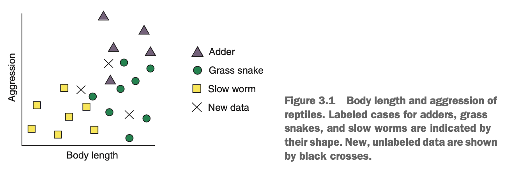
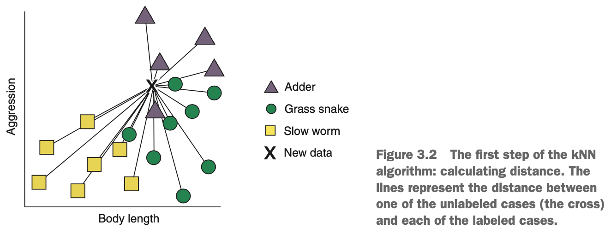
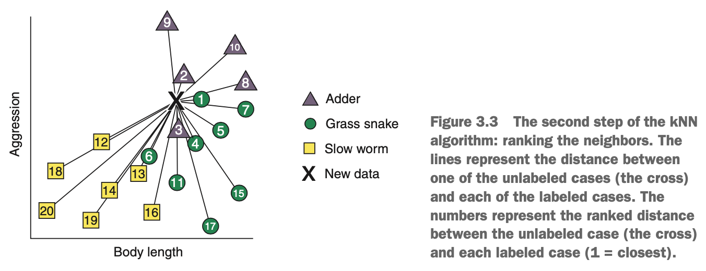
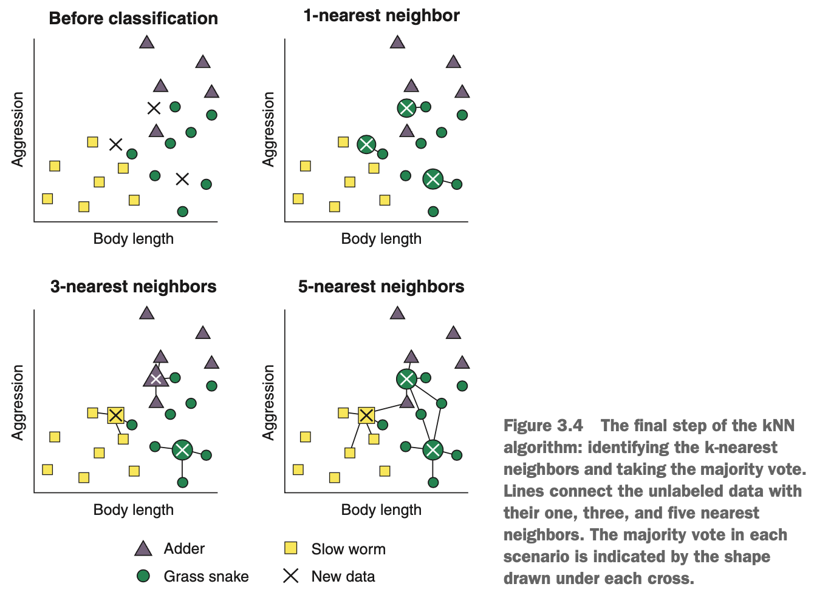

# What is the k-nearest neighbours algorithm?

Simple things in life are the best & the kNN algorithm does not fall short. Some machine learning practitioners look down on kNN because it's very simplistic. In fact, kNN is arguably the simplest machine learning algorithm. In spite of its simplicity, kNN can provide surprisingly good classification performance, & its simplicity makes it easy to interpret.

### How does the k-nearest neighbours algorithm learn?

In the UK, there are a few native species of snake. Two examples are the grass snake & the adder, the latter of which is the only venomous snake in the UK. However, there is also a limbless reptile called a slow worm, which is often mistaken for a snake.

Imagine you work for a reptile conservation project aiming to count the numbers of grass snakes, adders, & slow worms in a woodland. Your job is to build a model that allows you to quickly classify reptiles you find into one of these 3 classes. When you find one of these animals, you only have enough time to estimate its length & some measure of how aggressive it is towards you, before it slithers away. A reptile expert helps you manually classify the observations you've made so far, but you decide to build a kNN classifer to help you quickly classify future specimens you come across.

Each of our cases is plotted against body length & aggression, & the species identified by your expert is indicated by the shape of the datum. You go into the woodland again & collect data from 3 new specimens, which are shown by the black crosses.

{width=70%}

We can describe the kNN algorithm in terms of 2 phases.

1. The training phase
2. The prediction phase

The training phase of the kNN algorithm consists only of storing the data. During the prediction phase, the kNN algorithm calculates the distance between each new, unlabeled case & all the labeled cases. "Distance" here refers to their nearness in terms of the aggression & body-length variables, a.k.a. *Euclidean* distance, which is like the straight-line distance between two points on a plot.

{width=70%}

Next, for each unlabeled case, the algorithm ranks the neighbours from the nearest (most similar) to the furthest (least similar).

{width=70%}

The algorithm identifies the *k*-labeled cases (neighbours) nearest to each unlabeled case. *k* is an integer specified by us. In other words, find the *k*-labeled cases that are most similar in terms of their variables to the unlabled case. Finally, each of the k-nearest neighbour cases "votes" on which class the unlabeled data belongs in, based on the nearest neighbour's own class. In other words, whatever class most of the k-nearest neighbours belong to is what the unlabeled case is classified as.

When we set k to 1, the algorithm finds the single labeled case that is most similar to each of the unlabeled data items. Each fo the unlabeled reptiles is closest to a member of the grass snake class, so they are all assigned to this class.

{width=70%}

When we set *k* to 3, the algorithm finds the 3 labeled cases that are most similar to each of the unlabeled data items. As you can see in the above figure, 2 fo the unlabeled cases have nearest neighbours belonging to more than one class. In this situation, each nearest neighbours "votes" for its own class, & the majority vote wins. This is very intuitive because if a single unusually aggressive grass snake happens to be the nearest neighbour to an as-yet-unlabelled adder, it will be outvoted by the neighbouring adders in the data.

Hopefully, you can see how this extends to other values of *k*. When we set *k* to 5, the algorithm simply finds the 5 nearest cases to the unlabeled data & takes the majority vote as the five nearest cases to the unlabeled data & takes the majority vote as the class of the unlabeled case. In all 3 scenarios of the figure, the value of *k* directly impacts how each unlabelled case is classified.

### What happens if the vote is tied?

It may happen that all of the k-nearest neighbours belong to different classes & that the vote results in a tie. What happens in this situation? One way we can avoid this in a two-class classification problem (when the data can only belong to one of two mutually exclusive groups) is to ensure that we pick odd numbers of *k*. This way, there will always be a deciding vote. But what happens in situations like our reptile classification problem, where we have more than 2 groups?

One way of dealing with this situation is to decrease *k* until a majority vote can be won. But this doesn't help if the unlabeled case is equidistant between its two nearest neighbours.

Instead, a more common & pragmatic approach is to randomly assign cases with no majority vote to one of the classes. In practice, the proportion of cases that have ties among their nearest neighbours is very small, so this has a limited impact on the classification accuracy of the model. Hoever, if you have many ties in your data, your options are as follow:

* Choose a different value of *k*
* Add a small amount of noise to the data
* Consider using a different algorithm
