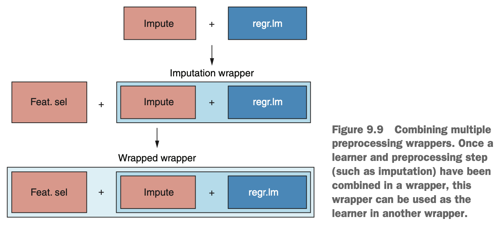

```{r, include = FALSE}
library(tidyverse)
library(mlr)
library(plotly)
library(parallel)
library(parallelMap)
```


# Building Your First Linear Regression Model

Imagine that you're an environmental scientist interested in predicting daily levels of atmospheric ozone pollution in Los Angeles. Ozone is an allotrope of oxygen molecule that has three oxygen atoms instead of two. While ozone in the stratosphere protects us from the sun's UV rays, products from burning fossil fuels can be converted into ozone at ground level, where it is toxic. Our job is to build a regression model that can predict ozone pollution levels based on the time of year & meteorological readings, such as humidity & temperature. 

Let's load the data & explore it. 

```{r}
data(Ozone, package = 'mlbench')
ozoneTib <- as_tibble(Ozone)
names(ozoneTib) <- c('Month', 'Date', 'Day', 'Ozone', 'Press_height', 'Wind', 'Humid', 'Temp_Sand', 'Temp_Monte', 'Inv_height', 'Press_grad', 'Inv_temp', 'Visib')
ozoneTib
```

We have a tibble containing 366 cases & 13 variables of daily meteorological & ozone readings. At present, the `Month`, `Day`, & `Date` variables are factors. Arguably this may make sense, but we're going to treat them as numerics for this exercise. To do this, we use the handy `mutate_all()` function, which takes the data as the first argument & a transformation/function as the second argument. Here, we use `as.numeric()` to convert all the variables into the numeric class. 

Next, we have some missing data in the data set. Missing data is okay in our predictor variables (we'll deal with this later using imputation), but missing data fro the variable we're trying to predict is not okay. Therefore, we remove the cases without any ozone measurement by piping the result of the `mutate_all()` call into the `filter()` function, where we remove cases with an `NA` value for `Ozone`.

```{r}
ozoneClean <- mutate_all(ozoneTib, as.numeric) %>%
  filter(is.na(Ozone) == FALSE)
ozoneClean
```

**Note: Could we have imputed missing data in our target variable? Yes we could, but this has the potential to introduce bias into our model. This is because we'll be training a model to predict values that were themselves generated by a model.** 

Let's plot each of our predictor variables against `Ozone` to get an idea of the relationships in the data. We start with our usual trick of gathering the variables with the `gather()` function so we can plot them on separate facets.

```{r, warning = FALSE}
ozoneUntidy <- gather(ozoneClean, key = 'Variable', value = 'Value', -Ozone)

ggplotly(
  ggplot(ozoneUntidy, aes(Value, Ozone)) +
    facet_wrap(~Variable, scale = 'free_x') +
    geom_point(size = 0.5) + geom_smooth() + 
    geom_smooth(method = 'lm', col = 'red') +
    theme_bw()
)
```

In our `ggplot()` call, we facet by `Variable` & allow the x-axes of the facets to vary by setting the `scale` argument equal to `'free_x'`. Then, along with a `geom_point()` layer, we add two `geom_smooth()` layers. The first `geom_smooth()` is given no arguments & so uses the default settings. By default, `geom_smooth()` will draw a LOESS curve to the data (a curvy, local regression line) if there are fewwer than 1,000 cases, or a GAM curve if there are 1,000 or more cases. Either will give us an idea of the shape of the relationships. The second `geom_smooth()` layer specifically asks for the `lm` method (linear model), which draws a linear regression line that best fits the data. Drawing both of these will help us identify if there are relationships in the data that are nonlinear. 

The resulting plot is shown above. Some of the predictors have a linear relationship with ozone levels, some have a nonlinear relationship, & some seem to have no relationship at all.


### Imputing Missing Values

Linear regression cannot handling missing values. Therefore, to avoid having to throw away a large portion of our data set, we'll use imputation to fill in the gaps. In previous lessons, we used mean imputation to replace missing values (`NA`s) with the mean of the variable. While this may work, it only uses the information within a single variable will take the same value, potentially biasing the model. Instead, we can actually use machine learning algorithms to predict the value of a missing observation, using all of the other variables in the data set.

There are multiple imputation methods that come packaged with mlr. These include methods such as `imputeMean()`, `imputeMedian()`, & `imputeMode()` (for replacing missing values with the mean, median & mode of each variable, respectively). However, the most important method is `imputeLearner()`. The `imputeLearner()` function lets us specify a supervised machine learning algorithm to predict what the missing values would have been, based on the information held in all the other variables. For example, if we want to impute missing values of a continuous variable, the process proceeds as follows:

1. Split the data set into cases with & without missing values for this particular variable.
2. Decide on a regression algorithm to predict what the missing values would have been.
3. Considering only the cases *without* missing values, use the algorithm to predict the values of the variable with missing values, using the other variables in the data set (including the dependent variable we're trying to predict in our final model).
4. Considering only the cases *with* missing values, use the model learned in step 3 to predict the missing values based on the values of the other predictors.

We employ the same strategy when imputing categorical variables, except that we choose a classification algorithm instead of a regression one. So we end up using a supervised learning algorithm to fill in the blanks so that we can use another algorithm to train our final model.

So how do we choose an imputation algorithm? There are a few practical considerations, but as always it will depend & it may pay off to try different methods & see which one gives you the best performance. We can at least initially whittle it down to either a classification or regression algorithm, depending on whether the variable with missing values is continuous or categorical. Next, whether we have missing values in one or multiple variables makes a difference because if it's the latter, we will need to choose an algorithm that can itslef handle missing values. For example, let's say we try to use logistic regression to impute missing values of a categorical variable. We'll get to step 3 of our procedure & stop because the other variables in the data (that the algorithm is trying to use to predict the categorical variable) also contain missing values. Logistic regression can't handle that & will throw an error. If the only variable with missing values was the one we were trying to impute, this wouldn't be a problem. Finally, the other consideration is computational budget. If the algorithm you're using to learn the final model is already computationally expensive, using a computationally expensive algorithm to impute our missing values is added expense. Within these constraints, it's often best to experiment with different imputation learner & see which one works best for the task at hand.

When doing any form of missing-value imputation, it's extremely important to ensure that the data is either *missing at random* (MAR) or *missing completely at random (MCAR)* & not *missing not at random* (MNAR). If the data is MCAR, it means the likelihood of a missing value is not related to any variable in the data set. If the data is MAR, it means the likelihood of a missing value is related only to the value of the other variables in the data set. For example, someone might be less likely to fill in their salary on a form because of their age. In either of these situations, we can still build models that are unbiased due to the presence of missing data. But consider a situation where someone is less likely to fill in their salary on a form because their salary is low. This is an example of data *missing not at random* (MNAR), where the likelihood of a missing value depends on the value of the variable itself. In such a situation, you would likely build a model that is biased to overestimate the salaries of the people in your survey.

How do we tell if our data is MCAR, MAR, or MNAR? There are methods for distinguishing MCAR & MAR. For example, you could build a classification model that predicts whether a case has a missing value for a particular variable. If the model does better at predicting missing values than a random guess, then the data is MAR. If the model can't do much better than a random guess, then the data is probably MCAR. Is there a way to tell whether data is MNAR? Unfortunately, no. Being confident your data is not MNAR depends on good experiment design & thoughtful examination of your predictor variables.

**Note: There is a more powerful imputation technique called *multiple imputation* where we create many new data sets, replacing missing data with sensible values in each one. We then train a model on each of these imputed data sets & return the average model. While this is the most widely used imputation technique, it isn't implemented in mlr. Check out the documentation for the `mice` package.**

For our ozone data, we have missing values across several variables, & they're all continuous variables. Therefore, we'll choose a regression algorithm that can handle missing data: rpart. We will impute the missing values with the rpart decision tree algorithm. In lessons we covered before, we considered tree based algorithms for classification problems, but decision trees can be used to predict continuous variables too. 

```{r}
imputeMethod <- imputeLearner('regr.rpart')
imputeMethod
ozoneImp <- impute(as.data.frame(ozoneClean), classes = list(numeric = imputeMethod))
ozoneImp
```

We first use the `imputeLearner()` function to define what algorithm we're going to use to impute the missing values. The only argument we supply to this function is the name of the learner, which in this case is `'regr.rpart'`.

Next, we use the `impute()` function to create the imputed data set, to which the first argument is the data. We've wrapper our tibble inside the `as.data.frame()` function just to prevent repeated warnings about the data being a tibble & not a data frame (these can be safely ignored). We can specify different imputation techniques for different columns by supplying a named list to the `cols` argument. For example, we could say `cols = list(var1 = imputeMean(), var2 = imputeLearner('regr.lm'))`. We can also specify different imputation techniques for different classes of variable (one technique for numeric variables, another for factors) using the `classes` argument in the same way. In the following listing, we use the `classes` argument to impute all the variables (they are all numeric) using the `imputeMethod` we defined.

This results in a data set we can access using `ozoneImp$data`, whose missing values have been replaced with predictions from a model learned by the rpart algorithm. Now we can define our task & learner using the imputed data set. By supplying `'regr.lm'` as an argument to the `makeLearner()` function, we're telling mlr that we want to use linear regression.

```{r}
ozoneTask <- makeRegrTask(data = ozoneImp$data, target = 'Ozone')
ozoneTask
lin <- makeLearner('regr.lm')
lin
```


### Automating Feature Selection

Sometimes, it may be obvious which variables have no predictive value & can be removed from the analysis. Domain knowledge is also very important here, where we include variables in the model that we, as experts, believe to have some predictive value for the outcome we're studying. But it's often better to take a less subjective approach to feature selection, & allow an algorithmm to choose the relevant features for us. 

There are two methods for automating feature selection:

* *Filter methods* -- Filter methods compare each of the predictors against the outcome variable, & calculate a metric of how much the outcome varies with the predictor. This metric could be a correlation: for example, if both variables are continuous. The predictor variables are ranked in order of this metric (which, in theory, ranks them in order of how much information they can contribute to the model), & we can choose to drop a certain number or proportion of the worst-performing variables from our model. The number or proportion of variables we drop can be tuned as a hyperparameter during model building.
* *Wrapper methods* -- With wrapper methods, rather than using a single, out-of-model statistic to estimate feature importance, we iteratively train out model with different predictor variables. Eventually, the combination of predictors that gives us the best performing model is chosen. There are different ways fo doing this, but one example is *sequential forward selection*. In sequential forward selection, we start with no predictors & then add predictors one by one. At each stop of the algorithm, the feature than results in the best model performance is chosen. Finally, when the addition of any more predictors doesn't result in an improvement in performance, feature addition stops & the final model is trained on the selected predictors.

Which method do we choose? It boils down to this: wrapper methods may result in models that perform better, because we're actually using the model we're training to estimate predictor importance. However, because we're training a fresh model at each iteration of the selection process (& each step may include other preprocessing steps such as imputation), wrapper methods tend to be computationally expensive. Filter methods, on the other hand, may or may not select the best-performing set of predictors but are much less computationally expensive.

**The Filter Method for Feature Selection**

We'll start with an example of using the filter method. There are a number of metrics we can use to estimate predictor importance. To see the list of available filter methods built into mlr, run `listFilterMethods()`. Some of the filter methods will require you to first install the FSelector package. There are too many filter methods to describe in full, but common choices include:

* *Linear correlation* - when both predictor & outcome are continuous
* *ANOVA* when predictor is categorical & outcome is continuous
* *Chi-squared* when predict & outcome are continuous
* *Random forest importance* - can be used whether the predictors & outcomes are categorical or continuous

The default method used by mlr (because it doesn't depend on whether the variables are categorical or continuous) is to build a random forest to predict the outcome & return the variables that contribute most to model predictions (using the out-of-bag error). In our ozone example, because both the predictors & outcome variable are continuous, we'll use linear correlation to estimate variable importance.

First, we use the `generateFilterValuesData()` function to generate an importance metric for each predictor. The first argument is the task, which contains our dataset & lets the function know that `Ozone` is the target variable. The second, optional argument is `method`, to which we supply one of the methods listed by `listFilterMethods()`. In this example, we use `'linear.correlation'`. By extracting the `$data` component of this object, we get the table of predictors with their Pearson correlation coefficients.

We'll also plot the coefficients for easier interpretability with `plotFilterValues()`.

```{r}
filterVals <- generateFilterValuesData(ozoneTask, 
                                       method = 'linear.correlation')
filterVals
plotFilterValues(filterVals) + theme_bw()
```

Now that we have a way of ranking our predictors in order of their estimated importance, we can decinde how to 'skim off' our least informative ones. We do this using the `filterFeatures()` function, which takes the task as the first argument, our `filterVals` object as the `fval` argument, & either the `abs`, `per`, or `threshold` argument. The `abs` argument allows us to specify the absolute number of best predictors to retain. The `per` argument allows us to specify a top percentage of best predictors to retain. The `threshold` argument allows us to specify a value of our filtering metric (in this case, correlation coefficient) that a predictor must exceed in order to be retained. We could manually filter out predictors using one of these three methods, but we could also have the computer learn the best predictors to retain. We can wrap together our learner (linear regression) & filter method so that we can treat any of `abs`, `per`, & `threshold` as hyperparameters & tune them.

To wrap together our learner & filter method, we use the `makeFilterWrapper()` function, supplying the linear regression learner we defined as the `learner` argument & our filter metric as the `fw.method` argument.

```{r}
filterWrapper <- makeFilterWrapper(learner = lin, 
                                   fw.method = 'linear.correlation')
```

When we wrap together a learner & a preprocessing step, the hyperparameters for both become available for tuning as part of our wrapper learner. In this situation, it means we can tune the *abs*, *per*, or *threshold* parameter using cross-validation, to select the best-performing features. In this example, we're going to tune the absolute number of features to retain.

First, we define the hyperparameter space with `makeParamSet()` & define `fw.abs` as an integer between 1 & 12 (the minimum & maximum number of features we're going to retain). Next, we define our grid search, using `makeTuneControlGrid()`. This will try every value of our hyperparameter. We define an ordinary 10-fold cross-validation strategy using `makeResampleDesc()` & then perform the tuning with `tuneParams()`. The first argument is our wrapper learner, & then we supply our task, cross-validation method, hyperparameter space, & search procedure.

```{r, message = FALSE}
lmParamSpace <- makeParamSet(
  makeIntegerParam('fw.abs', lower = 1, upper = 12)
)

gridSearch <- makeTuneControlGrid()
kFold <- makeResampleDesc('CV', iters = 10)
tunedFeats <- tuneParams(filterWrapper, task = ozoneTask, resampling = kFold, 
                          par.set = lmParamSpace, control = gridSearch)
tunedFeats
```

Our tuning procedure picks the 10 predictors with the highest correlation with ozone as the best-performing combination. But what does `mse.test.mean` mean? Well, the performance metrics we used for classification, such as mean misclassification error, doesn't make any sense when predicting continuous variables. For regression problems, there are three commonly used performance metrics:

* *Mean absolute error* (*MAE*) - finds the absolute residual between each case & the model, adds them all up, & divides the number of cases. We can interpret this as the mean absolute distance of the cases from the model.
* *Mean square error* (*MSE*) - similar to MAE but *squares* the residuals before finding their mean. This means MSE is more sensitive to outliers than MAE, because the size of the squared residual grows quadratically, the further from the model prediction it is. MSE is the default performance metric for regression learners in mlr. 
* *Root mean square error* (*RMSE*) - Because MSE squares the residual, its value isn't on the same scale as the outcome variable. Instead, we take the square root of MSE to get RMSE. When tuning hyperparameters & comparing models, MSE & RMSE will always select the same models (because RMSE is simply a transformation of MSE), but RMSE has the benefit of being on the same scale as our outcome variable & so is more interpretable.

Using the MSE performance metric, our tuned filter method has concluded that retaining the 10 features with the highest correlation with the ozone level results in the best-performing model. We can now train a final model that include only these top 10 features in the task.

First, we create a new task that includes only the filtered features, using the `filterFeatures()` function. To this function, we supply the name of the existing task, the `filterVals` object, & the number of features to retain as the argument to `abs`. This value can be accessed as the `$x` component of `tunedFeats` & needs to be wrapped in `unlist()`; otherwise, the function will throw an error. This creates a new task that contains only the filtered predictors & retains `Ozone` as the target variable. Finally, we train the linear model using this task.

```{r}
filteredTask <- filterFeatures(ozoneTask, fval = filterVals, 
                               abs = unlist(tunedFeats$x))
filteredTask
filteredModel <- train(lin, filteredTask)
filteredModel
```

**The Wrapper Method for Feature Selection**

With the filter method, we generate univariate statistics describing how each predictor relates to the outcome variable. This may result in selecting the most informative predictors, but it isn't guaranteed. Instead, we can use the actual model we're trying to train to determine which features help it make the best predictions, but it is computationally more expensive as we're training a fresh model for every permutation of predictor variables. 

There are four options to search for the best combination of predictors.

* *Exhaustive search* - Grid search. It will try every possible combination of predictor variables in our dataset & select the one that performs best. This is guaranteed to find the best combination but can be prohibitively slow. for example, in our 12-predictor dataset, exhaustive search would need to try more than $1.3 * 10^9$ different variable combinations.
* *Random search* - Random Search from hyperparameter tuning. We define a number of iterations & randomly select feature combinations. The best combination after the final iteration wins. This is usually less intensive (depending on how many iterations you choose), but it isn't guaranteed to find the best combination of features.
* *Sequential search* - From a particular starting point, we either add or remove features at each step that imporve performance. This can be one of the following:
   - *Forward search* - We start with an empty model & sequentially add the feature that improves the model most until additional features no longer improve the performance.
   - *Backward search* - We start with all the features & remove the feature whose removal improves the model the most until additional removals no longer improve performance.
   - *Floating forward search* - Starting from an empty model, we either add one variable or remove one variable at each step, whichever improves the model the most, until neither an addition nor a removal improves model performance.
   - *Floating backward search* - The same as floating forward, except with a full model.
* *Genetic algorithm* - This method, inspired by Darwinian evolution, finds pairs of feature combinations that act as 'parents' to 'offspring' variable combinations, which inherit the best-performing features. This method is cool, but can be computationally expensive as the feature space grows.

With so many options to choose from, where do we start? Exhaustive & genetic search prohibitively slow for a large feature space. While random search can alleviate this problem, sequential search is a good compromise between computational cost & probability of finding the best-performing feature combination. For this example, we're going to use floating backward selection.

First, we define the search method usign the `makeFeatSelControlSequential()` function. We use `'sfbs'` as the method argument to use a sequential floating backward selection. Then we use the `selectFeatures()` function to perform feature selection. To this function, we supply the learner, task, cross-validation strategy, & search method. When we run the function, every permutation of predictor variables is cross-validated using our `kFold` strategy to get an estimate of its performance.

```{r, message = FALSE}
featSelControl <- makeFeatSelControlSequential(method = 'sfbs')
selFeats <- selectFeatures(learner = lin, task = ozoneTask, resampling = kFold, control = featSelControl)
selFeats
```

By printing the result of this process, we can see the algorithm selected six predictors that had slightly lower MSE value than the predictors selected in our filter method.

Now, just as we did for the filter method, we can create a new task using the imputed data that contains only those selected predictors, & train a model on it.

```{r}
ozoneSelFeat <- ozoneImp$data[, c('Ozone', selFeats$x)]
ozoneSelFeatTask <- makeRegrTask(data = ozoneSelFeat, target = 'Ozone')
wrapperModel <- train(lin, ozoneSelFeatTask)
wrapperModel
```


### Including Imputation & Feature Selection in Cross-Validation

It's been said many times before, but always include data-dependent pre-processing steps in your cross-validation. However, up this this point, we've only needed to consider a single pre-processing step. How do combine more than one? mlr makes this simple. When we wrap together a learner & a pre-processing step, we essentially create a new learner algorithm that includes that pre-processing. So, to include an additional pre-processing step, we simply wrap the wrapped learner. The result is a sort of Matryoshka doll of wrappers, where one is encapsulated by another, which is encapsulated by another, & so on.

{width=65%}

Using this strategy, we can combine as many preprocessing steps as we like to create a pipeline. The innermost wrapper will always be used first, then the next innermost, & so on.

We're going to make an impute wrapper & then pass it as the learner to a feature-selection wrapper. First, we redefine our imputation method using the `imputeLearner()` function. Then, we create an imputation wrapper using the `makeImputeWrapper()` function, which takes the learner as the first argument. We use `list(numeric = imputeMethod)` as the `classes` argument to apply this imputation strategy to all of our numeric predictors.

Next comes the neat bit: we create a feature-selection wrapper using `makeFeatSelWrapper()` & supply the imputation wrapper we created as the learner. This is a crucial step because we're creating a wrapper with another wrapper. We set the cross-validation method as `kFold` & the method of searching feature combinations as `featSelControl`.

```{r}
imputeMethod <- imputeLearner('regr.rpart')
imputeWrapper <- makeImputeWrapper(lin, 
                                   classes = list(numeric = imputeMethod))
featSelWrapper <- makeFeatSelWrapper(learner = imputeWrapper,
                                     resampling = kFold, 
                                     control = featSelControl)
featSelWrapper
```

Now, let's cross-validate our entire model-building process like good data scientists. We define a task using the `ozoneClean` tibble, which still contains missing data. Next, we define an ordinary 3-fold cross-validation strategy for our cross-validation procedure. Finally, we start parallelisation with `parallelStartSocket()` & start the cross-validation procedure by supplying the learner (the wrapped wrapper), task, & cross-validation strategy to the `resample()` function.

```{r, message = FALSE, warning = FALSE}
ozoneTaskWithNAs <- makeRegrTask(data = ozoneClean, target = 'Ozone')
kFold3 <- makeResampleDesc('CV', iters = 3)

parallelStartSocket(cpus = detectCores() - 1)

lmCV <- resample(featSelWrapper, ozoneTaskWithNAs, resampling = kFold3)

parallelStop()

lmCV
```

The cross-validation process proceeds like this:

1. Split the data into 3 folds.
2. For each fold:
   * Use the rpart algorithm to impute the missing values.
   * Perform feature selection: Update template to support more tha two levels of nested ordered lists.
   * Use a selection method (such as backward search) to select combinations of features to train models on.
   * Use 10-fold cross-validation to evaluate the performance of each model.
3. Return the best-performing model for each of the three outer folds.
4. Return the mean MSE to give use our estimate of performance.

We can see that our model-building process gives us a mean MSE of approximately 21, suggesting a mean residual error of about 4.6 on the original ozone scale (taking the square root of 21).


### Intepreting the Model

Due to their simple structure, linear models are usually quite simple to interpret, because we can look at the slopes for each predictor to infer how much the outcome variable is affected by each. However, whether these interpretations are justified or not depends on whether some model assumptions have been met, so we'll interpret the model output & generate some diagnostic plots.

First, we need to extract the model information from our model object using the `getLearnerModel()` function. By calling `summary()` on the model data, we get an output with lots of information about our model.

```{r}
wrapperModelData <- getLearnerModel(wrapperModel)
summary(wrapperModelData)
```

The `Call` component would normally tell us the formula we used to create the model (which variables & whether we added more complex relationships between them). Because we built this model using mlr, we unfortunately don't get that information here, but the model formula is all of the selected predictors combined linearly together.

The `Residuals` component gives us some summary statistics about the model residuals. Here, we're looking to see if the median is approximately 0 & that the first & third quartiles are approximately the same. If they aren't, this might suggest the residuals are either not normally distributed, or heterescedastic. In both situations, not only could this negatively impact model performance, but it could make our interpretation of the slopes incorrect.

The `Coefficients` component shows us a table of model parameters & their standard errors. The intercept is the estimate of the ozone level when all other variables are 0. In this particular case, it doesn't make sense for some of our variables to be 0 (`month`, for example) so we don't draw too much interpretation from this. The estimates for the predictors are their slopes. For example, our model estimates than for every one-unit increase in the `Temp_Sand` variable, `Ozone` increases by about 0.2 (holding all other variables constant). The `Pr(>|t|)` column contains the *p* values that, in theory, represent the probability of seeing a slope this large if the population slope was actually 0. Use the *p* values to guide your model building process, by all means; but there are some problems associated with *p* values, so don't put too much faith in them. 

Finally, `Residual standard error` is the same as RMSE, `Multiple R-squared` is an estimate of the proportion of variance in the data accounted for by our model, & the `F-statistic` is the ratio of variance explained by our model to the variance not explained by the model. The *p* value here is an estimate of the probability that our model is better than just using the mean of `Ozone` to make predictions.

We can very quickly & easily print diagnostic plots for linear models in R by supplying the model data as the argument to `plot()`. We split the plotting device into four parts using the `mfrow` argument to the `par()` function. This means when we create our diagnostic plots (there will be four of them), they will be tiled in the same plotting window. These plots may help us identify flaws in our model that impact predictive performance.

```{r}
par(mfrow = c(2, 2))
plot(wrapperModelData)
par(mfrow = c(1, 1))
```

The resulting plot is shown above. The Residuals vs. Fitted plot shows the predicted ozone level on the x-axis & the residual on the y-axis for each case. We hope that there are no patterns in this plot. In other words, the amount of error shouldn't depend on the predicted value. In this situation, we have a curved relationship. This indicates that we have nonlinear relationships between predictors & ozone, &/or heteroscedasticity. 

The Normal Q-Q (quantile-quantile) plot shows the qunatiles of the model residuals plotted against their quantiles if they were draw from a theoretical normal distribution. If the data deviates considerably fromt eh 1:1 diagonal line, this suggests the residuals are not normally distributed. This doesn't seem to be a problem for this model. The residuals line up nicely on the diagonal.

The Scale-Location plot helps us identify heteroscedasticity of the residuals. There should be no patterns here, but it looks like the residuals are increasingly varied with larger predicted values, suggesting heteroscedasticity.

Finally, the Residuals vs Leverage plot helps us to identify cases that have excessive influence ont he model parameters (potential outliers). Cases that fall inside a dotted region of the plot caled *Cook's distance' may be outliers whose inclusion or exclusion makes a large difference to the model.

The diagnostic plots (particularly the Residuals vs. Fitted plot) indicate the presence of nonlinear relationships between the predictor variables & the outcome variable. We may, therefore, be able to get better predictive performance from a mode that doesn't assume linearity. In the next lesson, we'll go over *generalised additive models* & we'll train one to improve our model performance.


***


# Strengths & Weaknesses of Linear Regression

The strengths of linear regression are as follows:

* It produces models that are very interpretable.
* It can handle both continuous & categorical predictors.
* It is very computationally inexpensive.

The weaknesses of linear regression are as follows:

* It makes strong assumptions about the data, such as homoscedasticity, linearity & the distribution of residuals (performance may suffer if these are violated).
* It can only learn linear relationships in the data.
* It cannot handle missing data.


***


# Summary

* Linear regression can handle continuous & categorical predictors.
* Linear regression uses the equation of a straight line to model relationships in the data as straight lines.
* Missing values can be imputed using supervised learning algorithms that use the information from all the other variables.
* Automated feature selection takes two forms: filter methods & wrapper methods.
* Filter methods calculate univariate statistics outside of a model, to estimate how related predictors are to the outcome.
* Wrapper methods actively train models on different permutations of the predictors to select the best-performing combination.
* Pre-processing steps can be combined together in mlr by sequentially wrapping of wrapper functions.