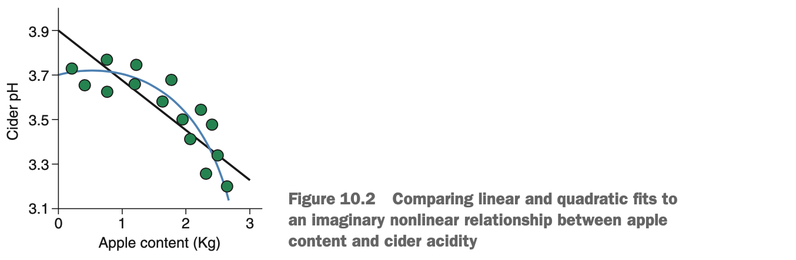
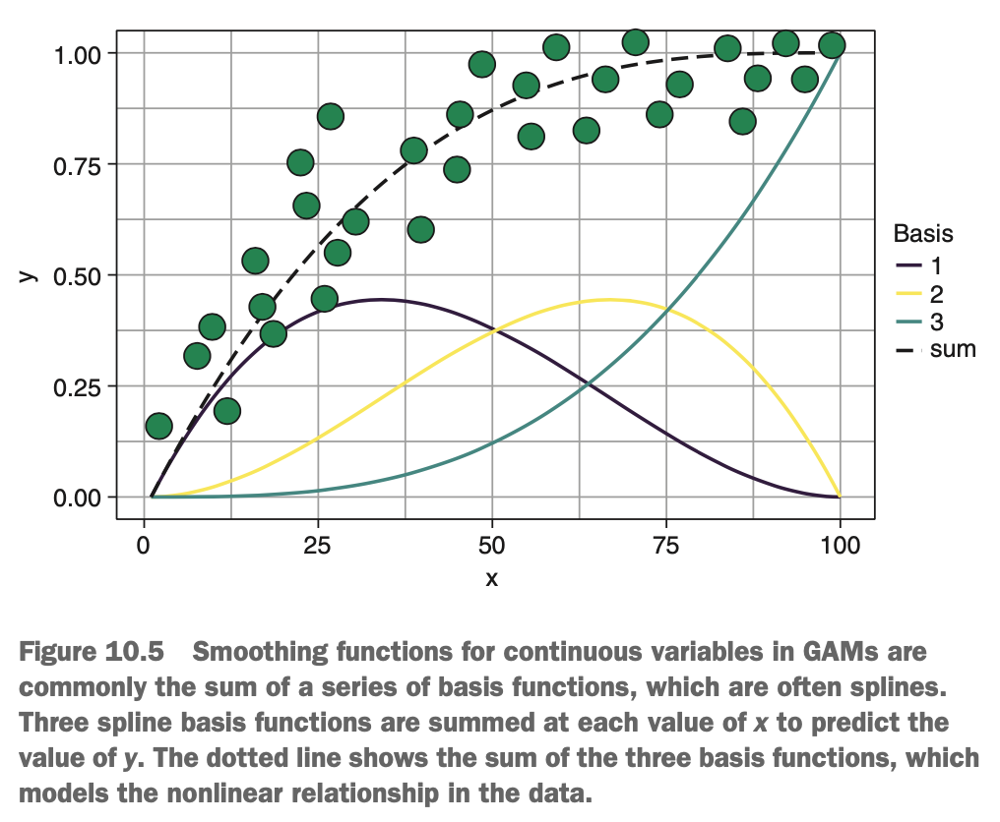

# Making Linear Regression Nonlinear with Polynomial Terms

In this lesson, we will take the general linear model in the previous lesson & extend it to include non-linear, polynomial relationships between predictor variables & the outcome variable. Linear regression makes the strong assumption that there is a linear relationship between predictor variables & the outcome. Sometimes, real-world variables have linear relationships & can be sufficiently approximated by one, but often, they do not. Surely, the general linear model falls down when faced with nonlinear relationships, right? After all, it's called the general *linear* model & uses the equation of a straight line. Well it turns out that the general linear model is surprisingly flexible, & we can use it to model *polynomial* relationships.

Recall that a polynomial equation is just an equation with multiple terms (single numbers or variables). If all the terms in the equation are raised to the power of 1 (an *exponent* of 1) -- in other words, they are all equal to themselves -- the equation is a *first-degree polynomial*. If the highest exponent in the equation is 2 -- in other words, one or some of the terms are squared but there are no higher exponents -- the equation is a *second-degree polynomial* or *quadratic* polynomial. If the highest exponent is 3, the equation is a *cubic* polynomial; & if the highest exponent is 4, the equation is a *quartic* polynomial.

Let's have a look at some examples of *n*th-degree polynomials:

* $y = x^1$ (Linear)
* $y = x^2$ (Quadratic)
* $y = x^3$ (Cubic)
* $y = x^4$ (Quartic)

The shape of these functions is shown below. When the exponent is 1, the function is a straight line, but when the exponent is greater than 1, the function is curvy.

{width=70%}

We can use this to our advantage: if the relationships between our predictor variables & our outcome variables have a curved relationship , we might be able to model this relationship by including *n*th degree polynomials in our model definition. Think back to our cider example, imagine that instead of a linear relationship between apple content & cider batch pH, we have a downward curvilinear relationship like in the diagram below.

{width=70%}

A straight line no longer models this relationship very well, & predictions made by such a model are likely to have high bias. Instead, we can better model this relationship by including a quadratic term in the model definition.

The formula for the model shown above would be 

$$y = \beta_{apples} * apples + \beta_{apples}^2 * apples^2 + \varepsilon$$

where $\beta_{apples}^2$ is the *slope* for the $apples^2$ term, which is more easily understood as how much the line curves as apple content increases (larger absolute values result in a more extreme curve). For a single predictor variable, we can generalise this for any *n*th-degree polynomial relationship as 

$$y = \beta_0 + \beta_1x + \beta_1x^2 + .. + \beta_nx^n + \varepsilon$$

where *n* is the highest degree polynomial you're modeling. Notice that when performing polynomial regression, it's usual to include all the lower-degree terms for that predictor variable as well. For example, if we're modeling a quartic relationship between two variables, we would include $x$, $x^2$, $x^3$, & $x^4$ terms in your model definition. Why is this? If we don't include the lower-degree terms in the model, the *vertex* of the curve, -- the part where the slope is 0 -- is forced to pass through $x = 0$. This might be a reasonable constraint to place on the mode, but it usually isn't. Instead, if we include the lower-degree terms in the mode, the curve doesn't need to pass through $x = 0$ & can 'wiggle around' more to (hopefully) fit the data better. 

{width=50%}

Just as before, when the model is given new data, it multiplies the values of the predictor variables (including the specified exponents) by their slopes & then adds them all together with the intercept to get the predicted value. The model we're using is still the general linear model, because we're *linearly* combining the model terms (adding them together).

***

# More Flexibility: Splines & Generalised Additive Models

When using polynomial terms in linear regression, the higher the degree of polynomial we use, the more flexible our model will be. High-degree polynomials allows us to capture complicated nonlinear relationships in the data but are therefore more likely to overfit the training set. Sometimes, increasing the degree of the polynomials doesn't help anyway, because the relationship between the predictor variable & outcome variable may not be the same across the range of the predictor variable. In such situations, instead of using high-degree polynomials, we can use *splines*.

A spline is a *piecewise* polynomial function. This means it splits the predictor variable into regions & fits a separate polynomial within each region, which regions connect to each other via knots. A *knot* is a position along the predictor variable that divides regions within which the separate polynomials are fit. The polynomial curves in each region of the predictor pass through the knows that delimit that region. This allows us to model complex nonlinear relationships that are not constant across the range of the predictor variable.

{width=65%}

Using splines is a great way of modeling complicated relationships such as the one shown in the diagram above, but this approach has some limitations:

* The position & number of the knots need to be chosen manually. Both choices can make a big impact on the shape of the spline. The choice of knot position is typically either at obvious regions of change in the data or at regular intervals across the predictor, such as at the quartiles.
* The degree of the polynomials between knots needs to be chosen. We generally use cubic splines or higher, because these ensure that the polynomials connect with each other smoothly through the knots (quadratic polynomials may leave the spline disconnected at the knots).
* It can become difficult to combine splines of different predictors.

So, can we do better than simple spline regression? Absolutely. The solution is GAMs. GAMs extend the general linear model such that instead of 

$$y = \beta_0 + \beta_1x_1 + \beta_2x_2 + ... + \beta_nx_n + \varepsilon$$

they take the form

$$y = \beta_0 + f_1(x_1) + f_2(x_2) + ... + f_k(x_k) + \varepsilon$$

where each f(x) represents a function of a particular predictor variable. These functions can be any sort of smoothing function but will typically be a combination of multiple splines.

### How GAMs Learn Their Smoothing Functions

The most common method of constructing these smoothing functions is to use splines as *basis functions*. Basis functions are simple functions that can be combined to form a more complex function. 

{width=55%}

The nonlinear relationship between the x & y variables is modeled as a weighted sum of three splines. In other words, at each value of x, we sum the contributions from each of these basis functions to give us the function that models the relationship (the dotted line). The overall function is a *weighted* sum because each basis function has a corresponding weight, determining how much it contributes to the final function.

Let's take another look at the GAM formula.

$$y = \beta_0 + f_1(x_1) + f_2(x_2) + ... + f_k(x_k) + \varepsilon$$

So each $f_k(x_k)$ is a smoothing function of that particular variable. When these smoothing functions use splines as basis functions, the function can be expressed as

$$f(x_i) = a_1b_1(x_i) + a_2b_2(x_i) + ... + a_nb_n(x_i)$$

where $b_1(x_i)$ is the value of the first basis function evaluated at a particular value of x, & $a_1$ is the weight of the first basis function. GAMs estimate the weights of these basis functions in order to minimise the residual square error of the model.

GAMs automatically learn a nonlinear relationship between each predictor variable & the outcome variable, & then add these effects together linearly, along with the intercept. GAMs overcome the limitations of simply using splines in the general linear model by doing the following:

* Automatically selecting the knots for spline functions
* Automatically selected the degree of flexibility of the smoothing functions by controlling the weights of the basis functions
* Allowing us to combine splines of multiple predictor variables simultaneously

### How GAMs Handle Categorical Variables

So far, we've shown that GAMs learn nonlinear relationships between our predictor variables & our outcome. What happens when our predictor variables are categorical? GAMs can handle categorical variables in two different ways.

One method is to treat categorical variables exactly the same way we do for the general linear model, & create k - 1 dummy variables that encode the effect of each level of the predictor on the outcome. When we use this method, the predicted value of a case is simply the sum of all of the smoothing functions, plus the contribution from the categorical variable effects. This method assumes independence between the categorical variable & the continuous variables (in other words, the smoothing functions are the same across each level of the categorical variable).

The other method is to model a separate smoothing function for each level of the categorical variable. This is important in situations where there are distinct nonlinear relationships between continuous variables & the outcome at each level of a categorical variable.

GAMs are extraordinarily flexible & powerful for a huge range of machine learning problems. 