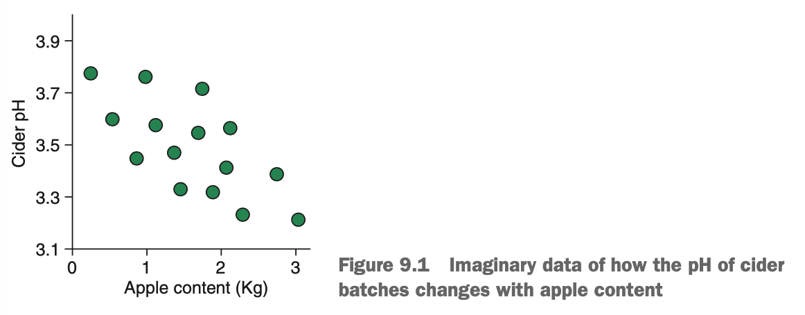
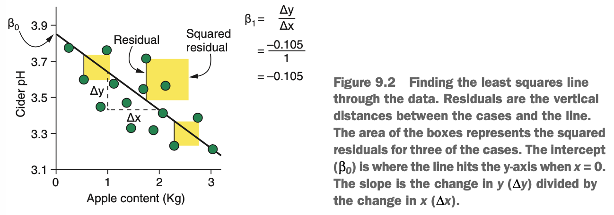
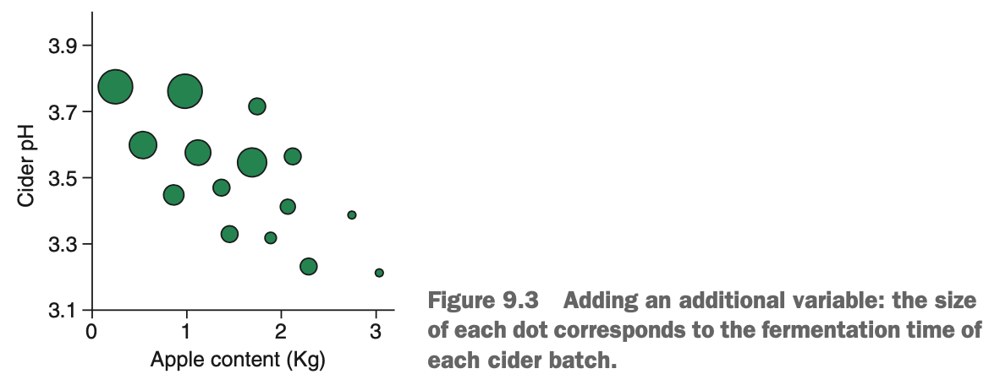
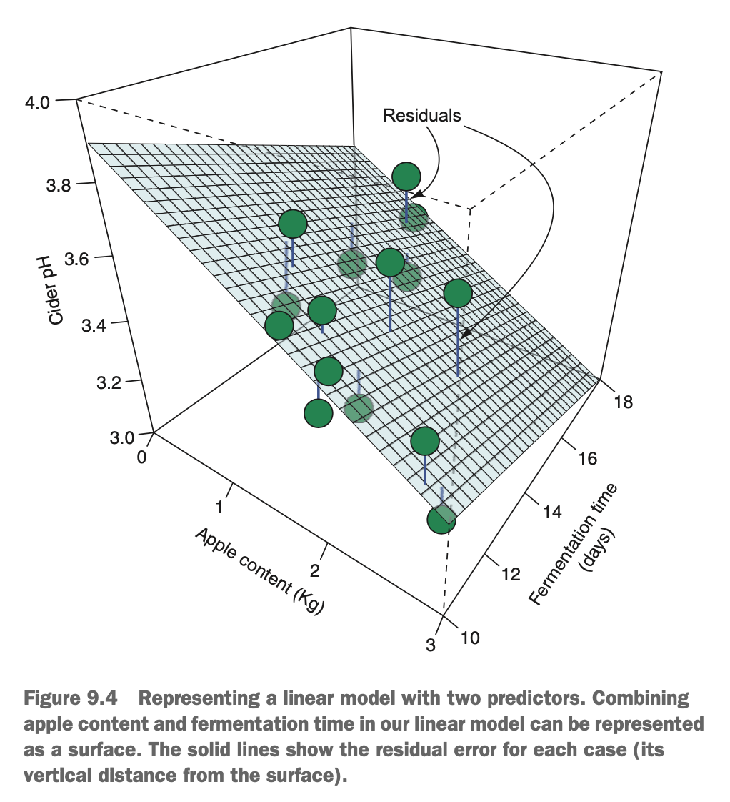
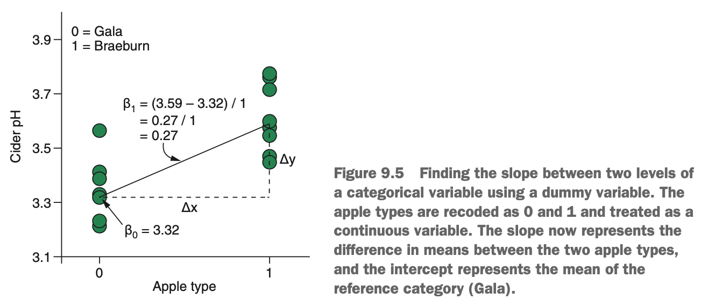
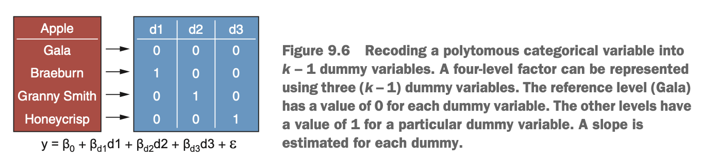

# What is Linear Regression?

Imagine that we want to predict the pH of batches of cider, based on the amount of apple content in each batch (in kilograms). An example diagram of the relationship is shown below.

{width=65%}

The relationship between apple weight & cider pH appears linear, & we could model this relationship using a straight line. The only parameters needed to describe a straight line are the slope & intercept:

$$y = intercept + slope * x$$

where *y* is the outcome variable, *x* is the predictor variable, & the intercept is the value of *y* when *x* is zero (where the line crosses the y-axis), & the slope is how much *y* changes when *x* increases by one unit.

If we were to read this aloud in English, we would say: 'For any particular case, the value of the outcome variable, *y*, is the model intercept, plus the value of the predictor variable, *x*, times its slope.'

Statisticians write this equation as

$$y = \beta_0 + \beta_1x_1 + \varepsilon$$

where $\beta_0$ is the intercept, $\beta_1$ is the slope for variable $x_1$, & $\varepsilon$ is the unobserved error unaccounted for by the model.

So, to learn a model that can predict pH from apple weight, we need a way to estimate the intercept & slope of a straight line that best represents this relationship.

Linear regression isn't technically an algorithm. Rather, it's the approach to modeling relationships using the straight-line equation. There are a few different algorithms to estimate the intercept & slope of a straight line. For simple solutions like in our cider pH problem, the most common algorithm is *ordinary least squares (OLS)*.

The job of OLS is to learn the combination of values for the intercept & slope that minimises the *residual sum of squares*. Residuals are the amount of information left unexplained by a model. In linear regression, we can visualise this as the vertical distance (along the y-axis) between a case & the straight line. But OLS doesn't just consider the raw distances between each case & the line: it squares them first & then adds them all up (hence *sum of squares*).

{width=70%}

Why does OLS square the distances? You may read that this is because it makes any negative residuals (for cases that lie below the line) positive, so they contribute to the sum of squares rather than subtract from it. This is certainly a handy by-product of squaring, but if that was true, we would simply use |*residual*| to denote the *absolute* value (removing the negative sign). We use the squared residuals so that we disproportionately penalise cases that are far away from their predicted value.

### What if We Have Multiple Predictors?

OLS finds the combination of slope & intercept that minimises the sum of squares, & the line learned in this way will be the one that best fits the data. But regression problems are rarely as simplistic as trying to predict an outcome with a single predictor. What happens when we have multiple predictor variables?

{width=65%}

When we have multiple predictors, a slopte is estimated for each (using OLS), & the contributions of each variable are added together linearly, along with the model intercept (which is now the value of *y* when each predictor equals zero). The slopes in linear regression tells us how the outcome variable changes for a one-unit increase in each predictor *while holding all other predictors constant*. In other words, the slopes tell us how the outcome changes when we change the predictor variables, one at a time. For example, our two-predictor cider model would look like this:

$$y = \beta_0 + \beta_{apples} * apples + \beta_{fermentation} * fermentation + \varepsilon$$

When we have two predictors, our line becomes a surface/plane. When we have more than two predictors, our plane becomes a hyperplane. Indeed, our straight line equation can be generalised to any number of predictors:

$$y = \beta_0 + \beta_1x_1 + \beta_2x_2 + ... + \beta_kx_k + \varepsilon$$

{width=55%}

where there are *k* predictors in the mode. This is called the *general linear model*, & it is the central equation of all linear models. If you're coming from a traditional statistical modeling background, we might find it familiar with *t* tests & analysis of variance. These approaches all use the general linear model to represent the relationships between the predictor variables & the outcome.

Recall that in logistic regression, we predict the log odds of a case belonging to a particular class. In linear regression, we simply predict the case's value of the outcome variable.

When modeling our data with the general linear model, we make the assumption that our residuals are normally distributed & *homoscedastic*. Homoscedastic simply means that the variance of the outcome variable doesn't increase as the predicted value of the outcome increases. The opposite of homoscedastic is *heteroscedastic*. We also make the assumption that there is a linear relationship between each predictor variable & the outcome, & that the effect of the predictor variables on the response variable are additive (rather than multiplicative).

When these assumptions are valid, our model wil make more accurate & unbiased predictions. However, the general linear model can be extended to handle situations in which the assumption of normally distributed residuals is violated (logistic regression is one such example).

In situations such as this, we turn to the *generalised linear model*. The generalised linear model is the same as the general linear model (in fact, the latter is a special case of the former), except that it uses various transformations called *link functions* to map out the outcome variable to the linear predictions made by the right-hand side of the equals sign. For example, count data is rarely normally distributed, but by building a generalised model with an appropriate link function, we can transform linear predictions made by the model back into counts.

### What if Our Predictors are Categorical?

Because the general linear model is essentially the equation of a straight line, & we use it to find the slopes between variables, how can we find the slope of a categorical variable? We can cheat by recoding categorical variables into *dummy variables*. Dummy variables are new representations of categorical variables that map the categories to 0 & 1.

Imagine that we want to predict the acidity of cider batches based on the type of apple: Gala or Braeburn. We want to find the intercept & slope that described the relationship between these two apple types & acidity, but how do we do that? Recall from earlier that the slope is how much *y* increases when *x* increases by one unit. If we recode our apple type variable such that Gala = 0 & Braeburn = 1, we can treat apple type as a continuous variable & find how much acidity changes as we go from 0 to 1.

{width=70%}

Take a look at the diagram above. The intercept is the value of *y* when x is 0, which is the mean acidity when apple type = Gala. Gala is thereform said to be our *reference level*. The slope is the change  in *y* with a one-unit increase in *x*, which is the difference between the mean acidity fro Gala & the mean acidity for Braeburn. This may feel like cheating, but it works & the slope with the least squared residuals will be the one that connects the means of the categories.

Recoding dichotomous (two-level) factors into a single dummy variable with value of 0 & 1 makes sense, but what if we have a *polytomous* factor (a factor containing more than two levels)? Do we code them as 1, 2, 3, 4 & so on, & treat this as a single continuous predictor? Instead, we create *k* - 1 dummy variables, where *k* is the number of levels of the factor.

Take a look at the diagram below. We have four types of apples & would like to predict pH based on the apple type used to make a particular batch of cider. To convert our four-level factor into dummy variables, we do the following:

1. Create a table of three columns, where each column represents a dummy variable.
2. Choose a reference level (Gala, in this case).
3. Set the value of each dummy variable to 0 for the reference level.
4. Set the value of each dummy variable to 1 for a particular factor level.

{width=70%}

We've now turned our single variable of four levels into three distinct dummy variables that each take a value of 1 or 0. But how does this help? Each dummy variable acts as a flag in the model formula to denote which level a particular case belongs to. The full model as shown is 

$$y = \beta_0 + \beta_{d1}d1 + \beta_{d2}d2 + \beta_{d3}d3 + \varepsilon$$

Now, because the intercept ($\beta_0$) represents acidity when all predictors equal to 0, this is now the mean of the reference level, Gala. The slopes in the model $\beta_{d1}$, $\beta_{d2}$ & so on, represent the difference between the mean of the reference level & the means of each of the other levels. If a batch of cider was made with a particular type of apple, its dummy variables will 'switch on' the slope between that type of apple & the reference class, & 'switch off' the others. For example, let's say a particular batch was made with Braeburn apples. The model would look like this:

$$y = \beta_0 + \beta_{d1} * 1 + \beta_{d2} * 0 + \beta_{d3} * 0 + \varepsilon$$

The slopes of the other apple types are still in the model, but because their dummy variables are set to 0, they make no contributions to the predicted value.

Models we building using the general linear model can mix both continuous & categorical predictors together. When we use our model to make predictions on new data, we simply do the following:

1. Take the values of each of the predictor variables for that data.
2. Multiple these values with the relevant slopes learned by the model.
3. Add these values together.
4. Add the intercept.

The result is our predicted value for that data.
