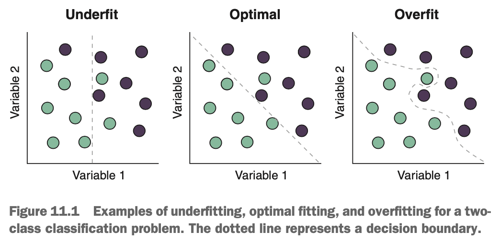
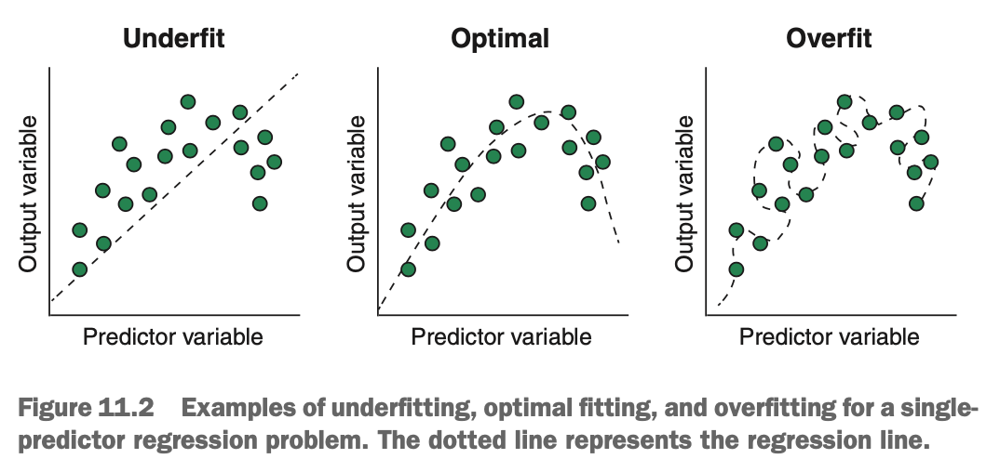
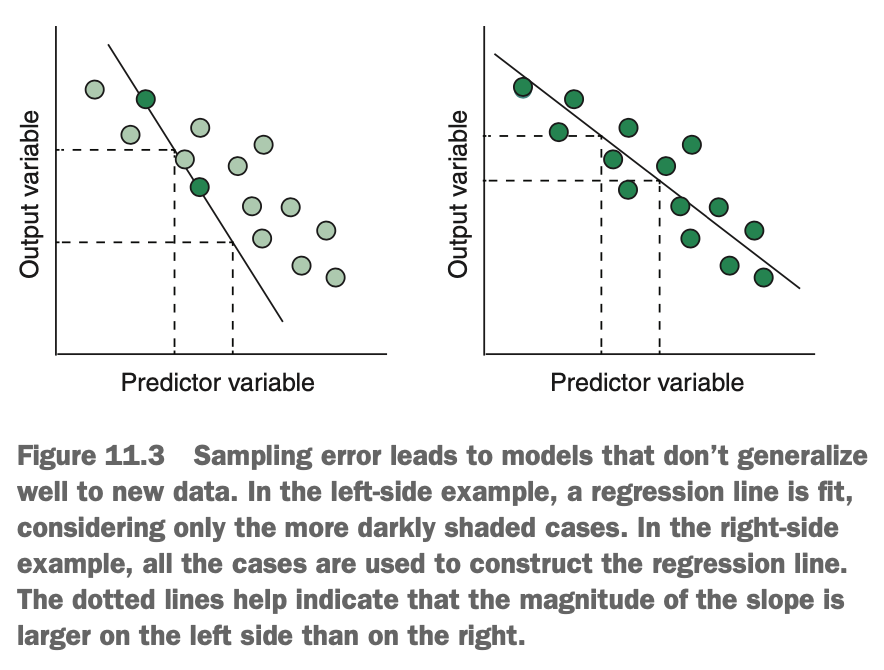
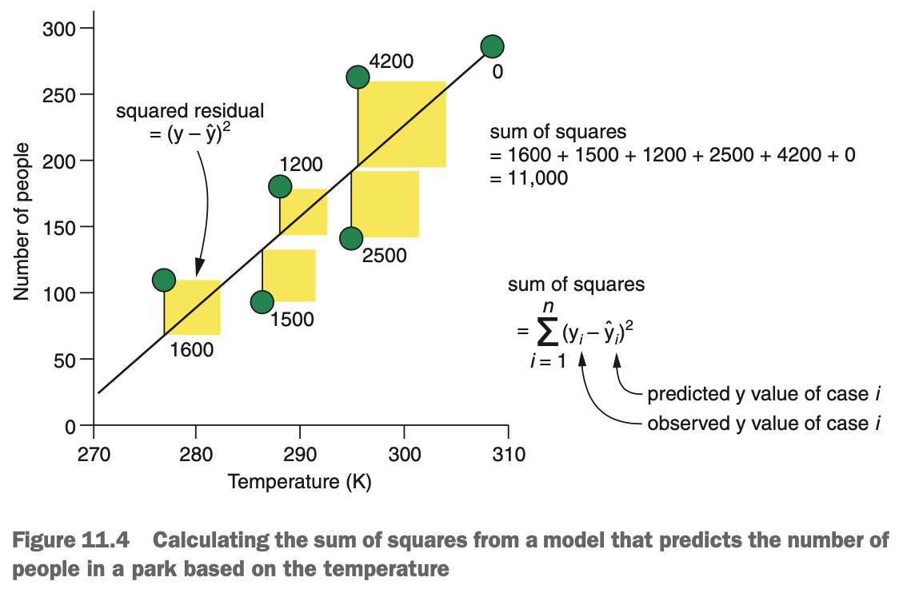
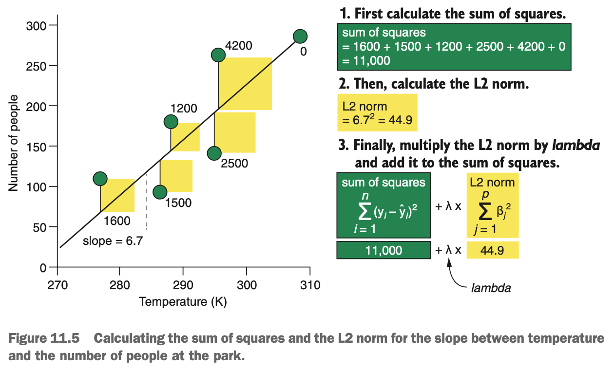
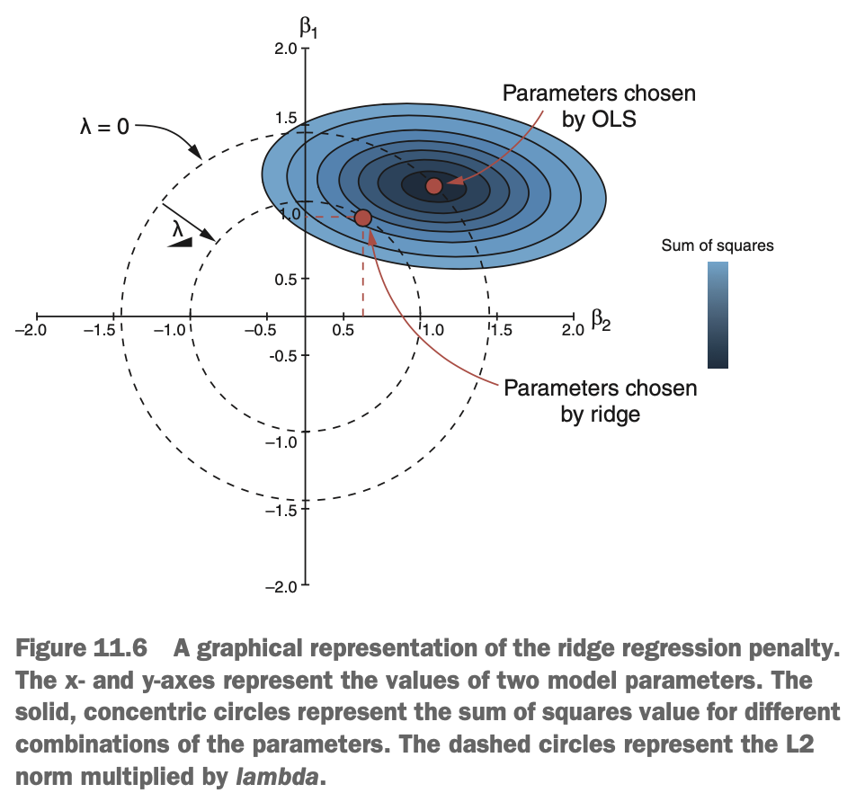
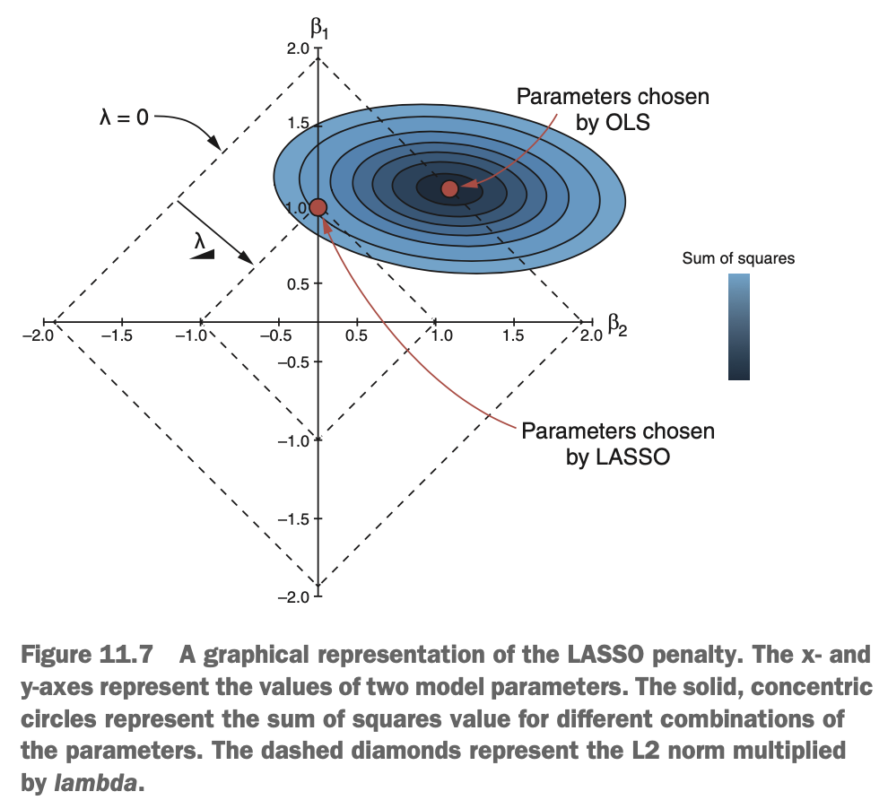
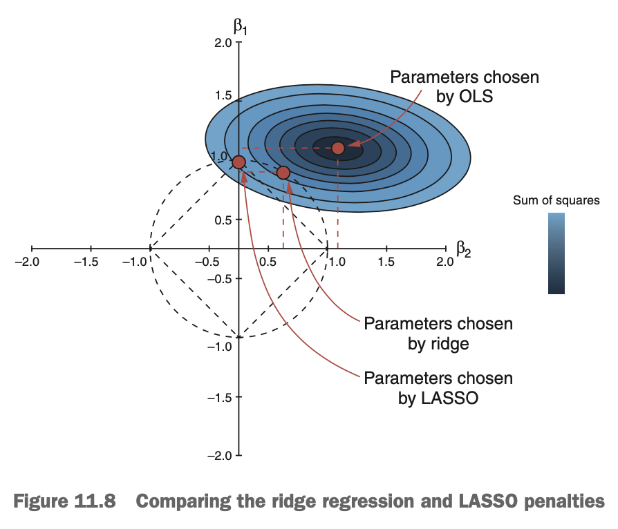
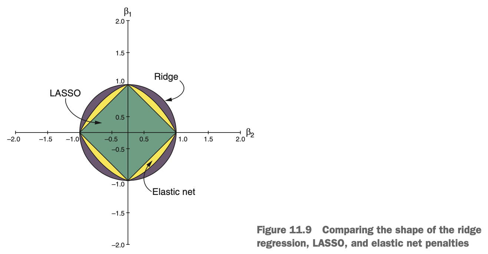

# What is Regularisation?

Regularisation (also sometimes call *shrinkage*) is a technique that prevents the parameters of a model from becoming too large & *shrinks* them toward 0. The result of regularisation is models that, when making predictions on new data, have less variance.

While we can apply regularisation to most machine learning problems, it is most commonly used in linear modeling, where it shrinks the slope parameter of each predictor toward 0. Three particularly well-known & commonly used regularisation techniques for linear models are as follows:

* Ridge regression
* Least absolute shrinkage & selection operator (LASSO)
* Elastic net

These three techniques can be though of as extensions to linear models that reduce overfitting. Because they shrink model parameters toward 0, they can also automatically perform feature selection by forcing predictors with little information to have no or negligible impact on predictions.

***

# What is Ridge Regression?

Take a look at the diagram below. Recall that we used this diagram for classification problems. When we underfit the problem, we partition the feature space in a way that doesn't do a good job of capturing local differences near the decision boundary. When we overfit, we place too much importance on these loca difference & end up with a decision boundary that captures too much of the noise in the training set, resulting in an overly complex decision boundary.

{width=55%}

Now take a look at the next diagram, which shows an example of what underfitting & overfitting look like for regression problems. When we underfit the data, we miss local differences in the relationship & produce a model that has high bias (makes inaccurate predictions). When we overfit the data, out model is too sensitive to local differences in the relationship & has high variance (will make very variable predictions on new data).

{width=55%}

The principal job of regularisation is to prevent algorithms from learning models that are overfit, by discouraging complexity. This is achieved by penalising model parameters that are large, shrinking them toward 0. This might sound counterintuitive: surely the model parameters learn by ordinary least squares (OLS) are the best, as they minimise the residual error. The problem is that this is only necessarily true for the training set, & not the test set.

{width=45%}

Consider the diagram above. In the left-side plot, imagine that we only measure the two more darkly shaded cases. OLS would learn a line that passes through both cases, because this will minimise the sum of squares. We collect more cases in out study & then plot them on the right-side plot, we can see that the first model we trained doesn't generalise well to the new data. This is due to *sampling error*, which is the difference between the distribution of data in our sample of cases & the distribution of data in the wider population we're trying to make predictions on. In this (slightly contrived) case, because we only measured two cases, the sampling doesn't do a good job of representing the wider population, & we learned a model that overfit the training set.

This is where regularisation comes in. While OLS will learn the model that best fits the training set, the training set probably isn't perfectly representative of the wider population. Overfitting the training set is more likely to result in model parameters that are too large, so regularisation adds a penalty to the least squares that grows bigger with larger estimated model parameters. This process usually adds a little bias to the mode, because we're intentionally underfitting the training set, but the reduction in model variance often results in a better model anyway. This is especially true in situations where the ration of predictors to cases is large.

So regularisation can help prevent overfitting due to sampling error, but perhaps a more important use of regularisation is in preventing the inclusion of spurious predictors. If we add predictors to an existing linear regression model, we're likely to get better predictions on the training set. This might lead us (falsely) to believe we are creating a better model by including more predictors. This is sometimes called *kitchen-sink regression* (because everything goes in, including the kitchen sink). For example, imagine you want to predict the number of people in a park on a given data, & you include the value of the FTSE 100 that day as a predictor. It's unlikely (unless the park was near the London Stock Exchange) that the value of the FTSE 100 has an influence on the number of people. Retaining this spurious predictor in the model has the potential to result in overfitting the training set. Because regularisation will shrink this parameter, it will reduce the degree to which the model overfits the training set.

Regularisation can also help in situations that are *ill-posed*. An ill-posed problem in mathematics is one that does not satisfy these three conditions: having a solution, having a unique solution, & having a solution that depends on the initial conditions. In statistical modeling, a common ill-posed problem is when there is not one optimal parameter value, often encountered when the number of parameters is higher than the number of cases. In situations like this, regularisation can make estimating the parameters a more stable problem.

What does this penalty look like if we add it to the least squares estimate? Two penalties are frequently used: the L1 norm & the L2 norm. We'll start by seeing how the L2 norm works, because this is the regularisation method used in ridge regression. Then, we'll extend this to show how LASSO uses the L1 norm, & how elastic norm combines both L1 & L2 norms.

***

# What is the L2 Norm & How Does Ridge Regression Use It?

In this section, we'll go over a mathematical & graphical explanation of the L2 norm, how ridge regression uses it, & why we would use it. Imagine we want to predict how busy our local park will be, depending on the temperature that day. An example of what this data may look like is shown below.

{width=60%}

When using OLS, the residuals for a particular combination of intercept & slope are calculated for each case & squared. These squared residuals are then all added up to give the sum of squares. We can represent this in mathematical notation as:

$$sum~of~squares = \sum_{i = 1}^{n}(y_i - \hat{y_i})^2$$

where $y_i$ is the value of the outcome variable for case $i$, & $\hat{y_i}$ is its value predicted by the model. This is the vertical distance of each case from the line. The Greek sigma ($\sum_{i = 1}^{n}$) simply means that we calculate this vertical distance & square it for every case from the first one (i = 1) to the last one (n) & then add up all of these values.

Mathematical functions that are minimised by machine learning algorithms to select the best combinations of parameters are called *loss functions*. Therefore, least squares is the loss function of the OLS algorithm.

Ridge regression modifies the least squares loss functions slightly to include a term that makes the function's value larger, the larger the parameter estimates are. As a result, the algorithm now has to balance selecting the model parameters that minimise the sum of squares, & selecting parameters that minimise this new penalty. In ridge regression, this penalty is called the *L2 norm*, & it is very easy to calculate: we simply square all of the model parameters & add them up (all except the intercept). When we have only one continuous predictor, we have only one parameter (the slope), so the L2 norm is its square. When we have two predictors, we square the slopes for each & then add these squares together, & so on. This is illustrated in the diagram below.

{width=65%}

We can control how much we want to penalise model complexity by multiplying the L2 norm by a value called *lambda* ($\lambda$). *Lambda* can be any value from 0 to infinity & acts as a volume knob: large values of *lambda* strongly penalise model complexity, while small values of *lambda* weakly penalise model complexity. *Lambda* cannot be estimated from the data, so it is a hyperparameter that we need to tune to achieve the best performance by cross-validation. Once we calculate the L2 norm & multiply it by *lambda*, we then add this product to the sum of squares to get our penalised least squares loss function.

If we're mathematically minded, then we can represent this in mathematical notation.

$$loss~function_{L2} = \sum_{i = 1}^{n}(y_i - \hat{y_i}) + \lambda\sum_{j = 1}^{p}\beta_j^2$$

So ridge regression learns a combination of model parameters that minimise this new loss function. Imagine a situation where we have many predictors. OLS might estimate a combination of model parameters that do a great job of minimising the least squares loss function, but the L2 norm of this combination might be huge. In this situation, ridge regression would estimate a combination of parameters that have a slightly higher least squares value but a considerably lower L2 norm. Because the L2 norm gets smaller when model parameters are smaller, the slopes estimated by ridge regression will probably be smaller than those estimated by OLS.

If we prefer a more graphical explanation of the L2-penalised loss function, look at the diagram below.

{width=50%}

The x- & y-axes show values for two slope parameters ($\beta_1$ & $\beta_2$). The shaded contour lines represent different sum of squares value for different combinations of the two parameters, where the combination resulting in the smallest sum of squares is at the center of the contours. The dashed circles centered at the 0 represent the L2 norm multiplied by different values of *lambda*, for the combinations of $\beta_1$ & $\beta_2$ the dashed lines pass through. 

Notice that when *lambda = 0*, the dashed circle passes through the combination of $\beta_1$ & $\beta_2$ that minimises the sum of squares. When *lambda* is increased, the dashed circle shrinks symmetrically toward 0. Now the combination of parameters that minimises the penalised loss function is the combination with the smallest sum of squares *that lies on the circle*. Put another way, the optimal solution when using ridge regression is always at the intersection of the circle & the ellipse around the OLS estimate. One can see that as we increase *lambda*, the circle shrinks & the selected combination of model parameters get sucked toward 0.

So, by using the L2-penalised loss function to learn the slope parameters, ridge regression prevents us from training models that overfit the training data.

***

# What is the L1 Norm & How Does LASSO Use It?

Now that we know about ridge regression, learning how LASSO works will be a simple extension of what we've already learned. Let's remind ourselves what the L2 norm looks like.

$$L2~Norm = \sum_{j = 1}^{p} \beta_j^2$$

The L1 norm is only slightly different than the L2 norm. instead of squaring the parameter values, we take their absolute value instead & then sum them. 

$$L1~Norm = \sum_{j = 1}^{p} |\beta_j|$$

We then create the loos function for LASSO (the L1-penalised loss function) in exactly the same way we did for ridge regression: we multiply the L1 norm by *lambda* (same meaning) & add it to the sum of squares. The L1-penalised loss function is shown below.

$$loss~function_{L1} = \sum_{i = 1}^{n} (y_i - \hat{y_i}) + \lambda \sum_{j = 1}^{p} |\beta_j|$$

So what is the benefit/difference of using the L1 norm instead of the L2 norm?. Well, ridge regression can shrink parameter estimates toward 0, but they never actually be 0 (unless the OLS estimate is 0 to begin with). So if you have a machine learning task where you believe all the variables should have some degree of predictive value, ridge regression is great because it won't remove any variables. But what if you have a large number of variables &/or you want the algorithm to perform feature selection for you? LASSO is helpful here because unlike ridge regression, LASSO is able to shrink small parameter values to 0, effectively removing that predictor from the model.

Let's represent this graphically the same way we did for ridge regression.

{width=50%}

The above diagram shows the contours of the sum of squares for the same two imaginary parameters as presented in the ridge regression graphical representation. Instead of forming a circle, the LASSO penalty forms a square. One can see that, for the same *lambda* as in our ridge regression example, the combination of parameters with the smallest sum of squares that touches the diamond is one where parameter $\beta_2$ is 0. This means the predictor represented by this parameter has been removed from the model.

***

# What is Elastic Net?

Elastic net mixes L2 & L1 regularisation to find a compromise between ridge regression & LASSO parameter estimates. Sometimes you may have a prior justification for why you wish to use ridge regression or LASSO. If it's important that you include all your predictors in the mode, however small their contribution, use ridge regression. If you want the algorithm to perform feature selection for you by shrinking uninformative slopes to 0, use LASSO. More often than not though, the decision between ridge regression & LASSO isn't a clear one. In such situations, don't choose between them: use elastic net instead.

{width=45%}

Elastic net is an extension of linear modeling that includes both L2 & L1 regularisation in its loss function. It finds a combination of parameter estimates somewhere between those found by ridge regression & LASSO. We're also able to control just how much importance we place on the L2 versus the L1 norms using the hyperparameter *alpha*.

The loss function for elastic net is

$$loss~function_{elastic} = SS + \lambda((1 - \alpha) * L2~norm + \alpha * L1~norm)$$

We multiply the L2 by 1 - $\alpha$, multiply the L1 norm by $\alpha$, & add up these values. We multiply the resulting value by *lambda* & add it to the sum of squares. *Alpha* can take any value between 0 & 1.

* When *alpha* is 0, the L1 norm becomes 0, & we get ridge regression.
* When *alpha* is 1, the L2 norm becomes 0, & we get LASSO.
* When *alpha* is between 0 & 1, we get a mixture of ridge regression & LASSO.

How do we choose *alpha*? We don't. We tune it as a hyperparameter & let cross-validation choose the best-performing value for us.

The full elastic net loss function is shown below, mathematically. We can see how the elastic net loss function combines the ridge & LASSO loss functions.

$$loss~function_{elastic} = \sum_{i = 1}^{n} (y_i - \hat{y_i}) + \lambda((1 - \alpha)\sum_{j = 1}^{p} \beta_j^2 + \sum_{j = 1}^{p} |\beta_j|)$$

A graphical representation is below, comparing ridge, LASSO, & elastic net penalties. Because the elastic net penalty is somewhere between the ridge & LASSO penalties, it looks like a square with rounded sides.

{width=70%}

So why might we prefer elastic net over ridge regression or LASSO? Well, elastic net can shrink parameter estimates 0, allowing it to perform feature selection like LASSO. But it also circumvents LASSO's limitation of not being able to select more variables than there are cases. Another limitation of LASSO is that if there is a group of predictors that are correlated with each other, LASSo will only select one of the predictors. Elastic net, on the other hand, is able to retain the group of predictors.

For these reasons, we should use elastic net as our regularisation method of choise. Even if pure ridge or LASSO will result in the best-performing model, the ability to tune *alpha* as a hyperparameter still allows the possibility of selecting ridge or LASSO, although the optimal solution is usually somewhere between them. An exception to this is when we have prior knowledge about the effect of the predictors we've included in our model. If we have very strong domain knowledge that predictors ought to be included in our model, then we may have a preference for ridge regression. Conversely, if we have a strong prior belief that there are variables that probably don't contribute anything (but we don't know which), we may prefer LASSO.