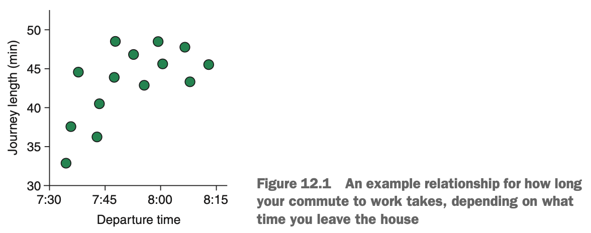
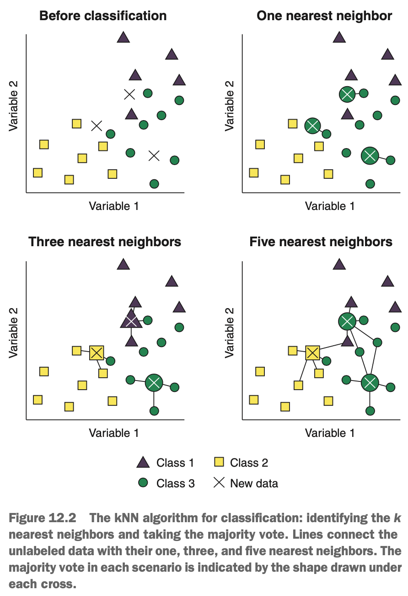
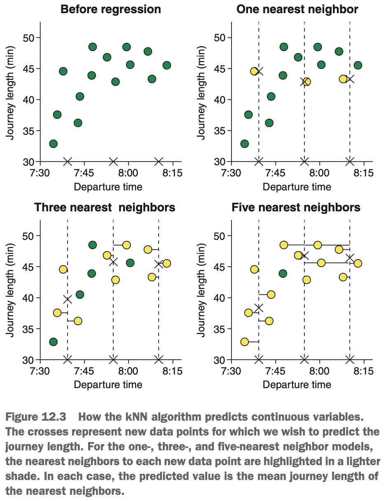
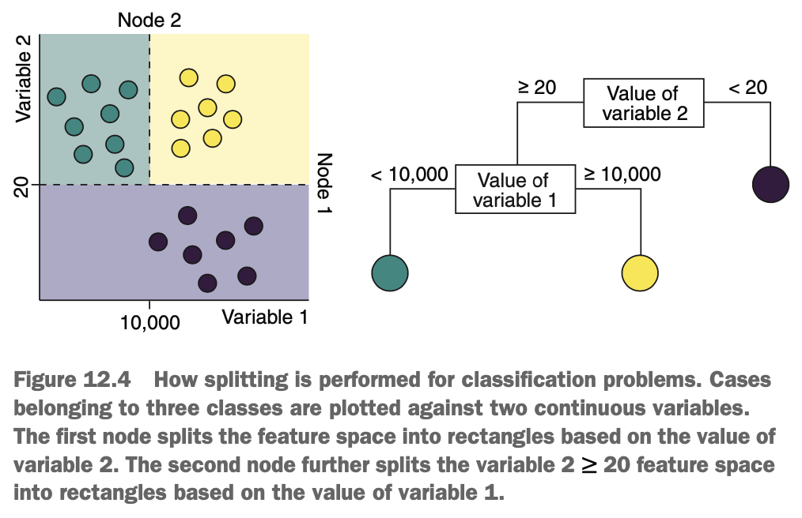
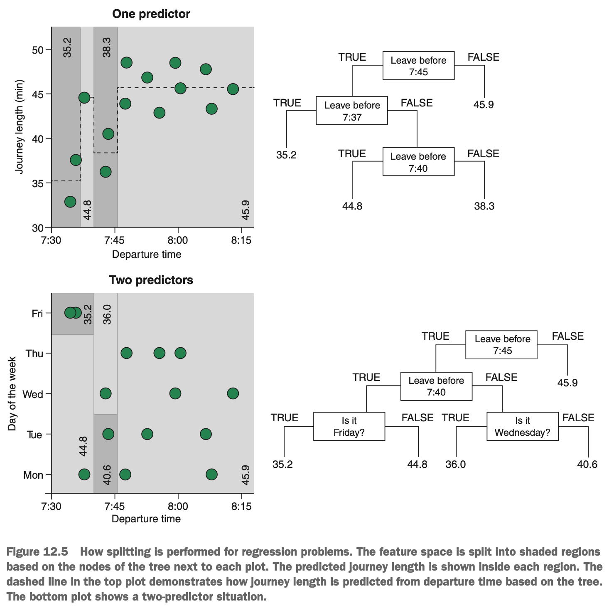
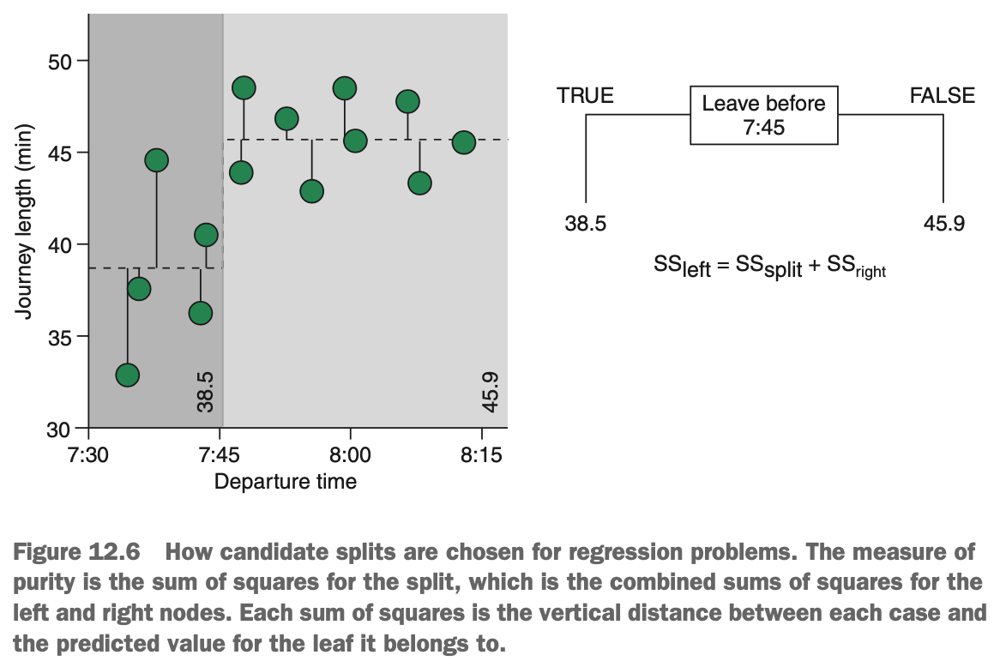

# Using k-Nearest Neighbours to Predict a Continuous Variable

Imagine that we're not morning people & we like to spend as much time in bend as possible. To maximise the amount of time we spend sleeping, we decide to train a machine learning model to predict how long it takes us to commute to work, based on the time we leave the house. It takes us 40 minutes to get ready in the morning, so we hope this model will tell us what time we need to leave the house to get to work on time, & therefore what time we need to wake up.

Every day for two weeks, we record the time we leave the house & how long our journey takes. Our journey time is affected by the traffic (which varies across the morning), so our journey length changes, depending on when we leave. An example of what the relationship between departure time & journey length might look like is shown below.

{width=60%}

Recall that the kNN algorithm is a lazy learner. It doesn't do any work during model training; it only stores the training data. It does all of its work when it makes predictions. When making predictions, the kNN algorithm looks in the training set for the *k* cases most similar to each of the new, unlabeled data values. Each of those *k* most similar cases votes on the predicted value of the new data. When using kNN for classification, these votes are for class membership, & the winning vote selects the class the model outputs for the new data. 

{width=45%}

The voting process when using kNN for regression is very similar, except we take the mean of these *k* votes as the predicted value for the new data. The process is illustrated for our commuting example below.

{width=50%}

The crosses on the x-axis represent new data: times we left the house & for which we want to predict journey length. If we train a one-nearest neighbour model, the model finds the single case from the training set that is closest to the departure time of each of the new data points, & uses that value as the predicted journey length. If we train a three-nearest neigbours model, the model finds the three training cases with departure times most similar to each of the new data points, takes the mean journey length of these nearest cases, & outputs this as the predicted value for the new data. The same applies to any number of *k* we use to train the model.

***

# Using Tree-Based Learners to Predict a Continuous Variable

Recall that tree-based algorithms (such as the rpart algorithm) split a feature space into separate regions, one binary split at a time. The algorithm tries to partition the feature space such that each region contains only cases from a particular class. Put another way, the algorithm tries to learn binary splits that result in regions that are as pure as possible.

{width=55%}

Classification with tree-based algorithms is a bit like herding animals into their pens on a farm. It's quite obvious that we want one pen for the chickens, one for the cows, & one for the alpacas. So conceptually, it's quite easy for us to picture splitting regions of the feature space into different pens for different categories. But it's perhaps it's not so easy to picture splitting the feature space to predict a continuous variable.

So how does this partitioning work for regression problems? In exactly the same way, the only difference is that instead of each region representing a class, it represents a value of the continuous outcome variable. 

{width=80%}

Take a look at the diagram above, where we're creating a regression tree using our journey length example. The nodes of the regression tree split the feature space (departure time) into distinct regions. Each region represents the mean of the outcome variable of the cases inside it. When making predictions on the new data, the model will predict the value of the region of the new data falls into. The leaves of the tree are no longer classes, but numbers. Although the diagram only illustrates situations for one & two predictor variables, it extends to any number of predictors.

Just as for classification, regression trees can handle both continuous & categorical predictor variables (with the exception of XGBoost, which requires categorical variables to be numerically encoded). The way splits are decided for continuous & categorical variables is the same as for classification trees, except that instead of finding the split that has the highest Gini gain, the algorithm looks for the split with the lowest sum of squares.

{width=65%}

For each candidate split, the algorithm calculates the sum of squared residuals for the left & right split, & adds them together to form a sum of squared residuals for the split as a whole. In the above figure, the algorithm is considering the candidate split of a departure time before 7:45. For each case where the departure time was before 7:45, the algorithm calculates the mean journey length, finds the residual error (the difference between each case's journey length & the mean), & squares it. The same is done for the cases where you left the house after 7:45, with their respective mean. These two sums of squared residual values are added together to give the sum of squares for the split. It is given in the equation below:

$$SS_{split} = \sum_{i \in left}(y_i - \hat{y_{left}})^2 + \sum_{i \in right}(y_i - \hat{y_{right}})^2$$

where $i \in left$ & $i \in right$ indicate cases belonging to the left & right splits, respectively.

The candidate split with the lowest sum of squares is chosen as the split for any particular point in the tree. So, for regression trees, *purity* refers to how spread the data are around the mean of the node.
