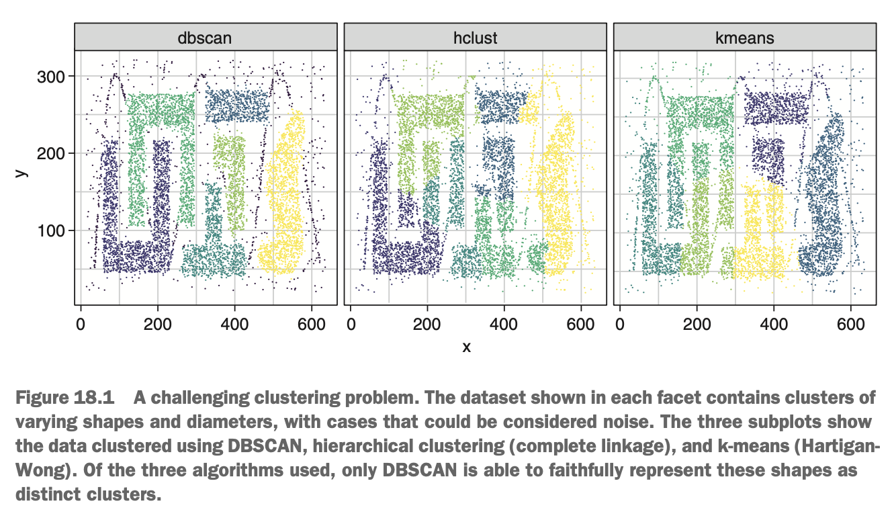
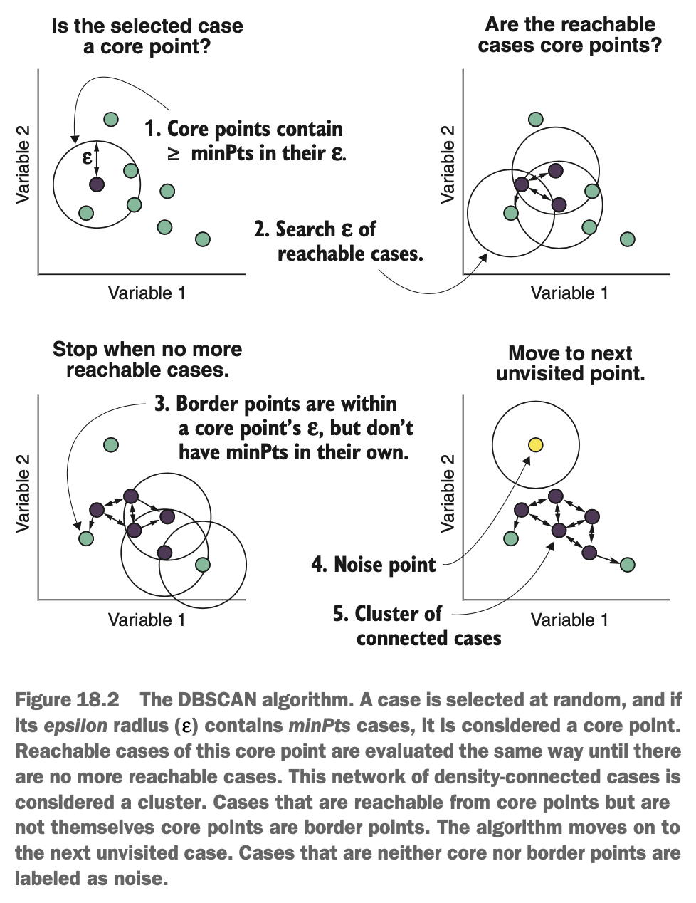
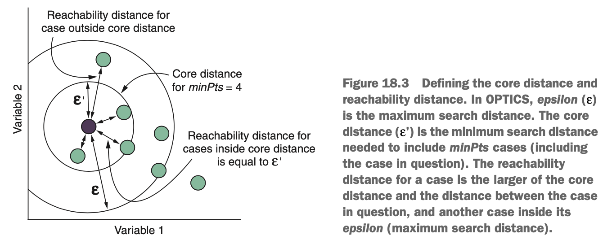
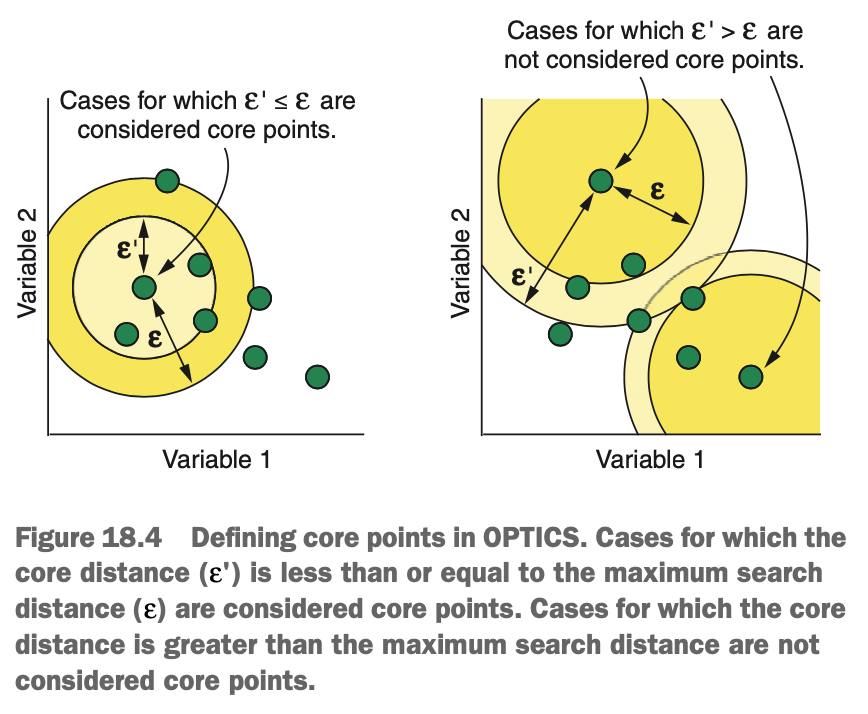
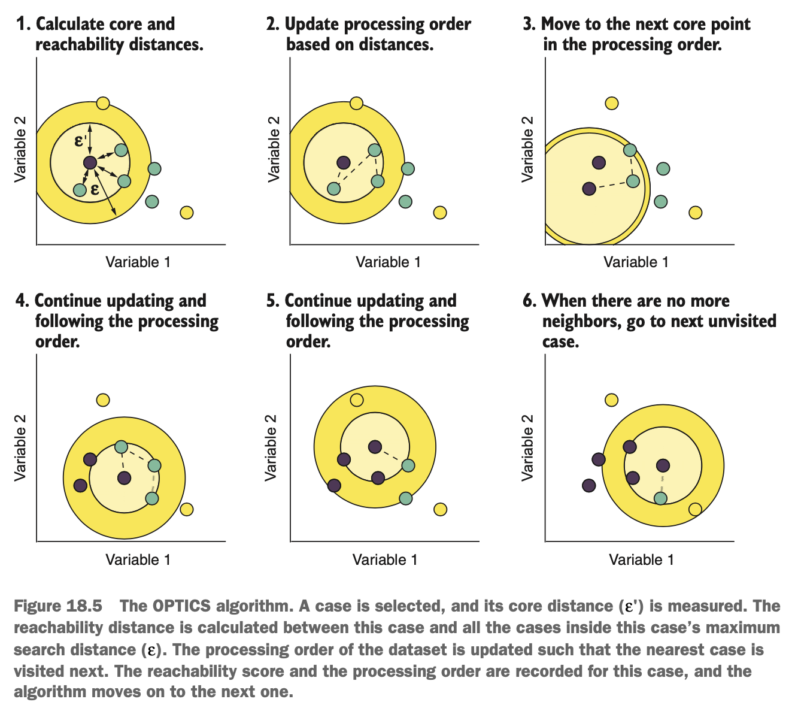
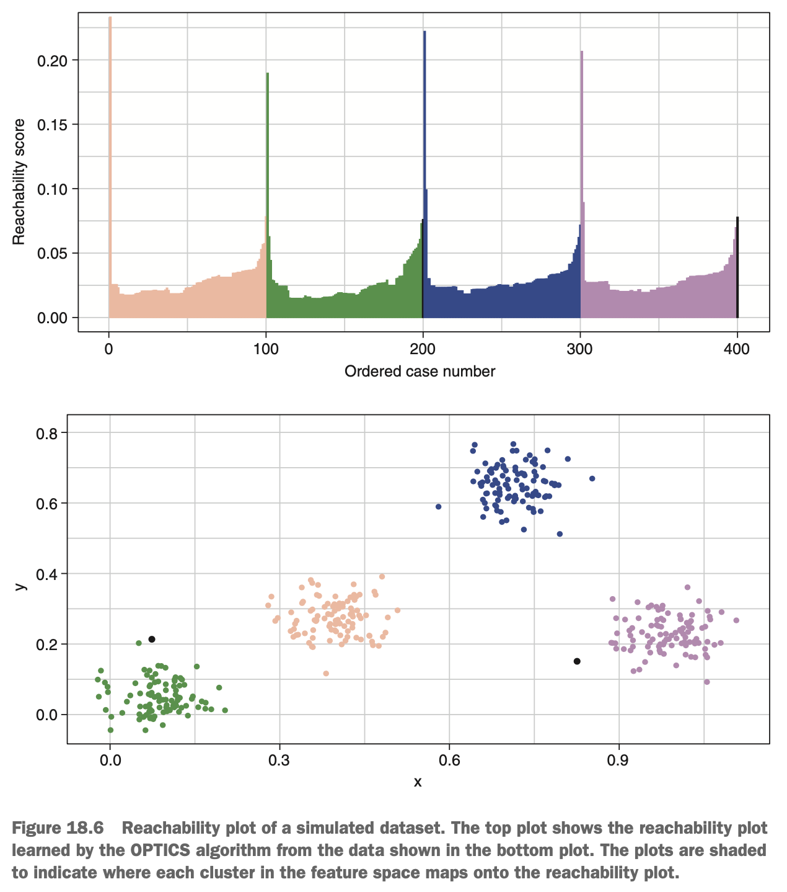
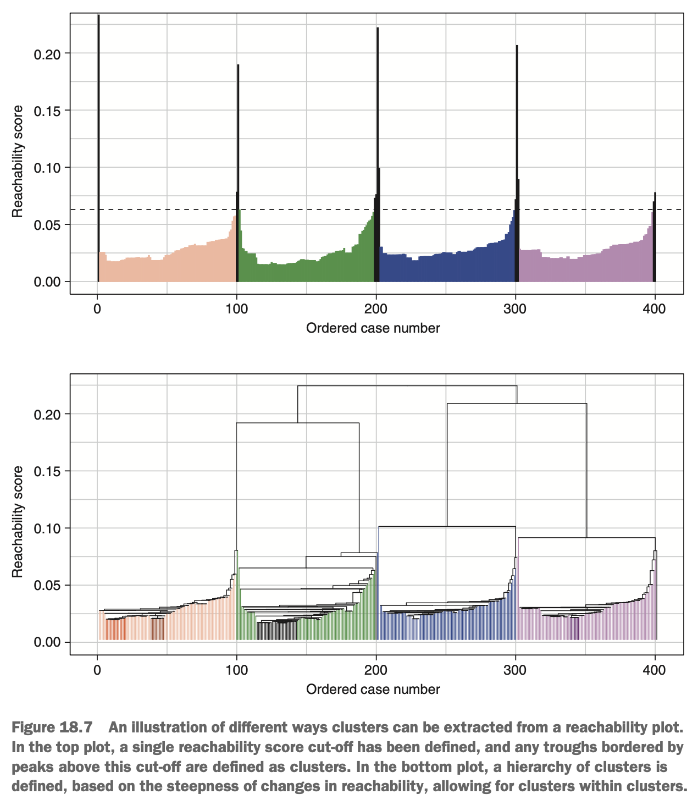

# What is Density-Based Clustering?

Two of the most commonly used density-based clustering algorithms are:

* Density-based spatial clustering of applications with noice (DBSCAN)
* Ordering points to identify the clustering structure (OPTICS)

Aside from having names that were seemingly contrived to form interesting acronyms, DBSCAN & OPTICS both learn regions of high density, separated by regions of low density in a data set. They achieve this in similar but slightly different ways, but both have a few advantages over k-means & hierarchical clustering:

* They are not biased to finding spherical clusters & can in fact find clusters of varying & complex shapes.
* They are not biased to finding clusters of equal diameter & can identify both very wide & very tight clusters in the same data set.
* They are seemingly unique among clustering algorithms in that cases that do not fall within regions of high enough density are put into a separate 'noise' cluster. This is often a desirable property, because it helps to prevent overfitting the data & allows us to focus on cases for which the evidence of cluster membership is stronger.

All three of these advantages can be seen in the diagram below.

{width=70%}

The three subplots each show the same data, clustered using either DBSCAN, k-means (Hartigan-Wong algorithm), or hierarchical clustering (complete linkage). This data set is certainly strange, & we might think we're unlikely to encounter real-world data like it, but it illustrates the advantages of density-based clustering over k-means & hierarchical clustering. The clusters in the data have very different shapes (that certainly aren't spherical) & diameters. While k-means & hierarchical clustering learn clusters that bisect & merge those real clusters, DBSCAN is able to faithfully find each shape as a distinct cluster. Additionally, notice that k-means & hierarchical clustering place every single case into a cluster. DBSCAN creates the cluster '0' into which it places any cases it considers to be noise. In this case, all cases outside of those geometrically shaped clusters are placed into the noise cluster. If we look carefully, we might notice a sine wave in the data that all three fail to identify as a cluster. 

### How Does The DBSCAN Algorithm Learn?

In order to understand the DBSCAN algorithm, we first need to understand its two hyperparameters:

* *epsilon* ($\varepsilon$)
* *minPts*

The algorithm starts by selecting a case in the data & searching for other cases within a search radius. This radius is the *epsilon* hyperparameter. So *epsilon* is simply how far away from each case (in an *n*-dimensional sphere) the algorithm will search for other cases around a point. Epsilon is expressed in units of the feature space & will be the Euclidean distance by default. Larger values mean the algorithm will search further away from each case.

The *minPts* hyperparameter specifies the minimum number of points (cases) that a cluster must have in order for it to be a cluster. The *minPts* hyperparameter is therefore an integer. If a particular case has at least *minPts* cases inside its *epsilon* radius (including itself), that case is considered a *core point*.

{width=50%}

The diagram above walks through the DBSCAN algorithm. The first step of the algorithm is to select a case at random from the data set. The algorithm searches for other cases in an *n*-dimensional sphere (where *n* is the number of features in the data set) with radius equal to *epsilon*. If this case contains at least *minPts* cases inside its search radius, it is marked as a core point. If the case does not contain *minPts* cases inside its search space, it is not a core point, & the algorithm moves on to another case.

Let's assume the algorithm picks a cases & finds that it is a core point. The algorithm then visits each of the cases within *epsilon* of the core point & repeats the same task: looks to see if this case has *minPts* cases inside its own search radius. Two cases within each others search radius are said to be *directly density connected* & *reachable* from each other. The search continues recursively, following all direct density connections from core points. If the algorithm finds a case that is reachable to a core point but does not itself have minPts-reachable cases, this case is considered a *border point*. The algorithm only searches the search space of core points, not border points.

Two cases are said to be *density connected* if they are not necessarily directly desntiy connected but are connected to each other via a chain or series of directly density-connected cases. Once the search has been exhausted, & none of the visited cases have any more direct density connections left to explore, all cases that are density connected to each other are placed into the same cluster (including border points).

The algorithm now selects a different case in the data set -- one that it hasn't visited before -- & the same process begins again. once every case in the data set has been visited, any lonesome cases that were neither core points nor border points are added to the noise cluster & are considered too far from regions of high density to confidently be clustered with the rest of the cases. So DBSCAN finds clusters by finding chains of cases in high-density regions of the feature space & throws out cases occupying spares regions of the feature space.

That was a lot of information. Here's a quick recap. (This is also important for the OPTICS algorithm.)

* *Epsilon* - The radius of an *n*-dimensional sphere around a case, within which the algorithm searches for other cases
* *minPts* - The minimum number of cases allowed in a cluster, & the number of cases that must be within *epsilon* of a case for it to be a core point
* *Core point* - A case that has at least *minPts* reachable cases
* *Reachable/directly density connected* - When two cases are within *epsilon* of each other 
* *Density connected* - When two cases are connected by a chain of directly density connected cases but may not be directly density connected themselves
* *Border point* - A case that is reachable from a core point but is not itself a core point
* *Noise point* - A case that is neither a core point nor reachable from one

### How Does The OPTICS Algorithm Learn?

The DBSCAN algorithm has one important drawback: it struggles to identify clusters that have different densities than each other. The OPTICS algorithm is an attempt to alleviate that drawback & identify clusters with varying densities. It does this by allowing the search radius around each case to expand dynamically instead of being fixed at a predetermined value.

In order to understand how OPTICS works, we'll need to introduce two new terms:

* Core distance
* Reachability distance

In OPTICS, the search radius around a case isn't fixed but expands until there are at least *minPts* cases within it. This means cases in dense regions of the feature space will have a small search radius, & cases in sparse regions will have a large search radius. The smallest distance away from a case that includes *minPts* other cases is called the *core distance*, sometimes abbreviated to $\varepsilon'$. In fact, the OPTICS algorithm only has one mandatory hyperparameter: *minPts*.

The *reachability distance* is the distance between a core point & another core point within its *epsilon*, but it cannot be less than the core distance. Put another way, if a case has a core point inside its core distance, the reachability distance between these cases is the core distance. If a case has a core point outside its core distance, then the reachability distance between these cases is simply the Euclidean distance between them.

{width=70%}

Take a look at the diagram above. We can see two circles centered around the darkly shaded case. The circle with the larger radius is *epsilon*, & the one with the smaller radius is the core distance ($\varepsilon'$). This example is showing the core distance for a *minPts* value of 4, because the core distance has expanded to include four cases (including the case in question). The arrows indicate the reachability distance between the core point & the other cases within its *epsilon*.

Because the reachability distance is the distance between one core point & another core point within its *epsilon*, OPTICS need to know which cases are core points. So the algorithm starts by visiting every case in the data & determining whether its core distance is less than *epsilon*. This is illustrated in the diagram below. If a case's core distance is less than or equal to *epsilon*, the case is a core point. If a case's core distance is greater than *epsilon*, the case is not a core point.

{width=45%}

Now that we understand the concepts of core distance & reachability distance, we'll see how the OPTICS algorithm works. The first step is to visit each case in the data & mark it as a core point or not. The rest of the algorithm is illustrated in the diagram below.

{width=70%}

OPTICS selects a case & calculates its core distance & its reachability distance to all cases inside its *epsilon* (the maximum search distance).

The algorithm does two things before moving on to the next case:

* Records the *reachability score* of the case
* Updates the processing order of cases

The reachability score of a case is different from a reachability distance. A case's reachability score is defined as the alrger of its core distance or its smallest reachability distance. If a case doesn't have *minPts* cases inside *epsilon* (it isn't a core point), then its reachability score will be the reachability distance to its closest core point. If a case does have *minPts* cases inside its *epsilon*, the its smallest reachability distance will be less than or equal to its core distance, so we just take the core distance as the case's reachability score.

Once the reachability has been recorded for its particular case, the algorithm then updates the sequence of cases it's going to visit next (the processing order). It updates the processing order such that it will next visit the core point with the smallest reachability distance to the current case, then the one that is next-farthest away, & so on. This is illustrated in the second step of the above diagram.

The algorithm then visits the next case in the update processing order & repeats the same process, likely changing the processing order once again. When there are no more reachable cases in the current chain, the algorithm moves on to the next unvisited core point in the data set & repeats the process.

Once all cases have been visited, the algorithm returns both the processing order (the order in which each case was visited) & the reachability score of each case. If we plot processing order against reachability score, we get something like the top plot in  the below diagram.

{width=65%}

This plot applied the OPTICS algorithm to a simulated data set with four clusters. Notice that when we plot the processing order against the reachability score, we get four shallow troughs, each separated by spikes of high reachability. Each trough in the plot corresponds to a region of high density, while each spike indicates a separation of these regions by a region of low density.

The OPTICs algorithm actually goes no further than this. Once it produces the plot, its work is doen, & now it's our job to use the information contained in the plot to extract the cluster membership. This is why we say that OPTICS isn't technically a clustering algorithm but creates an ordering of the data that allows us to find clusters in the data.

So how do we extract clusters? We have a couple of options. One method would be to simply draw a horizontal line across the reachability plot, at some reachability score, & define the start & end of clusters as when the plot dips below & back above the line. Any cases above the line could be classified as noise, as shown in the plot below.

{width=70%}

This approach will result in the clustering very similar to what the DBSCAN algorithm would produce, except that some border points are more likely to be put into the noise cluster.

Another (usually more useful) method is to define a particular steepness in the reachability plot as indicative of the start & end of a cluster. We can define the start of a cluster as when we have a downward slope of at least this steepness, & its end as when we have an upward slope of at least this steepness. The method we'll use defines the steepness as $1 - \xi$ (xi, pronounced 'zy', 'sigh', or 'kzee'), where the reachability of two successive cases must change by a factor of $1 - \xi$. When we have a downward slope that meets this steepness criterion, the start of a cluster is defined; & when we have an upward slope that meets this steepness, the end of the cluster is defined.

Using this method has two majour benefits. First, it allows us to overcome DBSCAN's limitation of only finding clusters of equal density. Second, it allows us to find clusters within clusters, to form a hierarchy. Imagine that we have a downward slope that starts a cluster, & then we have another downward slope before the cluster ends: we have a cluster within a cluster. This hierarchical extraction of clusters from a reachability plot is shown on thebottom plot of the above diagram.