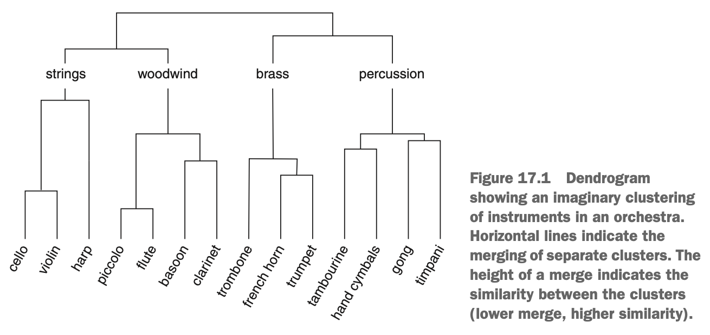
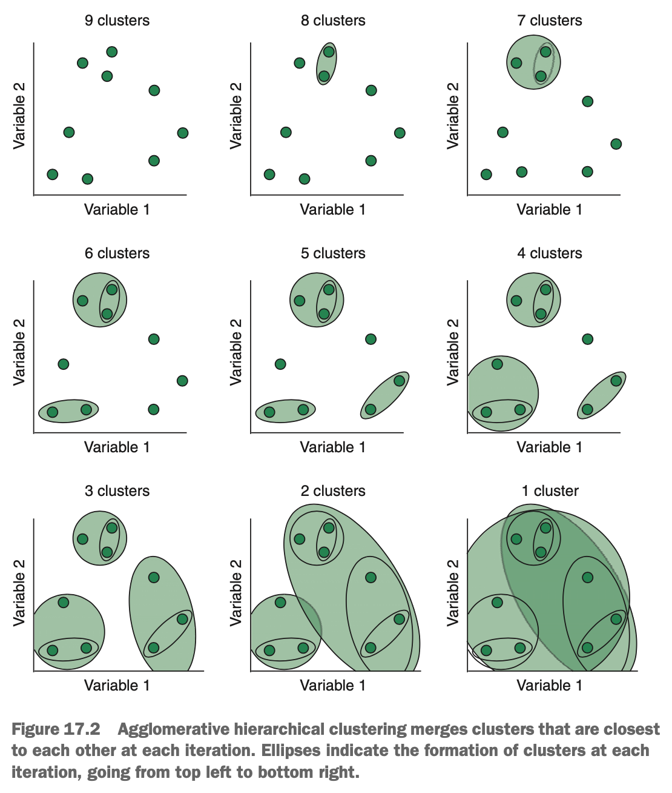
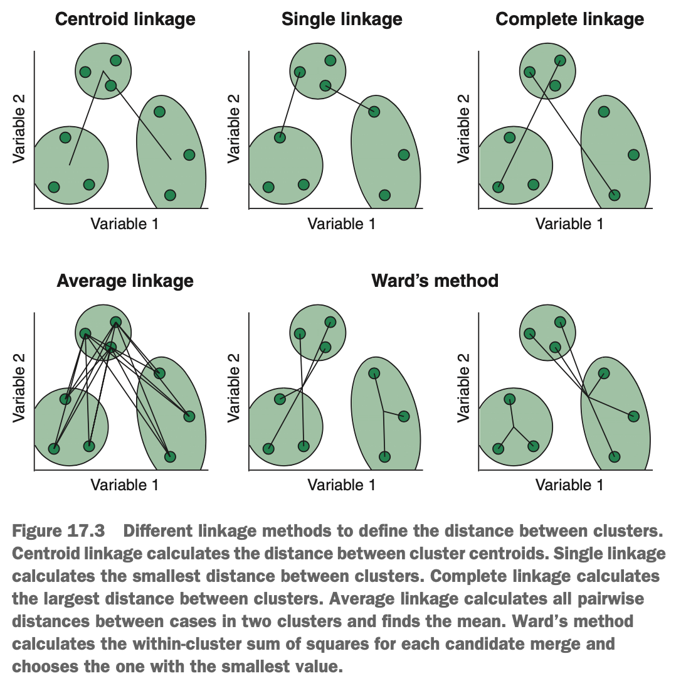

# What is Hierarchical Clustering?

When we looked at k-means clustering, we only considered a single level of clustering. But sometimes, hierarchicals exist in our data set that clustering at a single, flat level is unable to highlight. For example, imagine that we werelooking at clusters of instruments in an orchestra. At the highest level, we could place each instrument into one of four different clusters:
 
* Percussion
* Brass
* Woodwinds
* Strings

But we could then further split each of these clusters into sub-clusters based on the way they're played:

* Percussion
   - Played with a mallet
   - Played by hand
* Brass
   - Valve
   - Slide
* Woodwinds
   - Reeded
   - Non-reeded
* Strings
   - Plucked 
   - Bowed
   
Next, we could further split this level of clusters into sub-clusters based on the sounds they make:

* Percussion
   - Played with a mallet
      - Timpani
      - Gong
   - Played by hand
      - Hand cymbals
      - Tambourine
* Brass
   - Valve
      - Trumpet
      - French horn
   - Slide
      - Trombone
* Woodwinds
   - Reeded
      - Clarinet
      - Bassoon
   - Non-reeded
      - Flute
      - Piccolo
* Strings
   - Plucked 
      - Harp
   - Bowed
      - Violin
      - Cello
      
Notice that we have formed a hierarchy where there are clusters of instruments within other clusters, going all the way from a very high-level clustering down to each individual instrument. A common way to visualise hierarchies like this is with a graphical representation called a dendrogram, such as the one shown below.

{width=70%}

Notice that at the bottom of the dendrogram, each instrument is represented by its own vertical line, & at this level, instruments in the same cluster are connected by a horizontal line. The height at which clusters merge like this is inversely proportional to how similar the clusters are to each other. For example, we've drawn this dendrogram to suggest that the piccolo & flute are more similar to each other than how similar the bassoon & clarinet are to each other.

Typically, when finding a hierarchy in data like this, one end of the dendrogram displays every case in its own cluster; these clusters in a data set. The main benefit of hierarchical clustering over k-means is that we get a much finer-grained understanding of the structure of our data, & this approach is often able to reconstruct real hierarchies in nature. For example, imagine that we sequence the genomes (all the DNA) of all breeds of frogs. We can safely assume that the genome of a breed will be more similar to the genome of the breed(s) it was derived from than it is to the genomes of breeds it was not derived from. If we apply hierarchical clustering to this data, the hierarchy, which can be visualised as a dendrogram, can be directly interpreted as showing which breeds were derived from other breeds.

The hierarchy is very useful, but how do we partition the dendrogram into a finite set of clusters? Well, at any height on the dendrogram, we can cut the tree horizontally & take the number of clusters at that level. Another way of imagining it is that if we were to cut a slice through the dendrogram, however many individual branches would fall off is the number of clusters. Look back at the diagram above. If we cut the tree where we've labeled the strings, woodwinds, brass & percussion, we would get four individual clusters, & cases would be assigned to whichever of these four clusters they fell within.

Now that we have an understanding of what hierarchical clustering algorithms try to achieve, we can talk about how they achieve it. There are two approaches we can take while trying to learn hierarchies in data.

Agglomerative hierarchical clustering is where we start with every case isolated in its own cluster, & sequentially merge clusters until all the data resides within a single cluster. Divisive hierarchical clustering does the opposite: it starts with all the cases in a single cluster & recursively splits them into clusters until each case resides in its own cluster.

### Agglomerative Hierarchical Clustering

The way agglomerative hierarchical clustering learns the structure in the data is quite simple:

1. Calculate some distance metric (defined by us) between each cluster & all other clusters.
2. Merge the most similar clusters together into a single cluster.
3. Repeat steps 1 & 2 until all cases reside in a single cluster.

{width=60%}

An example of how this might look is shown above. We start with nine cases & therefore nine clusters. The algorithm calculated a distance metric between each of the clusters & merges the clusters that are most similar to each other. This continues until all the cases are gobbled up by the final supercluster.

So how do we calculate the distance between clusters? The first choice we need to make is what kind of distance we want to compute. As usual, the Euclidean & Manhattan distance are the most popular choices. The second choices is how to calculate this distance metric between clusters. Calculating the distance between two cases (two vectors) is reasonably obvious, but a cluster contains multiple cases; how do we calculate Euclidean distance between two clusters? We have a few options available to use, called *linkage methods*:

* Centroid linkage
* Single linkage
* Complete linkage
* Average linkage
* Ward's method

Each of these linkages is illustrated below.

{width=60%}

Centroid linkage calculates the distance (Euclidean or Manhattan, for example) between each cluster's centroid to every other cluster's centroid. Single linkage takes the distance between the nearest cases of two clusters, as the distance between those clusters. Average linkage takes the average distance between all the cases of two clusters, as the distance between those clusters. Ward's method is a little more complex. For every possible combination of clusters, Ward's method (sometimes called Ward's minimum variance method) calculates the within-cluster sum of squares. Look at the examples for Ward's method. The algorithm has three clusters to consider merging. For each candidate merge, the algorithm calculates the sum of squared differences between each case & its cluster's centroid, & then adds these sums of squares together. The candidate merge that results in the smallest sum of squared differences is chosen at each step.

### Divisive Hierarchical Clustering

Unlike agglomerative clustering, divisive clustering starts with all cases in a single cluster & recursively divides this into smaller & smaller clusters, until each case resides in its own cluster. Finding the optimal split at each stage of clustering is a difficult task, so divisive clustering uses a heuristic approach.

At each stage of clustering, the clusters with the largest diameter is chosen. Recall that a cluster's diameter is the largest distance between any two cases within the cluster. The algorithm then finds the case in this cluster that has the alrgest average distance to all the other cases in teh cluster. This most-dissimilar case starts its own splinter group (like a rebel without a cause). The algorithm then iterates through every case in the cluster & assigns cases to either the splinter group or the original cluster, depending on which they are most similar to. In essence, divisive clustering applies k-means clustering (with *k* = 2) at each level of the hierarchy, in order to split each cluster. This process repeats until all cases reside in their own cluster.

There is only one implementation of divisive clustering: The DIANA (DIvisive ANAlysis) algorithm. Agglomerative clustering is more commonly used & is less computationally expensive than the DIANA algorithm. However, mistakes made early in hierarchical clustering cannot be fixed further down the tree; so whereas agglomerative clustering may do better at finding small clusters, DIANA may do better at finding large clusters. 