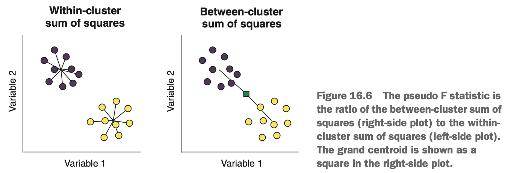

```{r, include = FALSE}
library(tidyverse)
library(mclust)
library(GGally)
library(mlr)
library(clusterSim)
```


# Building Your First k-Means Cluster

Imagine we're looking for clusters of white blood cells from patients with graft versus host disease (GvHD). GvHD is a unpleasant disease where residual white blood cells in transplanted tissue attack the body of the patient receiving the transplant. We take a biopsy from each pateint & measure different proteins on the surface of each cell. We hope to create a clustering model that will help us identify different cell types from the biopsy, to help us better understand the disease.


### Loading & Exploring the GvHD Data Set

We'll load the data, which is built into the mclust package, convert it into a tibble with `as_tibble()`, & explore it a little.

```{r}
data(GvHD, package = 'mclust')
gvhdTib <- as_tibble(GvHD.control)
gvhdTib
```

We have a tibble containing 6,809 cases & 4 variables, each of which is a different protein measured on the surface of each cell.

Because k-mean algorithms use a distance metric to assign cases to clusters, it's important that our variables are scaled so variables on different scales are given equal weight. All of our variables are continuous, so we can simply pipe our entire tibble into the `scale()` function. Remember that this will center & scale each variable by subtracting the mean & dividing by the standard deviation.

```{r}
gvhdScaled <- gvhdTib %>% scale()
```

Next, let's plot the data using using the `ggpairs()` function from the GGally package. This time, we modify the way `ggpairs()` draws the facets. We use the `upper`, `lower`, & `diag` arguments to specify what kind of plots should be drawn above, below, & on the diagonal respectively. Each of these arguments takes a list where each list element can be used to specify a different type of plot for continuous variables, discrete variables, & combinations of the two. We'll draw 2D density plots on the upper plots, scatterplots on the lower plots, & density plots on the diagonal.

To prevent overcrowding, we reduce the size of the points on the lower plots. To change any of the graphical options of the plots (such as size & colour of the geoms), we need to wrap the name of the plot type inside the `wrap()` function, along with the options we're changing. Here, we use `wrap('points', size = 0.5)` to draw scatterplots on the lower panels, with a smaller point size than the default.

```{r}
ggpairs(GvHD.control,
        upper = list(continuous = 'density'),
        lower = list(continuous = wrap('points', size = 0.5)),
        diag = list(continuous = 'densityDiag')) +
  theme_bw()
```

The resulting plot is above. We can see different clusters of cases in the data. It seems that there are at least 4 clusters in the data set. The density plots are useful to help us see dense regions of cases, which simply appear black in the scatterplots.


### Defining our Task & Learner

In mlr, we create a clustering task by using the `makeClusterTask()` function. We supply our scaled data (converted into a data frame) as the `data` argument. 

**Note: We can use `listLearners()` to see what algorithms have been implemented by the mlr package. Not a lot of clustering algorithms are provided by mlr, much fewer than the number of algorithms available for classification & regression.**

Let's define our k-means learner. We do this using the familiar `makeLearner()` function, this time supplying 'cluster.kmeans' as the name of the learner. We use the `par.vals` argument to supply two arguments to the learner: `iter.max` & `nstart`.

```{r, warning = FALSE}
gvhdTask <- makeClusterTask(data = as.data.frame(gvhdScaled))
gvhdTask

listLearners('cluster')$class

kMeans <- makeLearner('cluster.kmeans',
                      par.vals = list(iter.max = 100, nstart = 10))
kMeans
```

The `iter.max` argument sets an upper limit for the number of times the algorithm will cycle through the data (the default is 10). The k-means algorithms will all stop once cases stop moving clusters, but setting a maximum can be useful for large data sets that take a long time to converge.

The `nstart` argument controls how many times the function will randomly initialise the centers. Recall that the initial centers are usually randomly initialised somewhere in the feature space: this can have an impact on the final centroid positions &, therefore, the final cluster memberships. Setting the `nstart` argument higher than the default value of 1 will randomly initialise this number of centers. For each set  of initial centers, the cases are assigned to the cluster of their nearest center in each set, & the set with the smallest within-cluster sum of squared error is then used for the rest of the clustering algorithm. In this way, the algorithm selects the set of centers that is already most similar to the real cluster centroids in the data. Increasing `nstart` is arguably more important than increasing the number of iterations.


### Choosing the Number of Clusters

We will need to learn how to sensibly choose the value of *k*, which defines the number of centers, & therefore clusters, that our model will identify. The need to choose *k* is often cited as a weakness of k-means clustering. This is because choosing *k* can be subjective. If we have prior domain knowledge as to how many clusters should theoretically be present in a data set, then we should use this knowledge to guide our selection. If we're using the clustering as a pre-processing step before a supervised learning algorithm (classification, for example), then the choice is quite easy: tune *k* as a hyperparameter of the whole model-building process, & compare the predictions of the final model against the original labels.

But what if we have no prior knowledge & no labeled data to compare against? What happens if we get our selection wrong? Just like for classification & regression, clustering is subject to the bias-variance trade-off. If we want to generalise a clustering model to the wider population, it's important we neither overfit nor underfit the training data. The below figure illustrates what under- & overfitting might look like for a clustering problem. When we underfit, we fail to identify & separate real clusters in the data; but when we overfit, we split real clusters into smaller, non-sensical clusters that simply don't exist in the wider population.

{width=55%}

Avoiding over- & underfitting clustering problems is not straightfoward. people have proposed many different methods for avoiding over- & underfitting, & they won't all agree with one another for a particular problem. Many of these methods rely on the calculation of *internal cluster metrics*, which are statistics that aim to quantify the 'quality' of a clustering result.

These metrics are 'internal' because they are calculated from the clustered data itself rather than by comparing the result to any external label or ground truth. A common approach to selecting the number of clusters is to train multiple clustering models over a range of cluster numbers & compare the cluster metrics for each mode to help choose the best-fitting one. Three commonly used internal cluster metrics are as follows:

* Davies-Bouldin index
* Dunn index
* Pseudo F statistic

##### Using the Davies-Bouldin Index to Evaluate Clustering Performance

The Davies-Bouldin index quantifies the average separability of each cluster from its nearest counterpart. It does this by calculating the ration of the within-cluster variance (aka *scatter*) to the separation between cluster centroids.

{width=55%}

If we fix the distance between clusters but make the cases within each cluster more spread out, the Davies-Bouldin index will get larger. Conversely, if we fix the within-cluster variance but move the clusters farther apart from each other, the index will get smaller. In theory, the smaller the value (which is bounded between zero & infinity), the better the separation between cluster. Boiled down into plain English, the Davis-Bouldin index quantifies the mean separability between each cluster & its most similar counterpart.


**Calculating the Davies-Boulding Index**

We define the scatter within clusters as

$$scatter_k = (\frac{1}{n_k}\sum_{i \in k}^{n_k}(x_i - c_k)^2)^{1/2}$$

where $scatter_k$ is a measure of scatter within cluster $k$, $n_k$ is the number of cases in cluster $k$, $x_i$ is the $i^{th}$ case in cluster $k$, & $c_k$ is the centroid of cluster $k$. 

The separation between clusters can be defined as 

$$separation_{j,k} = (\sum_{1 \le j \le k}^{N}(c_j - c_k)^2)^{1/2}$$

where $separation_{j,k}$ is a measure of the separation between clusters $j$ & $k$, $c_j$ & $c_k$ are their respective centroids, & $N$ is the total number of clusters.

The ratio between within-cluster scatter & the separation between two clusters is then calculated as 

$$ration_{j,k} = \frac{scatter_j + scatter_k}{separation_{j,k}}$$

This ratio is calculated for all pairs of clusters, & for each cluster, the largest ratio between it & the other clusters is defined to be $R_k$. The Davies-Bouldin index is then simply the mean of these largest ratios:

$$DB = \frac{1}{N}\sum_{k = 1}^{N}R_k$$


##### Using the Pseudo F Statistic to Evaluate Clustering Performance

The pseudo F statistic is a ratio of the *between-cluster sum of squares* to the *within-cluster sum of squares*. The between-cluster sum of squares is the squared difference between each cluster centroid & the *grand centroid* (the centroid of the data as if it was all in one big cluster), weighted by the number of cases in that cluster, added up across each cluster. This is another way of measuring how separated the clusters are from each other (the farther the cluster centroids are from each other, the smaller the between sum of squares will be). The within-cluster sum of squares is the squared difference between each case & its cluster's centroid, added up across each cluster. This is another way of measuring the variance or dispersion within each cluster (the denser each cluster is, the smaller the within-cluster sum of squares will be).

{width=75%}

Because the pseudo F statistic is also a ratio, if we maintain the same cluster variance but move the clusters farther apart, the pseudo F statistic will increase. Conversely, if we maintain the same separation between the cluster centroids but make the clusters more spread out, the pseudo F statistic will decrease. As such, the number of clusters that results in the largest pseudo F statistic is, in theory, the one that maximises the separation of the clusters.

**Calculating the Pseudo F Statistic**

We define the pseudo F statistic as

$$Pseudo F = \frac{SS_{between}/(k - 1)}{SS_{within}/(n - k)}$$

where $SS_{between}$ & $SS_{within}$ are calculated as

$$SS_{between} = \sum_{k}^{N} n_k(c_k - c_g)^2$$

$$SS_{within} = \sum_{k}^{N} \sum_{i \in k}^{n_k}(x_i - c_k)^2$$

where there are $N$ clusters, $n_k$ is the number of cases in cluster $k$, $c_k$ is the centroid of cluster $k$, & $c_g$ is the grand centroid of all cases.

These are just two among the many commonly used internal cluster metrics, & at this point, we may be wondering why there isn't just one metric that tells us how well separated our clusters are. The reason is that these metrics will tend to agree with each other when we have very clear, well-defined clusters, but will start to disagree with each other as the solution becomes more ambiguous, with some of the metrics performing better than others in certain circumstances. For example, internal cluster metrics that rely on calculating sum of squares may prefer to select a number of clusters if the real clusters have very unequal diameters. As such, it's often a good idea to consider multiple internal cluster metrics as evidence when choosing the number of clusters.

So internal cluster metrics like these can help use find the optimal number of clusters. But there is always a danger that we might overfit the training data by *over-clustering*. One approach to avoid overclustering is to take multiple bootstrap samples (sampling cases with replacement) of the data, apply the clustering algorithm to each sample, & compare how well the cluster memberships agree between samples. If there is high stability (in other words, the clustering result is *stable* between samples), then we have more confidence that we are not fitting the noise in data.

For clustering algorithms that are able to predict the clusters of new data, like the k-means algorithms, another approach is to use a cross-validation-like procedure. This involves splitting the data into training & test sets (using k-fold, for example), training the clustering algorithm on the training set, predicting the cluster membership of the cases in the test set, & calculating internal cluster metrics for the predicted clusters. This approach has the benefit of allowing us both to test cluster stability & to calculate the metric on data the algorithm never saw. This is the approach we'll use to select the optimal number of clusters using k-means.


### Tuning k & the Algorithm Choice for our k-Means Model

We'll start by defining our hyperparameter search space using the `makeParamSet()` function. We define two discrete hyperparameters over which to search for values: `centers`, which is the number of clusters the algorithm will search for (*k*), & `algorithm`, which specifies which of the three algorithms we will use to fit the model. We then define our search method as a grid search (to try every combination of hyperparameters) & define our cross-validation approach as 10-fold.

```{r}
kMeansParamSpace <- makeParamSet(
  makeDiscreteParam('centers', values = 3:8),
  makeDiscreteParam('algorithm', values = c('Hartigan-Wong', 'Lloyd', 'MacQueen'))
)

gridSearch <- makeTuneControlGrid()

kFold <- makeResampleDesc('CV', iters = 10)
```

Now that we've defined our search space, we'll perform the tuning. To use the Davies-Bouldin index & the pseudo F statistic performance measures, we'll first need to clusterSim package.

To perform tuning, we use the `tuneParams()` function. Here's a refresher of the arguments:

* The first argument is the name of the learner.
* The `task` argument is the name of our clustering task.
* The `resampling` argument is the name of our cross-validation strategy.
* The `par.set` argument is our hyperparameter search space.
* The `control` argument is our search method.
* The `measures` argument allows us to define which performance measures we want to calculate for each iteration of the search. Here, we ask the Davies-Bouldin index (`db`), Dunn index (`dunn`), & pseudo F statistic (`G1`), in that order.

Just to reiterate: when we perform the tuning, for each combination of hyperparameters, the data will be split into 10 folds, & the k-means algorithm will be trained on the training set of each fold. The cases in each test set will be assigned to their nearest cluster centroid, & the internal cluster metric will be calculated on these test set clusters. Calling the result of the tuning shows us that Lloyd's algorithm with four clusters gave the lowest (most optimal) Davies-Bouldin index.

```{r, warning = FALSE, message = FALSE}
tunedK <- tuneParams(kMeans, task = gvhdTask,
                     resampling = kFold,
                     par.set = kMeansParamSpace,
                     control = gridSearch,
                     measures = list(db, G1))
tunedK
```

To get a better understanding of how our internal metrics vary with both cluster number & algorithm choice, let's plot the tuning process. To do this, we extract the tuning data from our tuning result using the `generateHyperParsEffectData()` function. We then call the `$data` component from the `kMeansTuningData` object so we can see how it is structured.

Let's plot this data such that we have a different facet per performance metric & a different line per algorithm. To do this, we first need to gather the data such that the name of each performance metric is in one column & the value of the metric is in another column. We do this using the `gather()` function, naming the key column `'Metric'` & the value column `'Value'`. Because we only want *these* columns gathered, we supply a vector of columns we don't want to gather. Having the data in this format allows us to facet by algorithm & plot separate lines for each metric.

To plot the data, we use the `ggplot()` function, mapping `centers` (the number of clusters) & `Value` to the x & y aesthetics, respectively. By mapping `algorithm` to the `col` aesthetic, separate `geom_line()` & `geom_point()` layers will be drawn for each algorithm (with different colours). We use the `facet_wrap()` function to draw a separate subplot for each performance metric, setting the `scales = 'free_y'` argument to allow different y-axes for each facet (as they have different scales). Finally, we add the `geom_line()` & `geom_point()` layers & a theme.

```{r}
kMeansTuningData <- generateHyperParsEffectData(tunedK)
kMeansTuningData$data

gatheredTuningData <- gather(kMeansTuningData$data,
                             key = 'Metric',
                             value = 'Value', 
                             c(-centers, -iteration, -algorithm))

ggplot(gatheredTuningData, aes(centers, Value, col = algorithm)) +
  facet_wrap(~ Metric, scales = 'free_y') +
  geom_line() + geom_point() + 
  theme_bw()
```

The resulting plot is shown above. Each facet shows a different performance metric, & each separate line shows one of the three algorithms. Notice that the clustering models with four clusters (centers), the Davies-Bouldin index is minimised & the pseudo F statistic (G1) are maximised. Because lower values of the Davies-Bouldin index & higher values of pseudo F statistic indicate better-separated clusters, all three of the internal metrics agree with each other that four is the optimal number of clusters for this data set. There is also very little disagreement between differnet algorithms particularly at the optimal value of four clusters.

The greatest difference between thte algorithms is their training time. The MacQueen's algorithm is consistently faster than either of the others. This is due to the algorithm updating its centroid more frequently than Lloyd's & having to recompute distance less often than Hartigan-Wong. The Hartigan-Wong algorithm seems to be the most computationally intense at low cluster numbers but overtakes Lloyd's algorithm as the number of clusters increases beyond seven.


### Training the Final, Tuned k-Means Model

We will use our tuned hyperparameters to train our final clustering model. We're not going to use nested cross-validation to cross-validate the whole model-building process. While the *k* means algorithm is able to predict cluster membership for new data, it isn't typically used as a predictive technique. instead, we might use k-means to help us better define classes in our data set, which we can later use to build classification models.

We'll start by creating a k-means learner that uses our tuned hyperparameter values, using the `setHyperPars()` function. We then train this tuned model on our `gvhdTask` using the `train()` function & use the `getLearnerModel()` function to extract the model data so we can plot the clusters. We can then extract the model data & print the `$iter` compeonet of the object, so we can see how many iterations for the algorithm to converge (far fewer than `iter.max`).

```{r}
tunedKMeans <- setHyperPars(kMeans, par.vals = tunedK$x)
tunedKMeansModel <- train(tunedKMeans, gvhdTask)

kMeansModelData <- getLearnerModel(tunedKMeansModel)
kMeansModelData$iter
```

Finding the optimal number of clusters is not a well-defined problem; so, although internal metrics give evidence as to the correct number of clusters, you should still always try to validate our cluster model visually, to understand whether the result we're getting is sensible. This may be subjective, & it is, but it's much better to use our judgement that to rely solely on internal metrics. We can do this by plotting the data, but colouring each case by its cluster membership. To do this, we first add the cluster membership of each case as a new column in our `gvhdTib` tibble, using the `mutate()` function. We extract the vector of cluster memberships from the `$cluster` component of the model data & turn this into a factor using the `as.factor()` function, to ensure that a discrete colour scheme is applied during plotting.

We then use `ggpairs()` to plot all variables against each other, mapping `kMeansCluster` to the colour aesthetic. We use the `upper` argument to plot density plots on plots above the diagonal & apply the black & white theme.

```{r}
gvhdTib <- mutate(gvhdTib,
                  kMeansCluster = as.factor(kMeansModelData$cluster))
ggpairs(gvhdTib, aes(col = kMeansCluster),
        upper = list(coninuous = 'density')) +
  theme_bw()
```

The resulting plot is shown above. To the eye, it may seem our k-means model does a pretty good job of capturing the structure in the data overall. But look at the plot of CD8 versus CD4: cluster three appears to be split. This suggests that either we have *underclustered* our data, or these cases have been assigned to the wrong cluster; or perhaps they are simply outlying cases, the importance of which is overstated by the density plot.


### Using Our Model to Predict Clusters of New Data

As mentioned before, clustering techniques are not intended to be used for predicting classes of data -- we have classification algorithms that excel at that. But the k-means algorithm can take new data & output the clusters to which the new cases are closest. This can be useful when we are exploring & trying to understand the structure in our data.

Let's start by creating a tibble containing the data for a new case, including a value for each variable in the data set on which we trained the model. Because we scaled the training data, we need to scale the values for this new case. Recall that it's important to scale new data we pass through a model according to the mean & standard deviation of the data used to train the model. The easiest way to do this is to use the `attr()` function to extract the `center` & `scale` attributes from the scaled data. Because the `scale()` function returns an object of class `matrix` (& the `predict()` function will throw an error if we give it a matrix), we need to pipe the scaled data into the `as_tibble()` function to turn it back into a tibble.

To predict which cluster the new case belongs to, we simply call the `predict()` function, supplying the model as the first argument & the new case as the `newdata` argument. We can see from the output that this new case is closest to the centroid of cluster 2.

```{r, warning = FALSE}
newCell <- tibble(CD4 = 510,
                  CD8b = 26,
                  CD3 = 500,
                  CD8 = 122) %>%
  scale(center = attr(gvhdScaled, 'scaled:center'),
        scale = attr(gvhdScaled, 'scaled:scale')) %>%
  as_tibble()

predict(tunedKMeansModel, newdata = newCell)
```


***


# Strengths & Weaknesses of K-Means Clustering

The strengths of k-means clustering are as follows:

* Cases can move between clusters at each iteration until a stable result is found.
* It may be faster to compute than other algorithms when there are many variables.
* It is simple to implement.

The weaknesses of k-means clustering are as follows:

* It cannot natively handle categorical variables. This is because calculating Euclidean distance on a categorical feature space isn't meaningful.
* It cannot select the optimal number of clusters.
* It is sensitive to data on different scales.
* Due to the randomness of the initial centroids, clusters may vary slightly between runs.
* It is senstivie to outliers.
* It preferentially finds spherical clusters to equal diameter, even if the underlying data doesn't fit this description.


***


# Summary 

* Clustering is an unsupervised machine learning technique concerned with finding sets cases in a data set that are more similar to each other than to cases in other sets.
* K-means clustering involves the creation of randomly placed centroids that iteratively move toward the center of clusters in a data set.
* The three most commonly used k-means algorithm are Lloyd's Mac-Queen's & Hartigan-Wong.
* The number of clusters for k-means needs to be seelcted by the user. This can be done graphically, & by combining internal cluster metrics with cross-validation &/or bootstrapping.