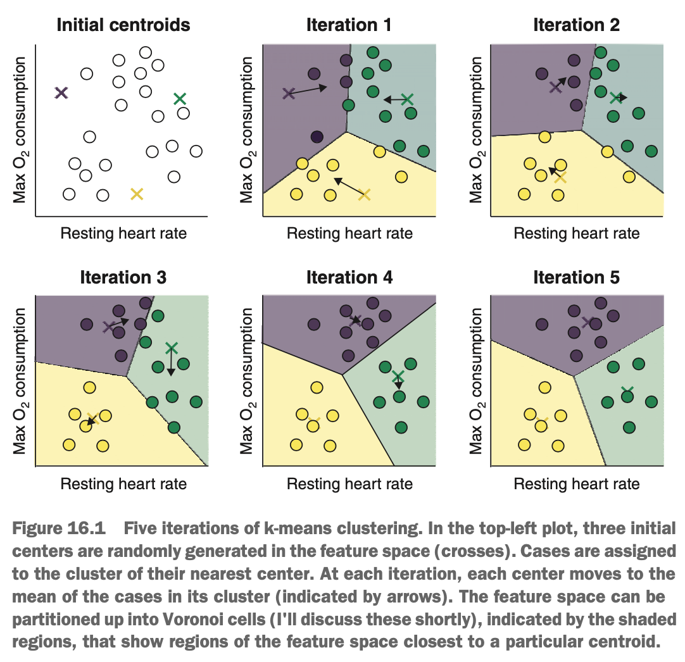

# What is k-means Clustering?

K-means algorithms partition cases in a data set into *k* clusters, where *k* is an integer defined by us. The clusters returned by k-means algorithms tend to be *n*-dimensionally spherical (where *n* is the number of dimensions of the feature space). This means the clusters tend to form a circle in two dimensions, a sphere in three dimensions, & a hypersphere in more than three dimensions. K-means clusters also tend to have a similar diameter. These are traits that may not be true of the underlying structure in the data.

There are a number of k-means algorithms, but some commonly used ones are as follows:

* Lloyd algorithm (also called Lloyd-Forgy algorithm)
* MacQueen algorithm
* Hartigan-Wong algorithm

The Lloyd, MacQueen, & Hartigan-Wong algorithms are conceptually quite similar but have some differences that affect both their computational cost & their performance on a particular problem.

### Lloyd's Algorithm

Imagine that we're sports scientists, interested in the biophysical differences among runners. We measure the resting heart rate & maximum oxygen consumption of a cohort of runners, & we want to use k-means to identify clusters of runner that might benefit from different training regimens.

Let's say we have a prior reason to believe there may be three distinct clusters of athletes in the data set. The first step in Lloyd's algorithm is to randomly initialise *k* (three in this case) centroids in the data. Next, the distance between each case & each centroid is calculated. This distance is commonly the Euclidean distance (straight-line distance) but can be other distance metrics, such as the Manhattan distance (taxi cab distance).

{width=55%}

Each case is assigned to the cluster represented by its nearest centroid. In this way, each centroid serves as a *prototype* case for its cluster. Next, the centroids are moved, such that they are placed at the mean of the cases that were assigned to their cluster in the previous step (this is why the approach is called *k-means*).

The process now repeats itself: the distance between each case & each centroid is calculated, & cases are assigned to the cluster of the nearest centroid. We can see that because the centroids update & move around the feature space, the centroid nearest to a particular case may change over time. This process continues until no cases change clusters from one iteration to the next, or until a maximum number of iterations is reached. Notice that in the diagram above, in iterations 4 & 5, no cases change clusters, so the algorithm stops.

Let's summarise the steps of Lloyd's algorithm:

1. Select *k*.
2. Randomly initialise *k* centers in the feature space.
3. For each case:
   a. Calculate the distance between the case & each center.
   b. Assign the case to the cluster of the nearest centroid.
4. Place each center at the mean of cases assigned to its cluster.
5. Repeat steps 3 & 4 until no cases change clusters or a maximum number of iterations is reached.

In the above diagram, see how at each iteration, the positions of the centroids are updated suche that they move toward the center of genuine clusters. At each iteration, we can partition the feature space into polygonal (or polytopal, in more than two dimensions) regions around each centroid that show us the regions that 'belong' to a particular cluster. These regions are called *Voronoi cells*; and if a case falls inside one of them, this means the case is closest to that cell's centroid & will be assigned to its cluster. Visualising Voronoi cells on a plot (sometimes called a *Voronoi map*) is a useful way of visualising how a clustering algorithm has partitioned the feature space.

### MacQueen Algorithm

MacQueen's algorithm is extremely similar to Lloyd's algorithm, varying just subtly in when the centroids get updated. Lloyd's algorithm is called a *batch* or *offline* algorithm, meaning it updates the centroids together at the end of an iteration. MacQueen's algorithm, on the other hand, updates the centroids each time a case changes clusters & once the algorithm has passed through all the cases in the data.

Just like with Lloyd's algorithm, MacQueen's algorithm initialises *k* centers, assigns each case to the cluster of the nearest centroid, & updates the position of the centroid to match the mean of its nearest cases. Then the algorithm considers each case in turn & calculates its distance to each centroid. If the case changes clusters (because it's now closer to a different centroid), both the new & old centroid positions are updated. The algorithm continues through the data set, considering each case in turn. Once all cases have been considered, the centroid positions are updates again. If no cases change clusters, the algorithm stops; otherwise, it will perform another pass.

A benefit of MacQueen's algorithm over Lloyd's algorithm is that it tends to converge more quickly to an optimal solution. However, it may be slightly more computationally expensive for very large data sets.

Let's summarise the steps of MacQueen's algorithm:

1. Select *k*.
2. Randomly initialise *k* centers in the feature space.
3. Assign each case to the cluster of its nearest center.
4. Place each center at the mean of the cases assigned to its cluster.
5. For each case:
   a. Calculate the distance between the case & each centroid.
   b. Assign the case to the cluster of the nearest centroid.
   c. If the case changed clusters, update the position of the new & old centroids.
6. Once all cases have been considered, update all centroids.
7. If no cases change clusters, stop; otherwise, repeat step 5.

### Hartigan-Wong Algorithm

The third k-means algorithm is a little different from the Lloyd & MacQueen algorithms. The Hartigan-Wong algorithm starts by initialising *k* random centers & assigning each case to the cluster of its nearest center, just as we saw in the other two algorithms. Here's the different bit: for each case in the data set, the algorithm calculates the sum of squared error of that case's current cluster *if that case was removed*, & the sum of squared error of each of the other clusters *if that case was included in those clusters*. Recall that the sum of squared error (or simply the sum of squares) is the difference between each case's values & its predicted values (in this context, its centroid), squared & summed across all the cases. In mathematical notation:

$$SS = \sum_{i \in k}(x_i - c_k)^2$$

where $i \in k$ is the *i*th case belonging to cluster *k*, & $c_k$ is the centroid of the cluster *k*.

The cluster with the smallest sum of squared error (when including the case currently under consideration) is assigned as the cluster for that case. If a case changed clusters, then the centroids of the old & new clusters are updated to the mean of the cases in their cluster. The algorithm continues until no cases change clusters. As a result, a case could be assigned to a particular cluster (because it reduces the sum of squared error) even though it is closer to the centroid of another cluster.

Let's summarise the steps of the Hartigan-Wong algorithm:

1. Select *k*.
2. Randomly intialise *k* centers in the feature space.
3. Assign each case to the cluster of its nearest center.
4. Place each center at the mean of the cases assigned to its cluster.
5. For each case:
   a. Calculate the sum of squared error for its cluster, omitting the case under consideration.
   b. Calculate the sum of squared error for other clusters, as if that case were included.
   c. Assign the case to the cluster with the smallest sum of squared error.
   d. If the case change clusters, update the position of the new & old centroids.
6. If no cases change clusters, stop; otherwise, repeat step 5.

The Hartigan Wong algorithm *tends* to find a better clustering structure than either the Lloyd or MacQueen algorithms, although we are always subject to the *no free lunch* theorem. Hartigan-Wong is also more computationally expensive than the other two algorithms, so it will be considerably slower for large data sets.

Which algorithm do we choose? Well, the choice is a discrete hyperparameter, so we can use hyperparameter tuning to help us choose the best-performing method & make sure we don't make the wrong choice.