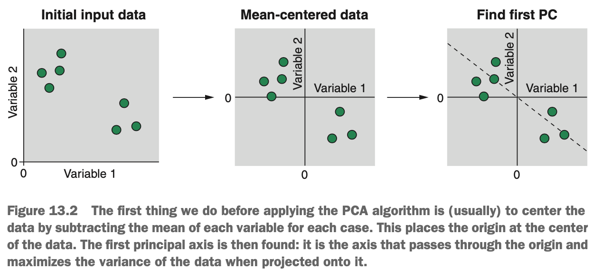
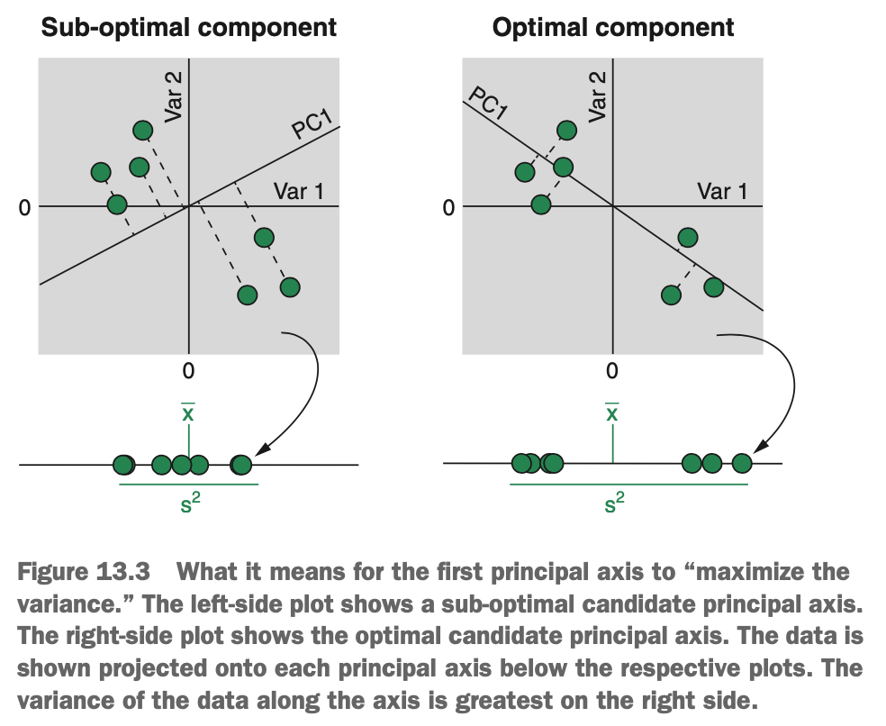
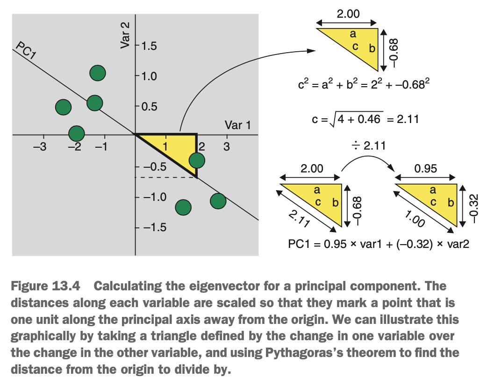
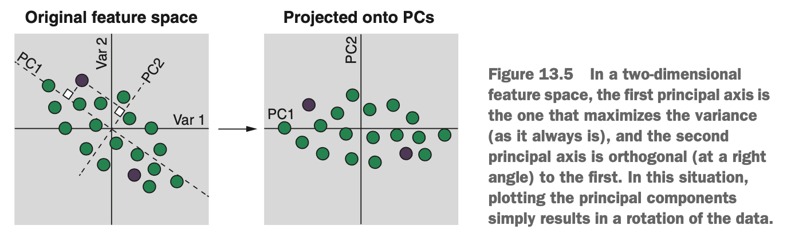
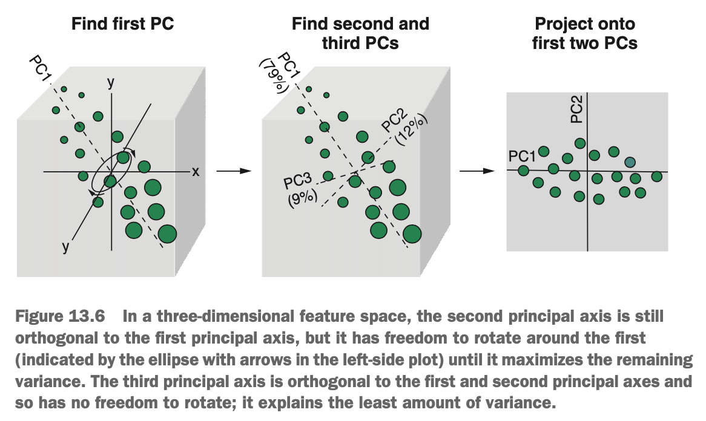

# What is Principal Component Analysis

Imagine that we measure two variables on seven people, & we want to compress this information down into a single variable using PCA. The first thing we need to do is center the variables by subtracting each variable's mean from its corresponding value for each case.

In addition to centering our variables, we can also scale them by dividing each variable by its standard deviation. This is important if the variables are measured on different scales -- otherwise, those on large scales will be weighted more heavily. If our variables are on similar scales, this standardisation step isn't necessary.

With our centered & (possibly) scaled data, PCA now finds a new axis that satisfies two conditions:

* The axis passes through the origin.
* The axis maximises the variance of the data along itself.

The new axis that satisfies these conditions is called the first *principal axis*. When the data is projected onto this principal axis (moved at a right angle onto the nearest point on the axis), this new variable is called the first *principal component*, often abbreviated PC1.

{width=65%}

The first principal axis is the line through the origin of the data that, once the data is projected onto it, has the greatest variance along it & is said to 'maximise the variance'.This axis is chosen because if this is the line that accounts for the majority of the variance in the data, then it is also the line that accounts for the majority of the information in the data.

{width=50%}

The new principal axis is actually a linear combination of the predictor variables. The first principal axis extends through the two clusters of cases to form a negative slope between var1 & var2. Just like in linear regression, we can express this line in terms of how one variable changes when the other variable changes (as the line passes through the origin, the intercept is 0). 

It's useful to have a standardised way of describing the slope through our feature space. In linear regression, we can define a slope in terms fo how much y changes with one-unit increase in x. But we often don't have any notion of predictor variables we wish to compress. Instead, we define the principal axis in terms of how far we need to go along each variable.

{width=55%}

Have a look at the diagram above. We're trying to calculate the length of sides *a* & *b* of the triangle when length *c* is equal to 1. This will then tell us how far along var1 & var2 we need to go, to be one unit away from the origin along the principal axis. How do we calculate the length og *c*? With the Pythagorean theorem. By applying $c^2 = a^2 + b^2$, we can work out that if we go along var1 2.00 units & along var2 -0.68 units, the length of *c* is equal to 2.11. TO normalise this such that the length of *c* is equal to 1, we simply divide all tree sides of the triangle by 2.11. We now define our principal axis as follow: for every 0.95 unit increase in var1, we decrease along var2 by 0.32.

Note that this transformation doesn't change the direction of the line: all it does is normalise everything so that the distance from the origin is 1. These normalised distances along each variable that define a principal axis are called an *eigenvector*. The formula for for the principal component that results from the principal axis is therefore

$$PC1 = 0.95 * var1 + (-0.32) * var2$$

So for any particular case, we enter it (substract the mean of each variable), take its value of var1 & multiple by 0.65, then add the result to the value of var2 multiplied by -0.32, to get this case's value of PC1. The value of a principal component for a case is called its *component score*.

Once we've found the first principal axis, we need to find the next one. PCA will find as many principal axes as there are variables or one less than the number of cases in the data set, whichever is smaller. So the first principal component is always the one that explains most of the variance in the data. Concretely, if we calculate the variance of the cases along each principal component, PC1 will have the largest value. The variance of the data along a particular principal component is called it *eigenvalue*.

Once the first principal axis is found, the next one must me orthogonal to it. When we only have two dimensions in our data set, this means the second principal axis will form a right angle with the first. When converting only two variables into two principal components, plotting the component scores of the data amounts to rotating the data around the origin.

{width=70%}

After rotating the data, the majority of the variance in the data is explained by PC1, & PC2 is orthogonal to it. But PCA is usually used to *reduce dimensions*, not just rotate bivariate data, so how are the principal axes calculated when we have a higher dimensional space? Take a look at the diagram below.

{width=60%}

We have a cloud of data in three dimensions that is closest to us at the bottom right of the feature space & gets further from us at the top left (notice that the points get smaller). The first principal axis is still the one that explains most of the variance in the data, but this time it extends through three-dimensional space (from front right to top left). The same process occurs in a feature space that has more than three dimensions, but it's difficult to visualise that.

The second principal axis is still orthogonal to the first,but as we now have three dimensions to play around with, it is free to rotate around the first in a plane that still maintains a right angle between them. We've illustrated this rotational freedom in the diagram with a circle around the arigin that gets fainter, the further away from us it is. The second principal axis is the one that is orthogonal to the first but explains the majority of the remaining variance in the data. The third principal axis must be orthogonal to the preceding axes (at right angles to both of them) & thereform has no freedom to move. The first principal component always explains the most variance, followed by the second, the third, & so on.

At this point we might be asking, if PCA calculates principal components for the smaller of the number of variables or the number of cases minus one, how exactly does it reduce the number of dimensions? Well, simply calculating the principal components isn't dimension reduction at all. Dimension reduction comes into it regarding *how many of the principal components we decide to keep in the remainder of the analysis*. In the example above, we have three principal components, but the first two account for 79% + 12% = 91% of the variation in the data set. If these two principal components capture enough of the information in the original data set to make the dimension reduction worthwhile (perhaps we get better results from a clustering or classification algorithm), then we can happily discard the remaining 9% of the information.