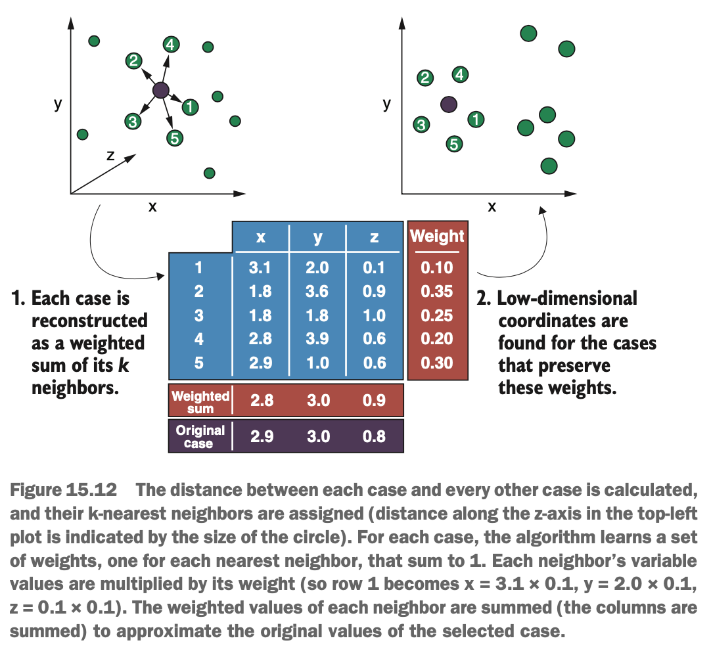

# What is Locally Linear Embedding?

Just like UMAP, the LLE algorithm tries to identify an underlying manifold that the data lies on. But LLE does this in a slightly different way: instead of trying to learn the manifold all at once, it learns local, linear patches of data around each case & then combines these linear pathces to form the (potentially nonlinear) manifold.

The LLE algorithm is particularly good at 'unrolling' or 'unfurling' data that is rolled or twisted into unusual shapes. For example, imagine a 3-dimensional data set where the cases are rolled up into a Swiss roll. The LLE algorithm is capable of unrolling the data & representing it as a two-dimensional rectangle of data points.

So how does the LLE algorithm work? It starts by selecting a case from the data set & calculating its k-nearest neighbours (so *k* is also a hyperparameter of the LLE algorithm). LLE then represents this case as a linear, weighted sum of its *k* neighbours. What does this mean? Well, each of the *k* neighbours is assigned a weight: a value between 0 & 1, such that the weights for all the k-nearest neighbours sum to 1. The variable values of a particular neighbour are multiplied by its weight (so the weighted values are a fraction of the original values).

**Note: Because the LLE algorithm relies on measuring distance between cases to calculate the nearest neighbours, it is sensitive to differences between the scales of the variables. It's often a good idea to scale the data before embedding it.**

{width=60%}

When the weighted values for each variable are added up across the k-nearest neighbours, this new weighted sum should approximate the variable values of the case for which we calculated the k-nearest neighbours in the first place. Therefore, the LLE algorithm learns a weight for each nearest neighbour such that, when we multiple each neighbour by its weight & add these values together, we get the original case (or an approximation). This is what we men when the LLE represents each case as a linear weighted sum of its neighbours.

This process is repeated for each case in the data set: its k-nearest enighbours are calculated, & then weights are learned that can be used to reconstruct it. because the weights are combined linearly (summed), the algorithm is essentially learning a linear 'patch' around each case. But how does it combine these patches to learn the manifold? Well, the data is placed into a low-dimensional space, typically two or three dimensions, such that the coordinates in this new space preserve the weights learned in the previous step. Put another way, the data is placed in this new feature space such that each case can *still* be calculated from the weighted sum of its neighbours.