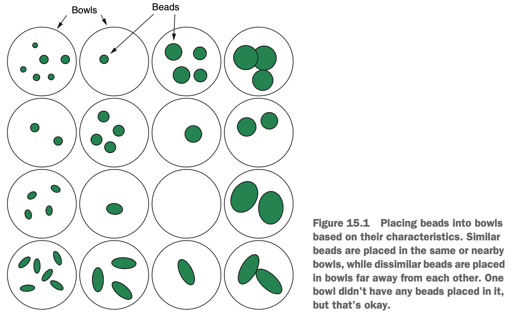
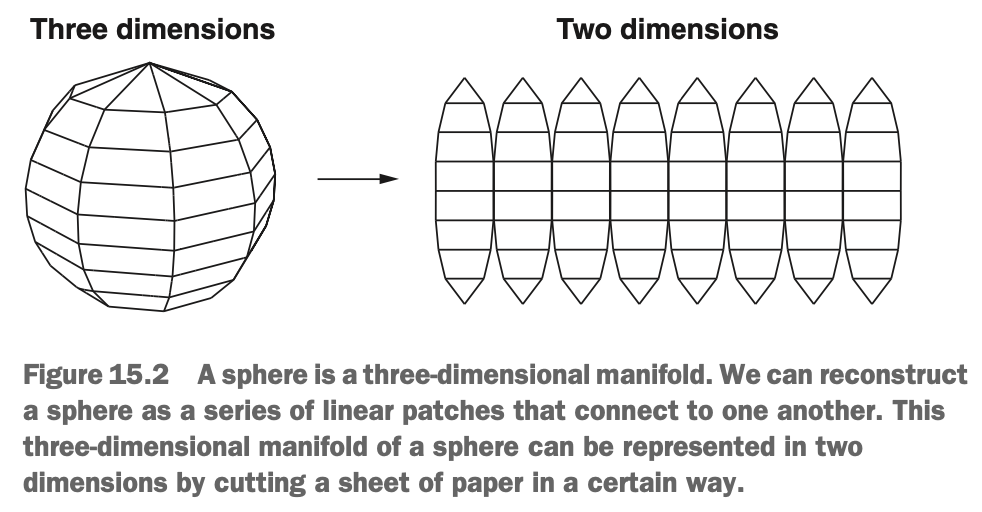

# Prerequisites: Grids of Nodes & Manifolds

Both the self-organising maps (SOMs) & locally linear embedding (LLE) algorithms reduce a large data set into a smaller, more manageable number of variables, but they work in very different ways. The SOM algorithm creates a two-dimensional grid of *nodes*, like grid references on a map. Each case in the data is placed into a node & then shuffled around the nodes so that cases that are more similar to each other in the original data are put close together on the map.

Imagine that we have a big jar of beads with our sewing kit. There are beads of different size & weights, & som are more elongated than others. There is nothing better to do, so we decide we'll organise our beads into sets to make it easier to find the beads we need in the future. We arrange a grid of bowls on the table & consider each bead in ture. We then place beads that are most similar to each other in the same bowl. We put beads that are similar, but not the same, in adjacent bowls, while beads that are very different go into bowls that are far away from each other. An example of what this mightlook like is shown in the diagram below.

{width=70%}

Once we've placed all the beads into bowls, we look at our grid & notice that a pattern has emerged. All the large, spherical beads congregate around the top-right corner of the grid. As we move from right to left, the beads gets smaller; & as we move from top to bottom, the beads become more elongated. Our process of placing beads into bowls based on the similarities between them has revealed structure in the beads.

This is what self-organising maps try to do. The 'map' of self-organising map is equivalent to the grid of bowls, where each bowl is called a *node*.

The LLE algorithm, on the other hand, learns a manifold on which the data lies, similar to the UMAP algorithm. Recall that a manifold is an *n*-dimensional smooth geometric shape that can be constructed from a series of linear 'patches'. Whereas UMAP tries to learn the manifold in one go, LLE looks for these local, linear patches of data around each case, & then combines these linear patches together to form the (potentially nonlinear) manifold. Example below:

{width=50%}

We can approximate a sphere by breaking it up into a series of flat surfaces that combine together (the more of these surfaces we use, the more closely we can approximate the sphere). Imagine that we had a flat sheet of paper & a pair of scissors & wanted to create a sphere. We might cut the sheet into the kind of shape shown on the right of the diagram above. We could then fold this flat sheet of paper to approximate representation of the sphere. This is the general principle behind LLE, except that it tries to learn the manifold that represents the data, & represents it in fewer dimensions.