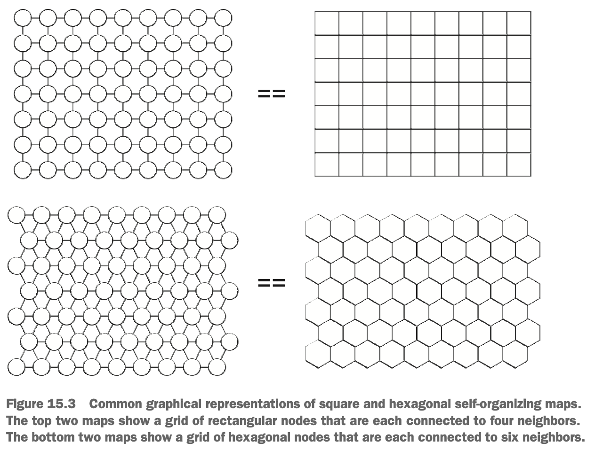
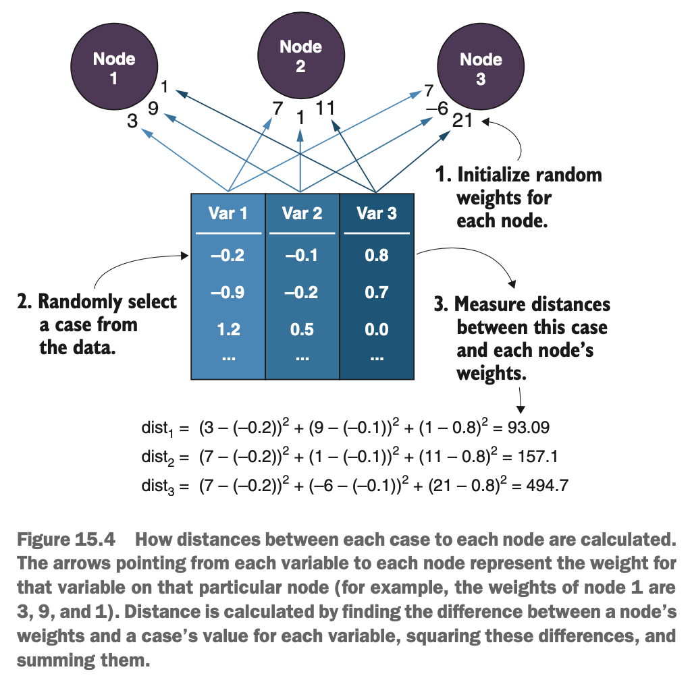
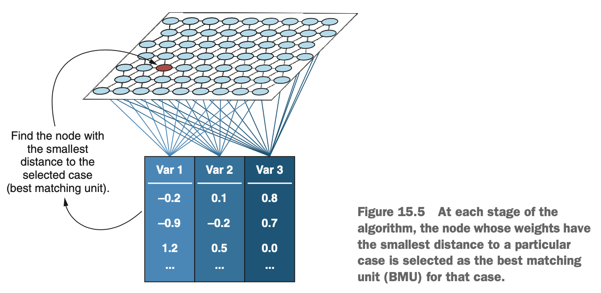
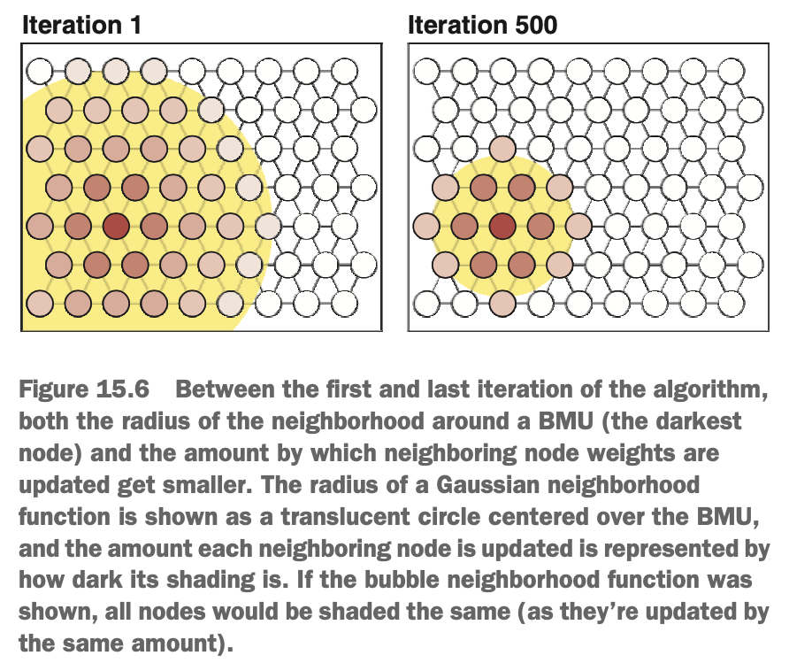

# What are Self-Organising Maps?

Consider the purpose of a map. Maps conveniently represent the layout of a part of the glob (which is not flat) in two dimensions, such as areas of the planet that are close to each other are draw close to each other on the map. This is a convoluted way fo saying that we'll find India drawn closer to Sri Lanka than to Madagascar, because they are closer to each other in space.

The goal of a SOM is very similar; but instead of countries, towns, & cities, the SOM tries to represent a data set in two dimensions, such that cases in the data that are more similar to each other are drawn close to each other. The first step of the algorithm is to create a grid of nodes in a two-dimensional lattice.

### Creating the Grid of Nodes

The SOM algorithm starts by creating a grid of nodes. For now, we can think of a node as a bowl into which we will eventually put cases from the data set. We've used the word *grid* to help understand the lattice structure of the nodes, but the word *map* is more commonly used, & will be used from now on.

The map can be made up of square/rectangular nodes, much like square grid references on a mp; or hexagonal nodes, which fit together snugly like a honeycomb. When the map is made up of square nodes, each node is connected to four of its neighbours (north, south, east, & west neighbours). When the map is made of hexagonal nodes, each nodes is connected to six of its neighbours (northeast, east, southeast, southwest, west, & northwest). The figure below shows two different ways that square & hexagonal SOMs are commonly represented.

{width=65%}

The left-side representation shows each node as a circle, connected to its neighbours with lines or *edges*. The right-side representation shows each node as a square or hexagon, connected to its neighbours across it flat sides. The dimensions of the map (how many rows & columns there are) need to be decided upon by us.Once the map has been created, the next step is to randomly assign each node a set of *weights*.

### Randomly Assigning Weights & Placing Cases in Nodes

Imagine we have a data set with three variables, & we want to distribute the cases of this data set across the nodes of our map. Eventually, we hope th algorithm will place the cases in the nodes such that similar cases are in the same node or a nearby node, & dissimilar cases are placed in nodes far away from each other.

After the creation of the map, the next thing the algorithm does is randomly assign each node a set of weights: one weight for each variable in the data set. So for our example, each node has three weights, because we have three variables. These weights are just random numbers & we can think of them as guesses for the value of each of the variables. If this is hard to visualise, look at the diagram below.

{width=55%}

We have a data set containing three variables, & we are looking at three nodes from a map. Each node has three numbers written under it: one corresponding to each variable in the data set. For example, the weights for node 1 are 3 (for var 1), 9 (for var 2), & 1 (for var 3). Remember, at this point, these are just random guesses for the value of each variable.

Next, the algorithm chooses a case at random from the data set & calculates which node's weights are the closest match to this case's values for each of the variables. For example, if there were a cases in the data set whose values for var 1, var 2, & var 3 were 3, 9, & 1, respectively, this case would perfectly match the weights of node 1. To find which node's weights are most similar to the case in question, the distance is calculated between each case & the weights of each node in the map. This distance is usually the squared Euclidean distance. Remembers that Euclidean distance is just the straight-line distance between two points, so the squared Euclidean distances just omits the square root step to make the computation faster. In our above diagram, we can see the distances calculated between the first case & each of the node's weights. This case is most similar to the weights of node 1, because it has the smallest squared Euclidean distance to them (93.09).

Once the distances between a particular case & all of the nodes have been calculated, the node with the smallest distance (most similar to the case) is selected as that case's *best matching unit* (BMU). This is illustrated in the diagram below. Just like when we put beads into bowls, the algorithm takes that case & places it inside its BMU.

{width=70%}

### Updating Node Weights to Better Match the Cases Inside Them

Here's a summary of our knowledge of the SOM algorithm so far:

1. Create the map of nodes.
2. Randomly assign weights to each node (one for each variable in the data set).
3. Select a case at random & calculate its distance to the weights of every node in the map.
4. Put the case into the node whose weights have the smallest distance to the case (the case's BMU).

Now that the BMU has been selected, its weights are updated to be more similar to the case we placed inside it. However, it's not only the BMU's weights that are updated. Nodes in the *neighbourhood* of the BMI also have their weights updated (nodes that are near to the BMU). We can define the neighbourhood in a few different ways: a common way is to use the *bubble function*. With the bubble function, we simply define a radius (or bubble) around the BMU, & all nodes inside that radius have their weights updated to the same degree. Any nodes outside the radius are not updated at all. For the bubble function, a radius of 3 would include any node within three direct connections of the BMU.

Another popular choice is to update the node weights of the map based on how far they are from the BMU (the farther from the BMU, the less the node's weights are updated). This is most commonly done using the *Gaussian* function. We can picture this as though we fit a Gaussian distribution centered over the BMU, & the node weights around the BMU are updated proportionally to the density of the Gaussian over them. We still define a radius around the BMU that defines how broad or skinny the Gaussian is, but this time it's a soft radius that has no hard cutoff. The Gaussian function is popular, but it's a little more computationally expensive than the simple bubble function.

Our choice of neighbourhood function is a hyperparameter, as it will affect the way our map updates its nodes but cannot be estimated from the data itself.

Whichever neighbourhood function we use, the benefit of updating node weights in a neighbourhood around the BMU is that, over time, doing so creates neighbourhoods of nodes that are similar to each other but still capture some variation in the data. Another trick the algorithm uses is that, as time goes on, both the radius of this neighbourhood & the amount by which the weights are updated get smaller. This means the map is updated very rapidly initially & then makes smaller & smaller updates as the learning process continues. This helps the map converge to a solution that, hopefully, places similar cases in the same or nearby nodes. This process of updating node weights in the neighbourhood of the BMU is illustrated below.

{width=50%}

Now that we've determined the BMu for a particular case & updated its weights & the weights of its neighbours, we simply repeat the procedure for the next iteration, selecting another random case from the data. As this process continues, cases will likely be selected more than once & will move around the map as their BMU changes over time. To put it another way, cases will change nodes if the one they are currently in is no longer their BMU. Eventually, similar cases will converge to a particular region of the map.

The result is that over time, the nodes on the map start to fit the data set better. & eventually, cases that are similar to each other in the original feature space will be placed either in the same node or in nearby nodes on the map.

Before we get our hands dirty by building our own SOM, let's recap the whole algorithm to make sure it sticks in our mind.

1. Create the map of nodes.
2. Randomly assign wieghts to each node (one for each variable in the data set).
3. Select a case at random, & calculate its distance to the weights of every node in the map.
4. Put the case into the node whose weights have the smallest distance to the case (the case's BMU).
5. Update the weights of the BMU & the nodes in its neighbourhood (depending on the neighbourhood function) to more closely match the cases inside it.
6. Repeat steps 3-5 for the specified number of iterations.
