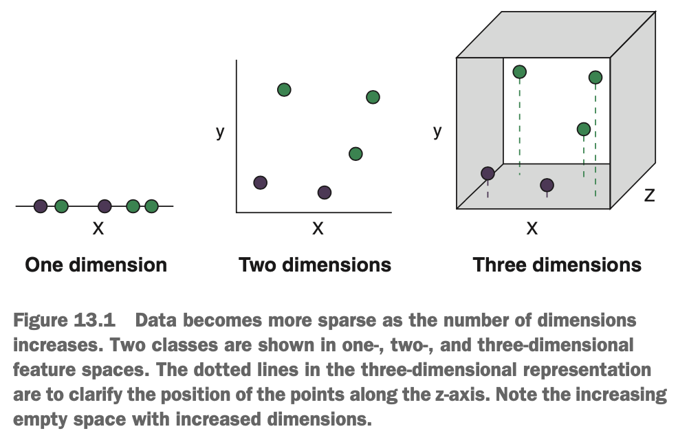

# What is Dimension Reduction?

Dimension reduction comprises a number of approaches that turn a set of (potentially many) variables into a smaller number of variables that retain as much of the original, multidimensional information as possible. We sometimes want to reduce the number of dimensions we're working with in a data set, to help us visualise the relationships in the data or to avoid the strange phenomena that occur in high dimensions. As such, dimensional reduction is a critical skill to add to our machine learning toolbox.

The main reasons for applying dimension reduction:

* Making it easier to visualise a data set with many variables
* Mitigating the curse of dimensionality
* Mitigating the effects of collinearity

We will expand on what the curse of dimensionality & collinearity are & why they cause problems for machine learning, as well as why dimension reduction can reduce the impact of both when searching for patters in data.

### Visualising High-Dimensional Data

When starting an exploratory analysis, one of the first things we should always do is plot our data. It's important that we, as data scientists, have an intuitive understanding of the structure of our data, the relationships between variables, & how the data is distributed. But how can we do that if we have a data set containing thousands of variables. Where do we start? Plotting each of these variables against each other isn't an option anymore, so how can we get a feel for the overall structure of the data? We can reduce the dimensions down to a more manageable number, & plot these instead. We won't get all of the information of the original data set, but it will help to identify patterns in our data, like clusters of cases that might suggest a grouping structure in the data.

### Consequences of the Curse of Dimensionality

The curse of dimensionality describes a set of challenges we encounter when trying to identify patterns in a data set with many variables. One aspect of the curse of dimensionality is that for a fixed number of cases, as we increase the number of dimensions in the data set (increase the feature space), the cases get further & further apart. In such a situation, the data is said to become *sparse*. Many machine learning algorithms struggle to learn patterns from sparse data & may start to learn from the noise in the data set instead.

{width=50%}

Another aspect of the curse of dimensionality is that as the number of dimensions increases, the distances between the cases begin to converge to a single value. Put another way, for a particular case, the ratio between the distance to its nearest neighbour & its furthest neighbour tends toward 1 in high dimensions. This presents a challenge to algorithms that rely on measuring distances (particularly Euclidean distance), such as k-nearest neighbours, because distance starts to become meaningless.

Finally, it's quite common to encounter situations in which we have many more variables that we have cases in the data. This is referred to as the *p >> n problem*, where *p* is the number of variables & *n* is the number of cases. This, again, results in sparse regions of the feature space, making it difficult for many algorithms to converge on an optimal solution.

### Consequences of Collinearity

Variables in a data set often have varying degrees of correlation with each other. Sometimes, we may have two variables that correlate very highly with each other, such that on basically contains the information of the other (say, with a Pearson correlation coefficient > 0.9). In such situations, these variables are said to be *collinear* or exhibit *collinearity*. An example of two variables that might be collinear are annual income & the maximum amount of money a bank is willing to loan someone; you can probably predict one form the other with a high degree of accuracy.

So what's the problem with collinearity? Well, it depends on the goal of your analysis & what algorithms we're using. The most commonly encountered negative impact of collinearity is on the parameter estimates of linear regression models.

Let's say we're trying to predict the value of houses based on the number of bedrooms, the age of the house in years, & the age of the house in months, using linear regression. The age variables are perfectly collinear with each other, because there's no information contained in one that is not contained in the other. The parameter estimates (slopes) for the two predictor variables describe the relationship between each predictor & the outcome variable, after accounting for the effect of the other variable. If both predictor variables capture most of (or all of, in this case) the same imformation about the outcome variable, then when we account the effect of one, there will be no information left for the other one to contribute. As a result, the parameter estimates for both predictors will be smaller than they should be (because each was estimated after accounting for the effect of the other).

So, collinearity makes the parameter estimates more variable & more sensitive to small changes in the data. This is mostly a problem if you're interested in interpreting & making inferences about the parameter estimates. If all we care about is predictive accuracy, & not interpreting the model parameters, then collinearity may not be a problem at all. 

It's also worth mentioning, that collinearity is particularly problematic when working with the naive Bayes algorithm. Recall that the 'naive' in naive Bayes refers to the fact that this algorithm assumes independence between predictors. This assumption is often invalid in the real world, but naive Bayes is usually resistant to small correlations between predictor variables. When predictors are highly correlated, however, the predictive performance of naive Bayes will suffer considerably, though this will be easy to identify when we cross-validate our model.

### Mitigating the Curse of Dimensionality & Collinearity by Using Dimension Reduction

How do we mitigate the impact of the curse of dimensionality &/or collinearity on the predictive performance of our models? If we can compress most of the information from 100 variables into just 2 or 3, then the problems of data sparsity & near-equal distances disappear. If we turn two collinear variables into one new variable that captures all the information of both, then the problem of dependence between the variables disappears.

We've already encountered another set of techniques that can mitigate the curse of dimensionality & collinearity: regularisation. Regularisation can be sued to shrink the parameter estimates & even completely remove weakly contributing predictors. Regularisation can therefore reduce sparsity resulting from the curse of dimensionality, & remove variables that are collinear with others.