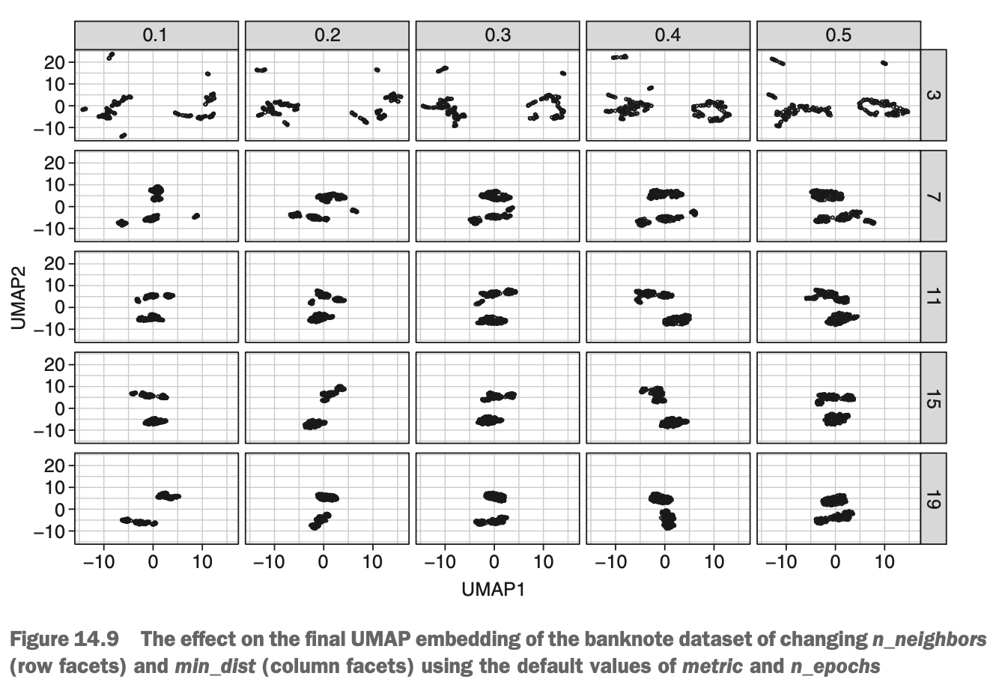
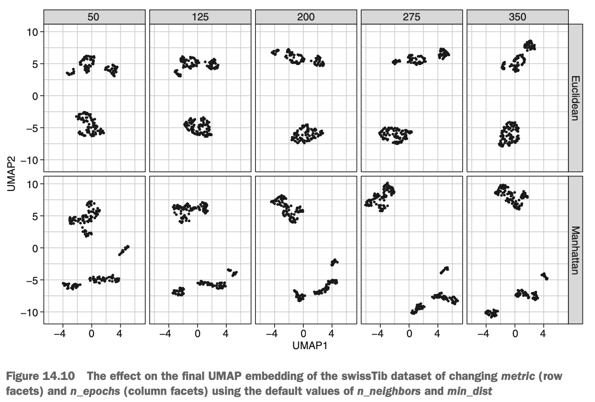

```{r, include = FALSE}
library(tidyverse)
library(plotly)
library(mlr)
library(parallel)
library(parallelMap)
library(umap)
``` 


# Building Your First UMAP Model

Just like t-SNE, MAP has four important hyperparameters that control the resulting embedding:

* *n_neighbors* - Controls the radius of fuzzy search region. Larger values will include more neighbouring cases, forcing the algorithm to focus on more global structure. Smaller values will include fewer neigbours, forcing the algorithm to focus on more local structure.
* *min_dist* - Defines the minimum distnace apart that cases are allowed to be in the lower-dimensional representation. Low values result in 'clumpy' embeddings, whereas larger values result in cases being spread further apart.
* *metric* - Defines which distance metric UMAP will use to measure distances along the manifold. By default, UMAP uses ordinary Euclidean distance, but other (sometimes crazy) distance metrics can be used instead. A common alternative to Euclidean distance is *Manhattan distance* (also called *taxi cab distance*): instead of measuring the distance between two points as a single (possibly diagonal) distance, it measures the distnace between two points one variable at a time & adds up these little journeys, just like a taxi cab driving around blocks in a city.
* *n_epochs* - Defines the number of iterations of the optimisation step.

Here's a visual representation. We've run UMAP on our Swiss banknote data using a grid of hyperparameter values. The below diagram shows the final embeddings with different combinations of *n_neighbors* (rows) & *min_dist* (columns) using the default values of *metric* & *n_epochs*. 

{width=70%}

Notice that the cases are more spread out for smaller values of *n_neighbors* & *min_dist* & that the clusters begin to break apart with low values for the *n_neighbors* hyperparameter.

{width=75%}

Above shows the final embeddings with different combinations of *metric* (rows) & *n_epochs* (columns). The effect here is a little more subtle, but the clusters thend to farther apart with more iterations. It also looks as though Manhattan distance does a slightly better job of breaking up those three smaller clusters (which we've not seen before!).

We'll run UMAP on our Swiss banknote data set. Just like bfore, we first select all the columns except the categorical variable (UMAP cannot currently handle categorical variables, but this may change in the future) & pipe this data into the `as.matrix()` function (to prevent an irritating warning message). This matrix is then piped into the `umap()` function, within which we manually set the values of all four hyperparameters & set the argument `verbose = TRUE` so the algorithm prints a running commentary on the number of epochs (iterations) that have passed.

```{r}
data(banknote, package = 'mclust')
swissTib <- as_tibble(banknote)

swissUmap <- select(swissTib, -Status) %>%
  as.matrix() %>%
  umap(n_neighbors = 7, min_dist = 0.1, metric = 'manhattan',
       n_epochs = 200, verbose = TRUE)
```


# Plotting the Result of UMAP

We'll plot the two UMAP dimensions against each other to see how well they separated the genuine & counterfeit banknotes.

```{r}
swissTibUmap <- swissTib %>%
  mutate_if(.funs = scale, .predicate = is.numeric, scale = FALSE) %>%
  mutate(UMAP1 = swissUmap$layout[, 1], UMAP2 = swissUmap$layout[, 2]) %>%
  gather(key = 'Variable', value = 'Value', c(-UMAP1, -UMAP2, -Status))

ggplotly(
  ggplot(swissTibUmap, aes(UMAP1, UMAP2, col = Value, shape = Status)) +
    facet_wrap(~ Variable) +
    geom_point(size = 3) +
    scale_colour_gradient(low = 'dark blue', high = 'cyan') +
    theme_bw()
)
```

The UMAP embedding seems to suggest the existence of three different clusters of counterfeit banknotes. Perhaps there are three different counterfeiters at large.


### Computing the UMAP Embeddings of New Data

Recall that, unlike t-SNE, new data can be projected reproducibly onto a UMAP embedding. Well, we can do this for the `newBanknotes` tibble we defined when predicting PCA component scores. in previous chapters. In fact, the process is exactly the same: we use the `predict()` function with the model as the first argument & the new data as the second argument. This outputs a matrix, where the rows represent the two cases & the columns represent the UMAP axes:

```{r}
newBanknotes <- tibble(
  Length = c(214, 216),
  Left = c(130, 128),
  Right = c(132, 129),
  Bottom = c(12, 7),
  Top = c(12, 8),
  Diagonal = c(138, 142)
)

predict(swissUmap, newBanknotes)
```


***


# Strengths & Weaknesses of t-SNE & UMAP

The strengths of t-SNE & UMAP are as follows:

* They can learn nonlinear patterns in the data.
* They tend to separate clusters of cases better than PCA.
* UMAP can make predictions on new data.
* UMAP is computationally inexpensive.
* UMAP preserves both local & global distances

The weaknesses of t-SNE & UMAP are as follows:

* The new axes of t-SNE & UMAP are not directly interpretable in terms of the original variables.
* t-SNE cannot make predictions on new data (different result each time).
* t-SNE is computationally expensive.
* t-SNE doesn't necessarily preserve global structure.
* They cannot handle categorical variables natively.


***


# Summary

* t-SNE & UMAP are nonlinear dimension-reduction algorithms.
* t-SNE converts the distances between all cases in teh data into probabilities based on the normal distribution & then iteratively shuffles the cases around in a lower-dimensional space to reproduce these distances.
* In the lower-dimensional space, t-SNE uses Student's t-distribution to convert distances to probabilities to better separates clusters of data.
* UMAP learns a manifold that the data are arranged along & then iteratively shuffles the data around in the lower-dimensional space to reproduce the distances between cases along the manifold.