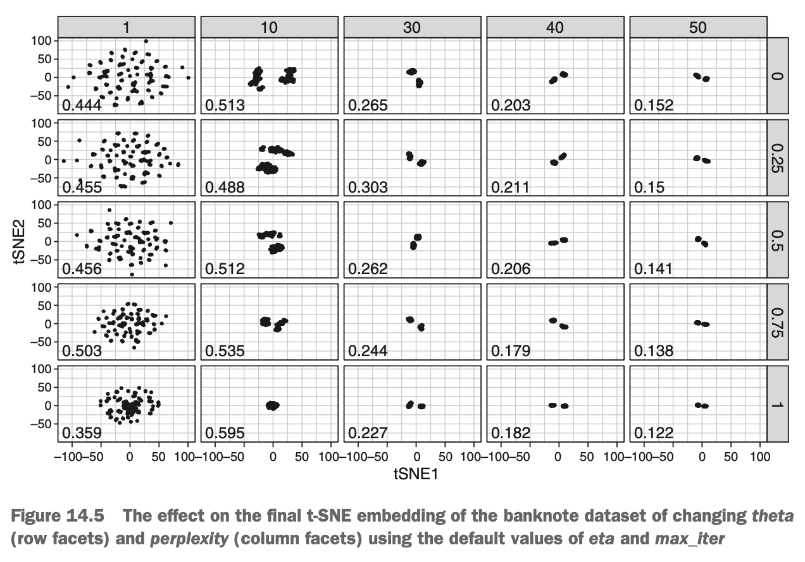
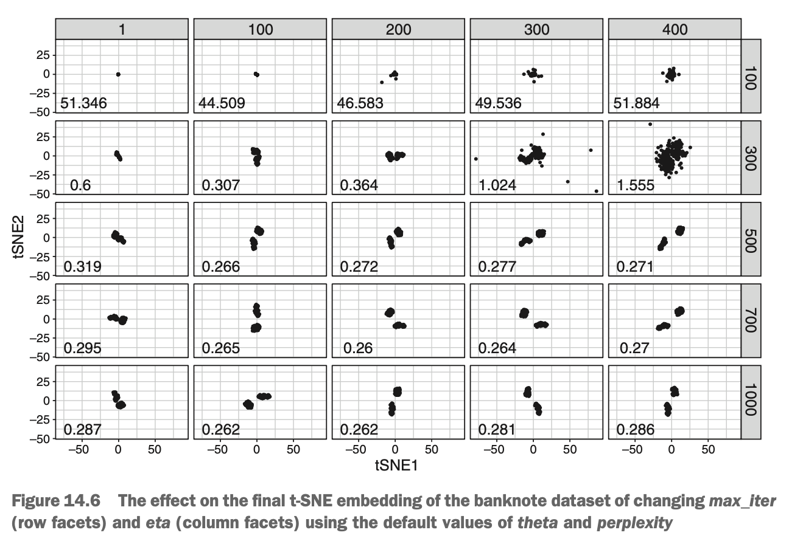

```{r, include = FALSE}
library(tidyverse)
library(mlr)
library(plotly)
library(parallel)
library(parallelMap)
library(Rtsne)
```


# Building Your First t-SNE Embedding

t-SNE has four important hyperparameters that can drastically change the resulting embedding:

* *perplexity* - Controls the width of the distributions used to convert distances into probabilities. High values place more focus on global structure, whereas small values place more focus on local structure. Typical values lie in the range 5 to 50. The default value is 30.
* *theta* - Controls the trade-off between speed & accuracy. Because t-SNE is slow, people commonly use an implementation called *Barnes-Hut* t-SNE, which allows us to perform the embedding much faster but with some loss of accuracy. The *theta* hyperparameter controls this trade-off with 0 being 'exact' t-SNE & 1 being the fastest but least accurate t-SNE. The default value is 0.5.
* *eta* - How far each data point moves at each iteration (also called the *learning rate*). Lower values need more iterations to reach convergence but may result in a more accurate embedding. The default value is 200, & this is usually fine.
* *max_iter* - The maximum iterations allowed before computation stops. This will depend on your computational budget, but it's important to have enough iterations to reach convergence. The default value is 1,000.

Our approach to tuning hyperparameters thus far has been to allow an automated tuning process to choose the best combination for us, through either grid search or random search. But due to its computational cost, most people will run t-SNE with its default hyperparameter values & change them if the embedding doesn't look sensible. If this sounds very subjective, that's because it is; but people are usually able to identify visually whether t-SNE is pulling apart clusters of observations nicely.

To give a visual aid for how each of these hyperparameters affects the final embedding, we'll run t-SNE on our Swiss banknote data using a grid of hyperparameter values.

{width=70%}

Above shows the final embeddings with different combinations of *theta* (rows) & *perplexity* (columns) using the default values of *eta* & *max_iter*. Notice that the clusters become tighter with larger values of *perplexity* & are lost with very low values. Also notice that for reasonable values of *perplexity*, the clusters are best resolved when *theta* is set to 0 (exact t-SNE).

Below shows the final embeddings with different combinations of *max_iters* (rows) & *eta* (columns). The effect here is a little more subtle, but smaller values of *eta* need a larger number of iterations in order to converge (because the cases move in smaller steps at each iteration). For example, for an *eta* of 100, 1,000 iterations is sufficient to separate the clusters; but with an *eta* of 1, the clusters remain poorly resolved after 1,000 iterations. 

{width=70%}

Now that we're a little more tuned in on how t-SNE's hyperparameters affect its performance, let's run t-SNE on our Swiss banknote data set. Just like for PCA, we first select all the columns except the categorical variable (t-SNE also cannot handle categorical variables) & pipe this data into the `Rtsne()` function. We manually set the values of *perplexity*, *theta*, & *max_iter* hyperparameters & set the argument `verbose = TRUE` so the algorithm prints a running commentary on what the KL divergence is at each iteration.

```{r}
data(banknote, package = 'mclust')
swissTib <- as_tibble(banknote)

swissTsne <- select(swissTib, -Status) %>%
  Rtsne(perplexity = 30, theta = 0, max_iter = 5000, verbose = TRUE)
```


### Plotting the Result of t-SNE

Let's plot the two t-SNE dimensions against each other to see how well they separated the genuine & counterfeit banknotes. Because we can't interpret the axes in terms of how much each variable correlates with them, it's common for people to colour their t-SNE plots by the values of each of their original variables, to help identify which clusters have higher & lower values. To do this, we first use the `mutate_if()` function to center the numeric variables in our original data set (by setting `.funs = scale` & `.predicate = is.numeric`). We include `scale = FALSE` to only center the variables, not divide by their standard deviations. The reason we center the variables is that we're going to shade by their value on the plots, & we don't want variables with larger values dominating the colour scales.

Next, we mutate two new columns that contain the t-SNE axes values for each vase. Finally, we gather the data so that we can facet by each of the original variables. We plot this data, mapping the value of each original variable to the colour aesthetic & the status of each banknote (genuine vs counterfeit) to the shape aesthetic, & facet by the original variables. We add a custom colour scale gradient to make the colour scale more readable in print.

```{r, warning = FALSE}
swissTibTsne <- swissTib %>%
  mutate_if(.funs = scale, .predicate = is.numeric, scale = FALSE) %>%
  mutate(tSNE1 = swissTsne$Y[, 1], tSNE2 = swissTsne$Y[, 2]) %>%
  gather(key = 'Variable', value = 'Value', c(-tSNE1, -tSNE2, -Status))

ggplotly(
  ggplot(swissTibTsne, aes(tSNE1, tSNE2, col = Value, shape = Status)) +
    facet_wrap(~ Variable) +
    geom_point(size = 3) +
    scale_colour_gradient(low = 'dark blue', high = 'cyan') +
    theme_bw()
)
```

Notice how much better t-SNE does than PCA at representing the differences between two clusters in a feature space with only two dimensions. The clusters are well resolved, although if we look closely, we can see a couple of cases that seem to be in the wrong cluster. Shading the points by the value of each variable also helps us identify that counterfeit notes tend to have lower values of the `Diagonal` variable & higher values of the `Bottom` & `Top` variables. It also seems as though there might be a small second cluster of counterfeit notes: this could be a set of notes made by a different counterfeiter, or an artifact of an imperfect combination of hyperparameters. More investigation would be needed to tell if these are actually a distinct cluster.