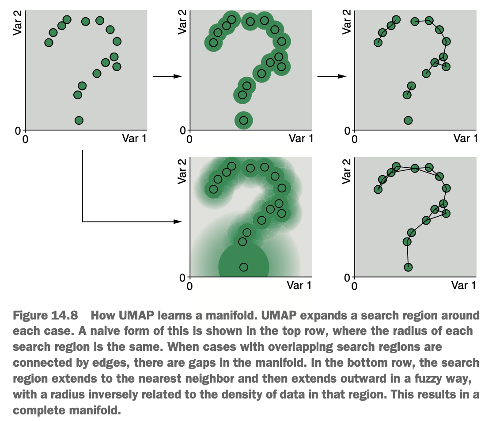

# What is UMAP?

Uniform manifold approximation & projection, fortunately shortened to UMAP, is a nonlinear dimension-reduction algorithm like t-SNE.

First, it's considerable faster than t-SNE, where the length of time it takes to run increase less than the square of the number of cases in the data set. To put this in perspective, a data set that might take t-SNE hours to compress will take UMAP minutes.

The second benefit & perhaps the main benefit is that UMAP is a deterministic algorithm. In other words, given the same input, it will always give the same output. This means that, unlike with t-SNE, we can project new data onto the lower dimensional representation, allowing us to incorporate UMAP into our machine learning pipelines.

The third benefit is that UMAP preserves both local & global structure. Practically, this means that not only can we interpret two cases close to each other in lower dimensions as being similar to each other in high dimensions, but we can also interpret two clusters of cases close to each other as being more similar to each other in high dimensions.

So how does UMAP work? Well, UMAP assumes that data is distributed along a *manifold*. A manifold is an n-dimensional smooth geometric shape where, for every point on this manifold, there exists a small neighbourhood around that point that looks like a flat, two-dimensional plane. If that doesn't make sense to you, consider that the world is a three-dimensional manifold, any part of which can be mapped into a flat representation literally called a map. UMAP searches for a surface, or a space with many dimensions, along which the data is distributed. The distances between cases *along the manifold* can be calculated, & a lower-dimensional representation of the data can be optimise iteratively to reproduce these distances.

Here's a visual representation.

{width=60%}

We have a question mark as a manifold & randomly seeded 15 cases around the manifold across 2 variables. UMAP's job is to learn the question mark manifold so that it can measure the distances between cases along the manifold instead of ordinary Euclidean distance, like t-SNE does. It achieves this by searching a region around each case, for another case. Where these regions encapsulate another case, the cases get connected by an edge. You can see in the top center figure in the diagram that how it is done. However, notice that the manifold is incomplete? There are gaps in the question mark. This is because the regions we searched around each case has the same radius, & the data wasn't uniformly distributed along the manifold. If the cases had been spaced out along the question mark at regular intervals, then this approach would have worked, provided I selected an appropriate radius for the search regions.

Real world data is rarely evenly distributed, & UMAP solves this problem in two ways. First, it expands each search region for each case until it meets its nearest neighbour. This ensures that there are no orphan cases: while there can be multiple, disconnected areas in a data set, every case must connect to at least one other case. Second, UMAP creates an additional search region that has a large radius in lower-density areas & a smaller radius in high-density regions. These search regions are described as *fuzzy*, in that the further from the center another case finds itself, the lower the probability that an edge exists between these cases. This forces an artificial uniform distribution of the cases (& is where the 'uniform' in UMAP comes from). This process in illustrated in the lower 2 figures of the diagram, where we get a more complete estimation of the underlying manifold.

The next step is to place the data onto a new manifold in (usually) two new dimensions. Then the algorithm iteratively shuffles this new manifold around until teh distances between the cases along the manifold look like the distance between the cases along the original high-dimensional manifold. This is similar to the optimisation step of t-SNE, except that UMAP minimises a different loss function called *cross-entropy* (whereass t-SNE minimises KL divergence). Once UMAP has learned the lower-dimensional manifold, new data can be projected onto this manifold to get the values on the new axes for visualisation or as input for another machine learning algorithm.