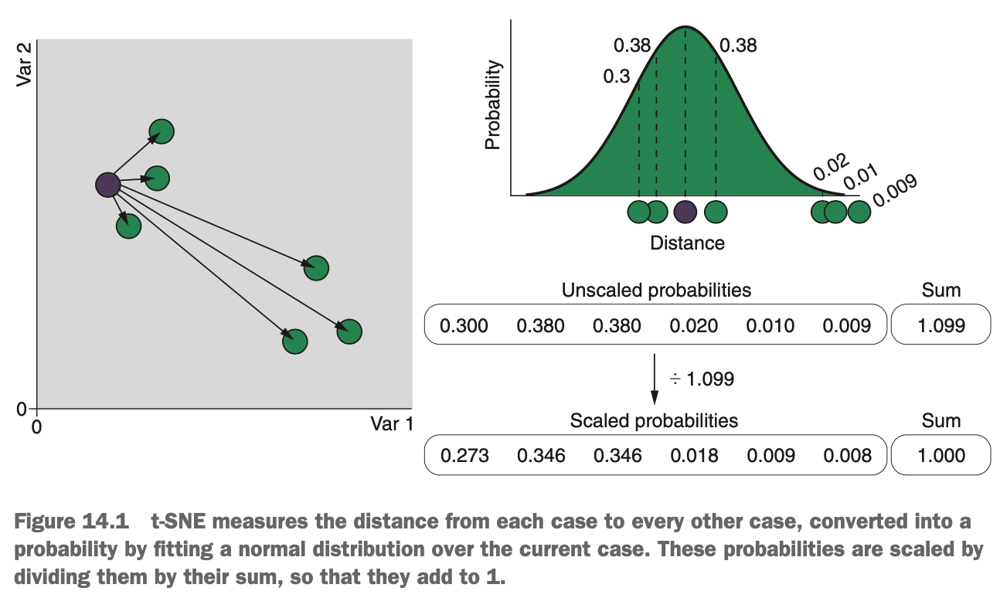
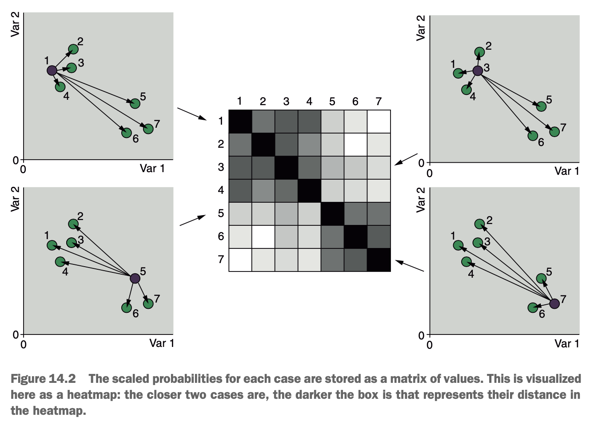
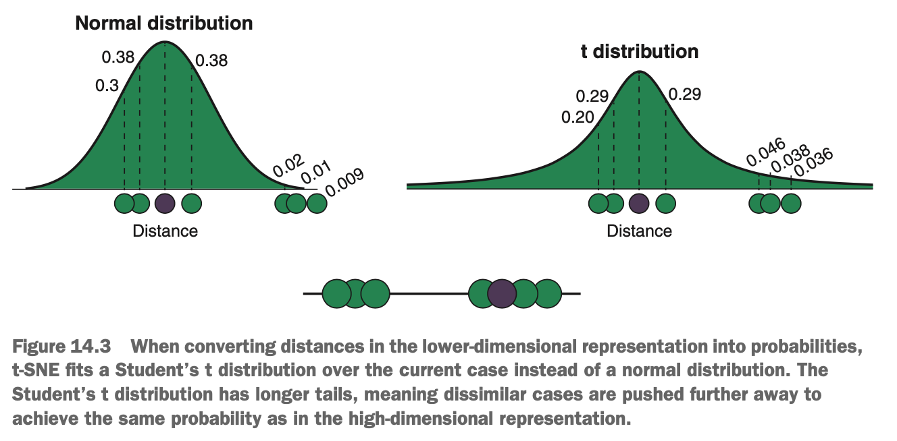
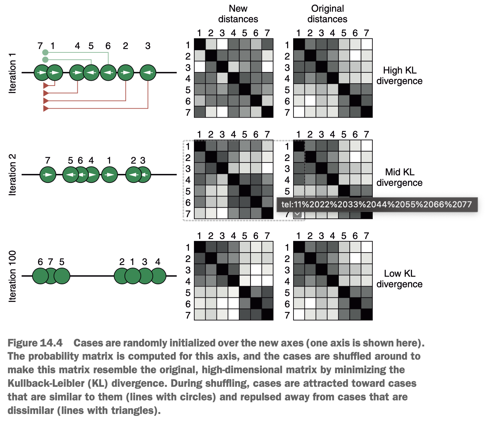

# What is t-SNE?

Whereas PCA is a linear dimension-reduction algorithm (because it finds new axes that are linear combinations of the original variables), t-SNE, t-distributed stochastic neighbour embedding, is a nonlinear dimension reduction algorithm. It is nonlinear because instead of finding new axes that are logical combinations of the original variables, it focuses on the similarities between nearby cases in a data set & tries to reproduce these similarities in a lower-dimensional space. The main benefit of this approach is that the axes are no longer interpretable, because they don't represent logical combinations of the original variables.

The first step in the t-SNE algorithm is to compute the distance between each case & every other case in the data set. By default, this distance is Euclidean distance, which is the straight line distance between any two points in the feature space. These distances are then converted into probabilities, illustrated in the diagram below.

{width=70%}

For a particular case in the data set, the distance between this case & all other cases is measured. Then a normal distribution is centered on this case, & the distances are converted into probabilities by mapping them into the probability density of the normal distribution. The standard deviation of this normal distribution is inversely related to the density of cases around the case in question. Put another way, if there are lots of cases nearby (more dense), then the standard deviation of the normal distribution is smaller; but if there are few cases nearby (less dense), then the standard deviation is larger.

After converting the distances to probabilities, the probabilities for each case are scaled by dividing them by their sum. This makes the probabilities sum to 1 for every case in the data set. Using different standard deviations for different densities, & then normalising the probabilities to 1 for every case, means if there are dense clusters & sparse clusters of cases in the data set, t-SNE will expand the dense clusters & compress the sparse ones so they can be visualised more easily together. The exact relationship between data density & the standard deviation of the normal distribution depends on a hyperparameter called *perplexity*.

Once the scaled probabilities have been calculated for each case in the data set, we have a matrix of probabilities that describes how similar each case is to each of the other cases. This is visualised in the heatmap below.

{width=70%}

Our matrix of probabilites is now our referance, or template, for how the data values related to each other in the original, high-dimensional space. The next step in the t-SNE algorithm is to randomise the cases along (usually) two new axes (this is where 'stochastic' in t-SNE comes from).

t-SNE calculates the distances between the cases in this new, randomised, low-dimensional space & converts them into probabilities just like before. The only difference is that instead of using the normal distribution, it now uses Student's t-distribution. The t-distribution looks like a normal distribution, except that it is not as tall in the middle, & its tails are flatter & extend further out (lower kurtosis than a normal distribution).

{width=70%}

The job for t-SNE now is to 'shuffle' the data points around these new axes, step by step, & make the matrix of probabilities in the lower-dimensional space look as close as possible to the matrix of probabilities in the original, high-dimensional space. The intuition here is that if the matrices are as similar as possible, then the data each case was close to in the original feature space will still be close by in the low-dimensional space. We can think of this as a game of attraction & repulsion.

To make the probability matrix in low-dimensional space look like the one in high-dimensional space, each case needs to move closer to cases that were close to it in the original data, & away from cases that were far away. So cases that should be nearby will pull their neighbours toward them, but cases that should be far away will push non-neighbours away from them. The balance of these attractive & repulsive forces causes each case in the data set to move in a direction that makes the two probability matrices a little more similar. Now, in this new position, the low-dimensional probability matrix is calculated again, & the cases move again, making the low- & high-dimensional matrices look more similar again. This process continues until we reach a pre-determined number of iterations, or until the *divergence* (difference) between the matrices stops improving.

{width=70%}

Why do we use the t-distribution to convert distances into probabilities in the low-dimensional space? Notice that the tails of the t-distribution are wider than for the normal distribution. This means that, in order to get the same probability as from the normal distribution, dissimilar cases need to be pushed further away from the cases the t-distribution is centered over. This helps spread out clusters of data that might be present in the data, helping us to identify them more easily. A major consequence of this, however, is that t-SNE is often said to retain *local* structure in the  low-dimensional representation, but it doesn't usually retain *global* structure. Practically, this means we can interpret cases that are close to each other in the final representation as being similar to each other, but we can't easily say which clusters of cases were more similar to other clusters of cases in the original data.

Once this iterative process has converged at a low KL divergence, we should have a low-dimensional representation of our original data that preserves the similarities between nearby cases. While t-SNE typically outperforms PCA for highlighting patterns in data, it does have some significant limitations:

* It is infamously computationally expensive; its computation time increases exponentially with the number of cases in the data set.
* It cannot project new data onto the embedding. By this, we mean that, because the initial placement of the data onto the new axes is random, rerunning t-SNE on the same data set repeatedly will give slightly different results. Thus, we can't use the `predict()` function to map new data onto the lower-dimensional representation as we can with PCA. This prohibits us from using t-SNE as part of a machine learning pipeline & pretty much relegates its use to data exploration & visualisation.
* Distances between clusters often don't mean anything. Say we have three clusters of data in our final t-SNE representation: two are close, & a third is far away from the other two. Because t-SNE focuses on local, not global, structure, we cannot say the first two clusters are more similar to each other than they are to the third cluster.
* t-SNE doesn't necessarily preserve the distances or density of the data in the final representation, so passing the output of t-SNE into clustering algorithms that rely on distances or densities tends not to work as well as we might expect.
* We need to select sensible values for a number of hyperparameters, which can be difficult if the t-SNE algorithm takes minutes to hours to run on a data set.
